# Throughline — Persistent long-term memory for Claude Code

[](LICENSE)
[](CONTRIBUTING.md)
[](https://www.python.org/downloads/)
[](https://www.postgresql.org/)
[](https://github.com/pgvector/pgvector)
[](#roadmap)
[](https://github.com/mkupermann/throughline/stargazers)
[](https://github.com/mkupermann/throughline/issues)
[](https://github.com/mkupermann/throughline/commits/main)
[](https://kupermann.com/memory/)

> A local-first, self-reflecting memory database for Claude Code that ingests JSONL sessions, extracts insights, and gives Claude its own memory to query across sessions.

<p align="center">
  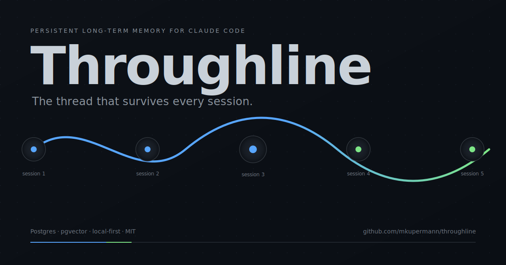
</p>

<p align="center">
  <b>Try it live</b> at <a href="https://kupermann.com/memory/"><code>kupermann.com/memory/</code></a>
  · More context at <a href="https://kupermann.com/en/"><code>kupermann.com</code></a>
</p>

---

## Table of Contents

- [Why this exists](#why-this-exists)
- [What it does](#what-it-does)
- [Demo / Screenshots](#demo--screenshots)
- [Features](#features)
- [Quick Start](#quick-start)
- [Architecture](#architecture)
- [Database Schema](#database-schema)
- [Usage Examples](#usage-examples)
- [Configuration](#configuration)
- [Comparison to alternatives](#comparison-to-alternatives)
- [Performance](#performance)
- [Roadmap](#roadmap)
- [Contributing](#contributing)
- [License](#license)

---

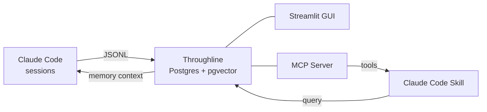

---

## Why this exists

Claude Code has no cross-session memory. Every new session starts from scratch.

The CLI stores each conversation as a JSONL file under `~/.claude/projects/<hash>/*.jsonl` — but nothing reads those files back. Decisions you made last week, the contact you met three projects ago, the subtle pattern you found at 2 a.m. on Tuesday: all of it sits in flat files that Claude never sees again.

**The cost is invisible but constant.** You re-explain context. You re-discover the same pitfall. You ask Claude to design something it already helped you design, because neither of you remember.

`Throughline` closes that loop. It is a local PostgreSQL database that continuously ingests your Claude Code JSONL sessions, extracts structured memory (decisions, patterns, insights, contacts, error solutions), and exposes that memory back to Claude as a queryable skill. Claude writes the sessions; Throughline reads them; you stay in flow.

Anthropic is actively shipping memory features on claude.ai and in the API, and the long-term answer for cross-session Claude Code memory will likely come from there. Throughline is the version I built for my laptop in the meantime — a complement, not a competitor. If an official answer lands that makes this redundant, I will happily retire it.

## What it does

- **Ingests Claude Code JSONL sessions** into a relational schema you can actually query — deduplicated by SHA-256, with full message history, tool calls, and token counts.
- **Extracts structured memory chunks** — eight categories (decisions, patterns, insights, error solutions, contacts, preferences, project context, workflows) extracted via Claude itself. Two backends: the Anthropic API (`ANTHROPIC_API_KEY`) or the Claude Code CLI in headless mode — both documented, both produce the same structured output.
- **Semantic search** over conversations and memory using pgvector with HNSW indexing. Works with OpenAI embeddings or fully local Ollama (`nomic-embed-text`) — no cloud required.
- **Temporal knowledge graph** of entities (people, projects, technologies) and their relationships, tracked across sessions with `valid_from` / `valid_until` for time-travel queries.
- **Streamlit GUI** with 14 pages — dashboard, conversations, memory CRUD, skills, knowledge graph, calendar, semantic search, SQL console, and more.
- **Context pre-loader hook** — a `SessionStart` hook queries the DB for the current project and injects a short, relevant memory summary before Claude's first response in each new session.
- **Scheduled automation** via launchd (ingest hourly, extract daily at 02:00, back up daily). Linux equivalent via systemd timers or cron.
- **Self-reflecting memory** — a periodic pass merges near-duplicates, flags contradictions, supersedes outdated decisions, and logs every reflection action for auditability.

## Demo / Screenshots

<p align="center">
  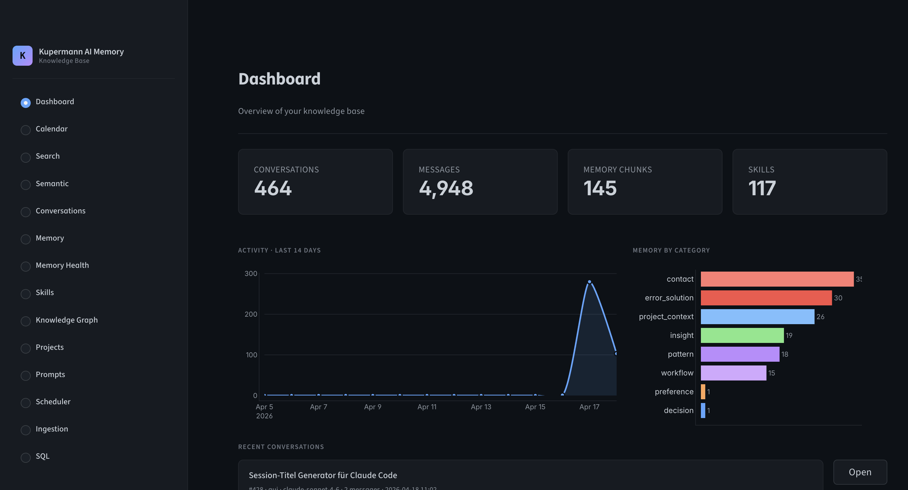
  <br/><em>Dashboard — session counts, token totals, and memory categories</em>
</p>

See the full gallery below or browse [`docs/screenshots/`](docs/screenshots/).

---

## Features

### Core

- **Session ingestion** — Reads JSONL files from `~/.claude/projects/`, deduplicates by SHA-256 hash, parses messages, tool calls, token counts, and timestamps.
- **Memory extraction** — Sends conversation windows through Claude and stores structured chunks (one of eight categories) with confidence scores and tags.
- **Skill scanning** — Walks `~/.claude/skills/` and project-local `.claude/skills/`, records triggers, descriptions, and usage counts.
- **Prompt library** — Catalogs reusable prompts from `CLAUDE.md` files and skill directories.

### Advanced

- **Semantic search** — Cosine similarity over 1536-dim OpenAI or 768-dim Ollama (`nomic-embed-text`) embeddings indexed with HNSW.
- **Temporal knowledge graph** — Entities, relationships, and mentions tracked across sessions with `valid_from` / `valid_until` for time-travel queries.
- **Self-reflecting memory** — Periodic reflection pass merges near-duplicates, flags contradictions, supersedes outdated decisions, and logs every reflection for auditability.
- **`forget` primitive** *(v0.2.0)* — First-class cascade-delete: removes the chunk AND its embeddings AND repairs dangling `superseded_by` references in one transaction, with an audit row in `memory_reflections`. Available from the GUI (Memory chunk detail / Knowledge Graph entity detail / bulk-forget expander), as a Python helper (`scripts/forget.py`), and as the `memory.forget` MCP tool.
- **PII / secret redaction** *(v0.2.0)* — runs at two distinct layers, so secrets are scrubbed both before they leave the machine and before they reach a screen:
  - **Server-side, pre-extraction.** `throughline/pii.py` runs over each transcript before it is sent to Claude for memory or entity extraction. Redacts Anthropic / OpenAI / GitHub / AWS / Google / Slack / Stripe key shapes, JWTs, bearer tokens, `password=` / `secret=` / `token=` assignments, private-key blocks, email addresses, and home-directory usernames. Default on; disable with `THROUGHLINE_REDACT_PII=0`.
  - **GUI-side, pre-display.** The Streamlit conversation viewer pipes raw message bodies through the same redactor before rendering, so any secret that scrolled past in a Bash output stays out of the UI. Toggle in the sidebar (`Redact secrets in views`); default ON.
  - **Strict project isolation.** Set `THROUGHLINE_PROJECT_SCOPE_STRICT=1` on the MCP server to refuse the `project=""` cross-project opt-out — every call must specify a project, enforcing data isolation between client engagements at policy level rather than convention.
- **Context pre-loader hook** — `SessionStart` hook queries the DB for the current project and injects a short memory summary into the first system message.
- **Scheduled automation** — macOS `launchd` plists for hourly ingest, daily extract, and daily backup. Linux users can wire the same scripts into systemd timers (units shipped under `systemd/`).

### UI

- **14 Streamlit pages** — Dashboard, Conversations, Memory, Skills, Prompts, Projects, Scheduler, Knowledge Graph, Calendar, Semantic Search, Reflections, Ingestion, SQL Console, Settings.
- **Knowledge graph visualization** — Interactive network via `streamlit-agraph`, filterable by entity type and project.
- **Knowledge Graph keyword search** *(v0.2.0)* — Search bar above the filters: filter the graph by one or more keywords against entity names. Toggles for **Match all words** (AND vs default OR) and **Include neighbors** (1-hop expansion so the graph renders the keyword's neighborhood). Seed matches highlighted with larger nodes, accent labels and bold borders.
- **CSV / Excel / PDF export** *(v0.2.0)* — Three download buttons above every list view (Conversations, Memory, Memory Health, Skills, Knowledge Graph entities, Projects, Prompts, every Search and Semantic-Search scope). CSV is UTF-8 with BOM; Excel via `openpyxl`; PDF via `reportlab` (landscape A4, repeated headers, alternating row backgrounds, document title and timestamp). Missing optional deps degrade gracefully — buttons disappear and the page shows a `pip install` hint. CSV is always available.
- **Calendar view** — Sessions plotted on a month grid, click a day to drill down.
- **SQL console** — Free-form SQL for power users.

---

## Quick Start

### Option A — Docker (one command, any platform)

```bash
git clone https://github.com/mkupermann/throughline.git
cd throughline
docker compose up -d
# open http://localhost:8501
```

That brings up Postgres 16 + pgvector + the Streamlit GUI. The schema
is auto-deployed on first boot. Your `~/.claude` directory is mounted
read-only into the container so the ingestion scripts can see your
sessions.

Ingest your existing Claude Code sessions:

```bash
docker compose exec gui python3 scripts/ingest_sessions.py
docker compose exec gui python3 scripts/scan_skills.py
```

Optional: enable local embeddings via Ollama (no API key needed):

```bash
docker compose --profile embeddings up -d
docker compose exec ollama ollama pull nomic-embed-text
docker compose exec gui python3 scripts/generate_embeddings.py --backend ollama
```

### Option B — Native macOS (full integration)

Use this path if you want the launchd scheduler, AppleScript hooks for
Mail/Calendar, and the context pre-loader installed in your real
`~/.claude/settings.json`:

```bash
git clone https://github.com/mkupermann/throughline.git
cd throughline

# Installs PostgreSQL 16 + pgvector via Homebrew, creates DB,
# deploys schema, installs launchd jobs
./scripts/install.sh

# Ingest
python3 scripts/ingest_sessions.py
python3 scripts/scan_skills.py

# Optional — extract memory chunks via Claude CLI
python3 scripts/extract_memory.py

# Start the GUI
streamlit run gui/app.py
# open http://localhost:8501
```

The installer is idempotent — running it twice will not break an existing setup.

### Option C — Python package (pip install)

If you just want the CLI and aren't running the Docker stack:

```bash
git clone https://github.com/mkupermann/throughline.git
cd throughline
pip install -e .[dev]       # editable install, dev deps included

throughline --help
python -m throughline ingest
make help                   # list every Makefile shortcut
```

Requires Python 3.10+, a reachable PostgreSQL 16 instance with `pgvector`,
and (for extraction/titles) the `claude` CLI on your `PATH`.

---

## Commands

All subcommands work as either `throughline <cmd>` or `python -m throughline <cmd>`.
Run `throughline <cmd> --help` for the per-command options.

| Command | Purpose |
|---|---|
| `throughline ingest` | Import Claude Code JSONL sessions (`~/.claude/projects/`) |
| `throughline ingest --windsurf` | Import Windsurf plans (`~/.windsurf/plans/`) |
| `throughline scan-skills` | Index all `SKILL.md` files (global + project) |
| `throughline scan-prompts` | Index `CLAUDE.md` files + skill prompt templates |
| `throughline extract-memory` | Extract structured memory chunks via the Claude CLI |
| `throughline generate-titles` | Auto-generate titles for untitled conversations |
| `throughline embed` | Generate vector embeddings (OpenAI or local Ollama) |
| `throughline search <query>` | Semantic search over messages + memory chunks |
| `throughline reflect` | Self-reflecting pass (dedup, contradictions, stale, consolidate) |
| `throughline gui` | Start the Streamlit GUI |
| `throughline install-hooks` | Install `SessionStart` hooks into `~/.claude/settings.json` |
| `throughline backup` | One-shot `pg_dump` backup |
| `throughline version` | Print the installed version |

The Makefile exposes common tasks (`install`, `test`, `gui`, `ingest`, `scan`,
`extract`, `docker-up/down/logs`, `clean`, `migrate`, `load-demo`).
Run `make help` for the full list.

---

## MCP Integration

Throughline ships a **[Model Context Protocol](https://modelcontextprotocol.io/)
server** as the [`memory_mcp/`](memory_mcp/) package. Register it once and
Claude Code (and any other MCP client — Claude Desktop, Cursor, Zed,
Continue) can read and write the memory database directly, across sessions,
without going through a skill round-trip or a shell command.

Eight tools are exposed:

| Tool | What it does |
|---|---|
| `memory.search` | Vector search across memory chunks and conversation messages. |
| `memory.recall_entity` | Knowledge-graph BFS up to 3 hops from a named entity, with optional `relation_types` whitelist. |
| `memory.write` | Append a new memory chunk (`source_type='mcp_write'`). |
| `memory.supersede` | Mark an old chunk superseded by a new one; logs an audit row in `memory_reflections`. |
| `memory.forget` | Cascade-delete chunks + their embeddings; logs an audit row. |
| `memory.list_projects` | Distinct project names known to memory. |
| `memory.recent_reflections` | Recent rows from the `memory_reflections` audit log — what the reflection engine and the preload hook have done. |
| `memory.preload_summary` | The most recent SessionStart preload audit row: which chunks the hook injected for this project, and when. |

Every tool with a `project` parameter defaults to the basename of
`$CLAUDE_PROJECT_DIR` so a session in one project cannot accidentally
recall memory from another. Pass `project=""` to opt out and search across
projects.

Install and register:

```bash
pip install -e .
# Then add to ~/.claude.json (or via `claude mcp add`):
claude mcp add throughline python3 -m memory_mcp.server
```

The DB connection honours libpq env vars: `PGHOST`, `PGPORT`, `PGDATABASE`,
`PGUSER`, `PGPASSWORD`. See [`memory_mcp/README.md`](memory_mcp/README.md)
for the full Claude Desktop / Cursor JSON snippet, troubleshooting, and a
verification command.

---

## Screenshots

> Captured from the bundled demo dataset (`examples/demo_data.sql`).
> All data shown is fictional.

### Dashboard

<p align="center">
  
</p>

Session counts, token totals, memory category breakdown, recent activity.

### Calendar

<p align="center">
  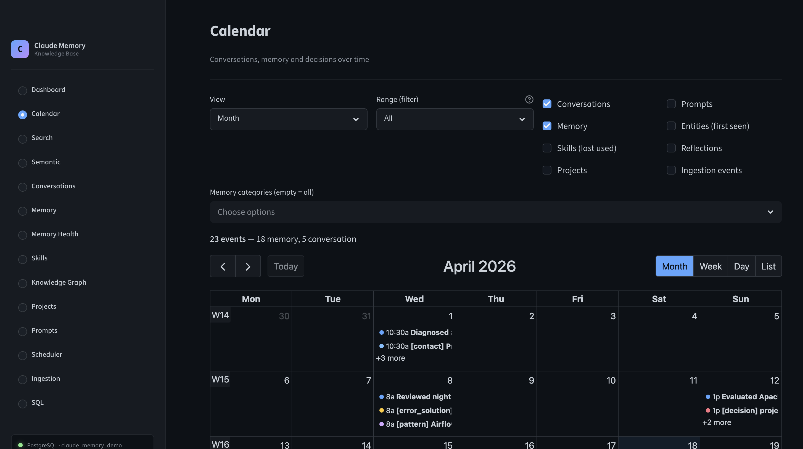
</p>

Conversations, memory, skills, projects, prompts and reflections plotted on a
shared month / week / day timeline.

### Global Search

<p align="center">
  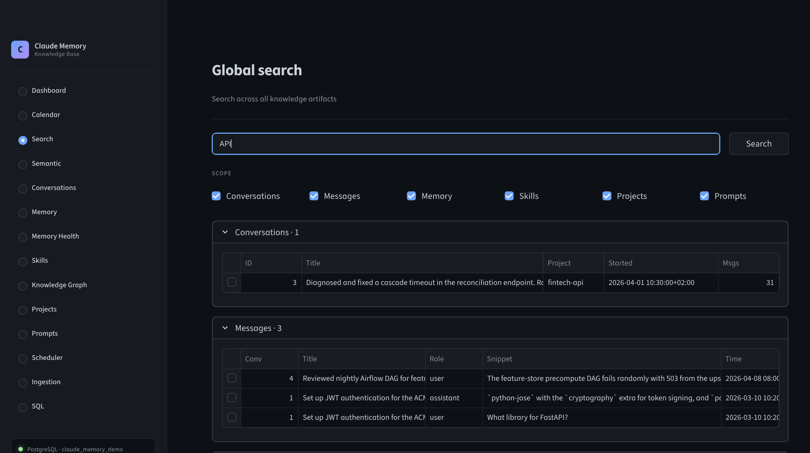
</p>

Full-text search across conversations, messages, memory, skills, projects and
prompts in one box.

### Conversations

<p align="center">
  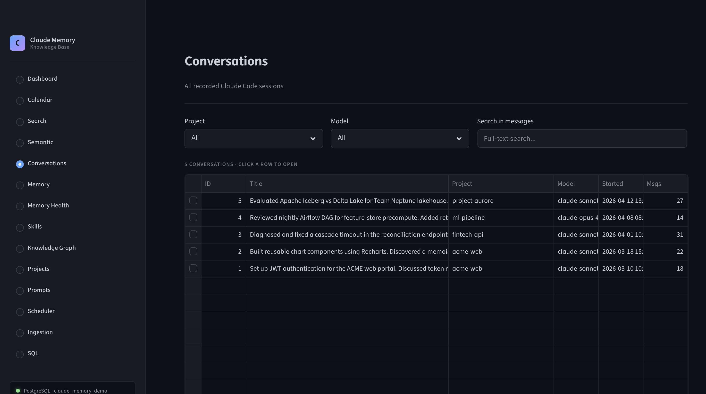
</p>

Every Claude Code session, filterable by project and model, click-through to
the full transcript.

### Memory

<p align="center">
  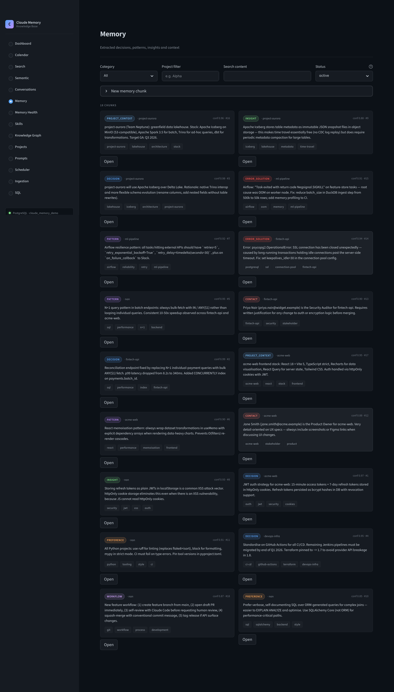
</p>

Extracted memory chunks as cards — category, confidence, tags, source link.

### Skills

<p align="center">
  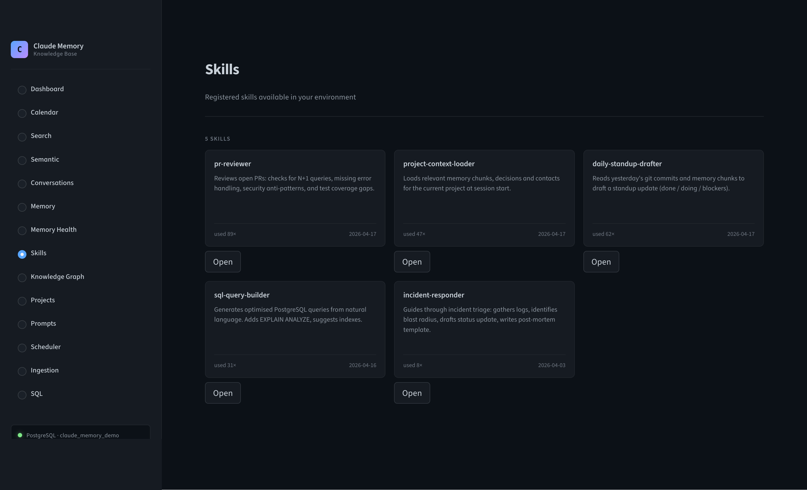
</p>

Registered skills from `~/.claude/skills/` with usage counts and last-used
timestamps.

### Knowledge Graph

<p align="center">
  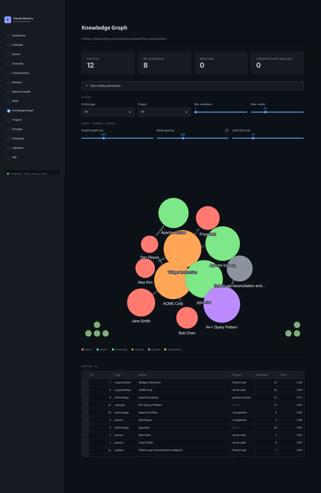
</p>

Entities and typed relationships extracted from conversations, rendered with
force-directed layout.

### Projects

<p align="center">
  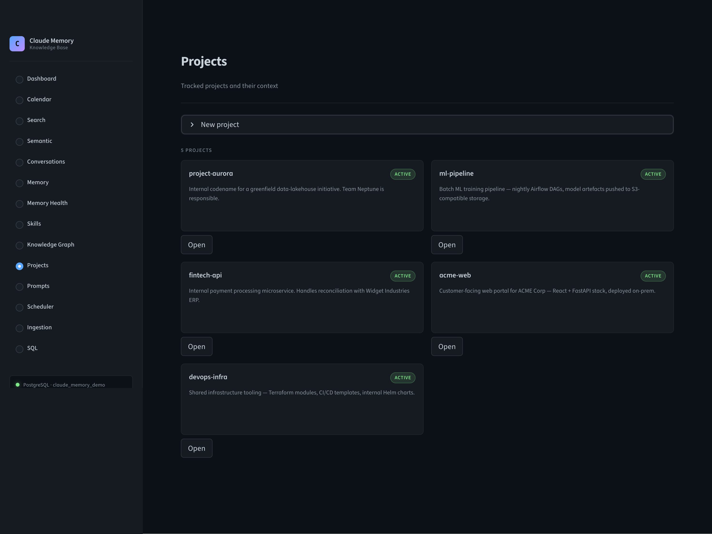
</p>

Tracked projects with status, description and context — the rollup across all
sessions in a given codebase.

### Prompts

<p align="center">
  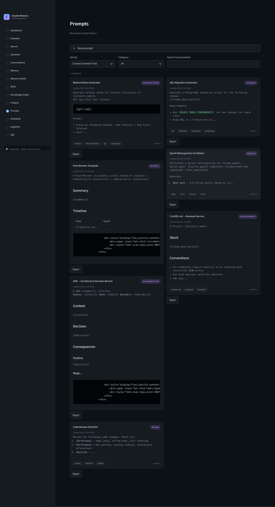
</p>

Reusable prompt library scanned from `CLAUDE.md` and skill directories.

### Ingestion

<p align="center">
  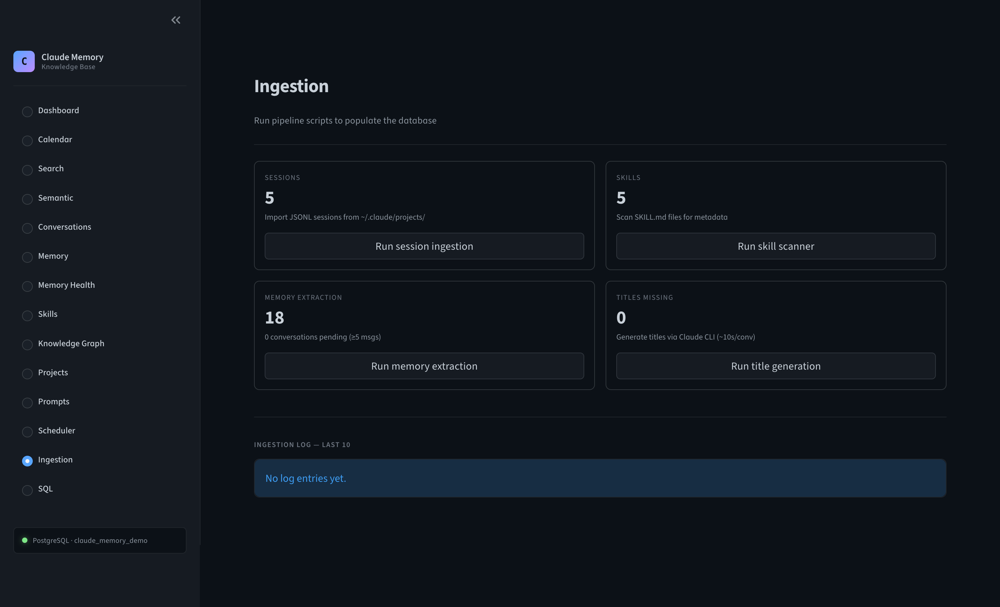
</p>

One-click pipeline runner — session ingest, skill scan, memory extraction,
title generation, with a live log tail.

### SQL Console

<p align="center">
  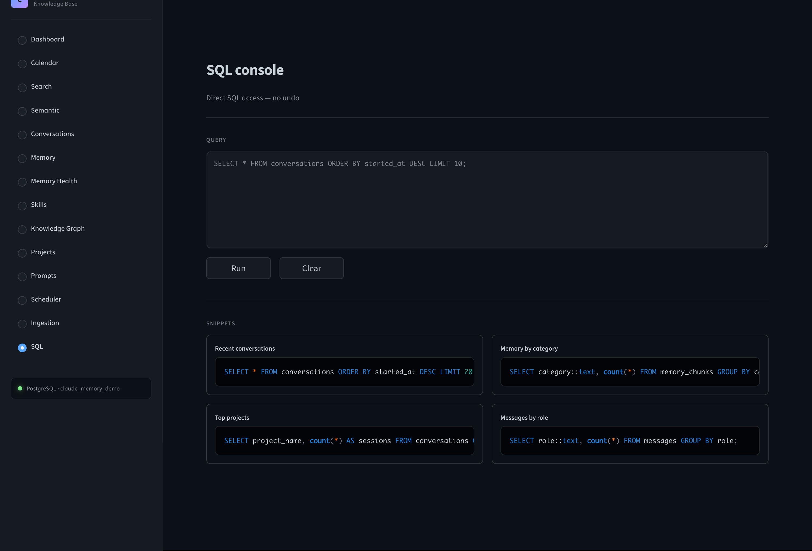
</p>

Direct SQL access with ready-made snippets — recent conversations, memory by
category, top projects, messages by role.

---

## Architecture

### Component Overview

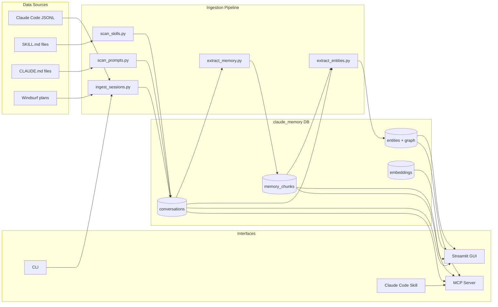

### Data Flow

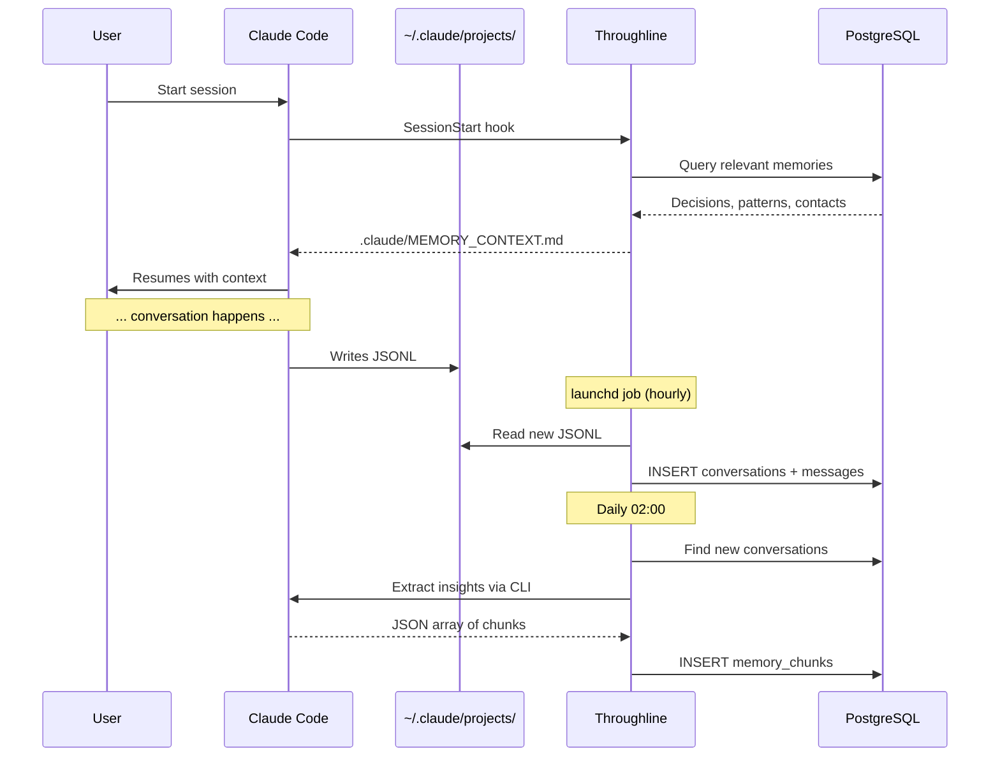

High-level data flow:

1. **JSONL files** land in `~/.claude/projects/` as you use Claude Code.
2. **Hourly ingest** dedups new files and writes `conversations` + `messages` rows.
3. **Daily extract** sends message windows to Claude, parses the response into `memory_chunks`.
4. **Embeddings generator** computes vectors for chunks and messages; HNSW indexes accelerate cosine queries.
5. **Reflection pass** merges duplicates, supersedes outdated decisions, logs every action.
6. **Consumers** (GUI, skill, hooks, CLI) read from the same schema.

A full deep-dive lives in [`docs/ARCHITECTURE.md`](docs/ARCHITECTURE.md).

---

## Database Schema

Eleven tables, three enum types, one view, and HNSW + GIN + trigram indexes.

| Table | Purpose |
|---|---|
| `conversations` | One row per Claude Code session (JSONL file) |
| `messages` | Individual messages with role, content, tool calls, timestamps |
| `memory_chunks` | Extracted insights, categorized, with confidence and tags |
| `skills` | Metadata for every Claude Code skill the scanner found |
| `prompts` | Reusable prompt templates from `CLAUDE.md` and skill dirs |
| `projects` | Project context with contacts and decisions as JSONB |
| `entities` | Named entities (people, projects, technologies) |
| `relationships` | Typed edges between entities with temporal validity |
| `entity_mentions` | Where an entity was mentioned (source + snippet) |
| `embeddings` | 1536-dim or 768-dim vectors indexed with HNSW |
| `memory_reflections` | Audit log of dedup, consolidation, and contradiction events |
| `ingestion_log` | SHA-256 hashes of every ingested file (dedup) |

Full DDL in [`sql/schema.sql`](sql/schema.sql). Conceptual model in [`docs/ARCHITECTURE.md`](docs/ARCHITECTURE.md).

### Memory categories

| Category | Example |
|---|---|
| `decision` | "We picked pgvector over Qdrant because it runs inside the same Postgres instance." |
| `pattern` | "Use HNSW with `m=16, ef_construction=64` for 1536-dim vectors." |
| `insight` | "The `tool_result` role is not a real enum in Anthropic's API — it's our mapping." |
| `preference` | "User wants all bash commands quoted with double quotes when paths contain spaces." |
| `contact` | "Alice Chen — staff engineer, owns the billing service, prefers async review." |
| `error_solution` | "If `pg_isready` hangs on macOS, restart `brew services restart postgresql@16`." |
| `project_context` | "The `acme-dashboard` repo uses Next.js 14 + Drizzle + Neon." |
| `workflow` | "Release checklist: bump version, run `pytest`, tag `vX.Y.Z`, push with tags." |

---

## Usage Examples

### 1. Ask Claude what it already knows

Inside a Claude Code session:

```
> What do I know about HNSW tuning?
```

The `Throughline` skill auto-triggers, runs a semantic + full-text search over
`memory_chunks` and `messages`, and returns ranked results that Claude can use
to answer without starting from zero.

### 2. Search from the command line

```bash
# Full-text + tag search
python3 scripts/search_semantic.py "HNSW tuning"

# Project context
python3 skill/scripts/query.py project "acme-dashboard"

# All decisions across all projects
python3 skill/scripts/query.py decisions

# Statistics
python3 skill/scripts/query.py stats
```

Example output for `stats`:

```
Conversations:      1,284
Messages:         214,507
Memory chunks:      3,129  (decision: 612, pattern: 488, insight: 901, ...)
Skills:                47
Projects:              19
Last ingest:   2 minutes ago
DB size:          482 MB
```

### 3. Add a memory chunk manually

```bash
python3 skill/scripts/add.py \
  --category decision \
  --content "Switched from IVFFlat to HNSW — recall improved from 0.91 to 0.98 on our eval set." \
  --project "Throughline" \
  --tags pgvector,hnsw,indexing \
  --confidence 0.95
```

### 4. Use the Streamlit GUI

```bash
streamlit run gui/app.py
# open http://localhost:8501
```

Click a conversation to see its full transcript plus extracted chunks. Edit
any memory chunk inline. Open the knowledge graph page to see how entities
connect. Drop into the SQL console when you need something custom.

---

## Configuration

Copy the example config and edit as needed:

```bash
cp config.example.yaml config.yaml
```

Key knobs:

- `db.host`, `db.port`, `db.name`, `db.user` — PostgreSQL connection.
- `claude_dir` — location of your `~/.claude/` directory.
- `embeddings.provider` — `openai` (1536d) or `ollama` (768d nomic-embed-text).
- `embeddings.model` — model name per provider.
- `extraction.provider` — `cli` (uses `claude -p` headless) or `api` (direct Anthropic API).
- `schedule.ingest_interval` — defaults to hourly.
- `reflection.enabled` — enable the self-reflection pass.

Secrets (API keys) live in `.env`, never in `config.yaml`. Both are gitignored.

See [`docs/INSTALLATION.md`](docs/INSTALLATION.md) for every option.

---

## Comparison to alternatives

| Tool | Scope | Local-first | Auto-ingests Claude Code | Knowledge graph | Self-reflection | Price |
|---|---|---|---|---|---|---|
| [Mem0](https://github.com/mem0ai/mem0) | General LLM memory | Partial (vector DB local, cloud SaaS option) | No | No | No | Free (OSS) / paid (cloud) |
| [Letta](https://github.com/letta-ai/letta) (MemGPT) | Agent memory framework | Yes | No | No | Limited | Free (OSS) |
| [Zep](https://github.com/getzep/zep) | Chat memory store | Yes (self-host) or cloud | No | Yes | Limited | Free (OSS) / paid (cloud) |
| [Anthropic Memory](https://www.anthropic.com) | Claude.ai / API | Anthropic-hosted | Not surfaced for the Claude Code CLI today | — | — | Included |
| ChatGPT Memory | ChatGPT consumer | No (OpenAI-hosted) | No | No | No | Included with plan |
| **`Throughline`** | **Claude Code sessions** | **Yes (100%)** | **Yes** | **Yes** | **Yes** | **Free** |

The unique slot `Throughline` fills: **one of the few tools purpose-built for
Claude Code JSONL sessions with a closed loop back into the CLI.** Two
extraction backends are supported — the Anthropic API and the Claude Code CLI
in headless mode — both documented in [INSTALLATION.md](docs/INSTALLATION.md).

---

## Performance

Numbers measured on a MacBook Pro M2 / macOS 15 / PostgreSQL 16 / pgvector 0.8
against ~100 conversations, ~3,000 messages, ~550 memory chunks, ~260k
embeddings. Full methodology and reproduction steps in
[`docs/BENCHMARKS.md`](docs/BENCHMARKS.md).

| Operation | Wall time |
|---|---|
| Ingestion throughput | 10 – 15 sessions/sec · 400 – 800 messages/sec |
| First-run ingest (~1,200 sessions) | ~80 – 120 s |
| Ollama embedding (warm, `nomic-embed-text`) | 30 – 60 ms per call |
| Full re-embed, 10k messages | 6 – 9 min single-threaded |
| pgvector HNSW cosine, 260k vectors | 15 – 30 ms |
| Blended hybrid search (HNSW + `pg_trgm`), end-to-end | 50 – 100 ms |
| Memory extraction via `claude -p` (per conversation) | 6 – 15 s |
| Daily extraction run (20 conversations) | 2 – 5 min |
| Storage per conversation (msgs + chunks + embeddings) | 20 – 50 KB |

---

## Roadmap

- [x] MCP (Model Context Protocol) server — shipped in v0.1.0, see [`mcp/`](mcp/)
- [x] Linux scheduler support via `systemd/` timers — shipped in v0.1.0
- [x] PII / secret-redaction pass before extraction (API keys, tokens,
      emails, home-directory paths); default on, see
      [`throughline/pii.py`](throughline/pii.py)
- [ ] Windows support (replace launchd with Task Scheduler)
- [ ] Multi-user support (per-user schemas and auth)
- [ ] Export to Obsidian, Notion, Logseq
- [ ] Ollama-only setup path (no OpenAI, no Anthropic API)
- [ ] Incremental embeddings (only re-embed changed chunks)
- [ ] First-class support for Cursor, Windsurf, and Cline session formats
- [ ] Web UI packaging as a single binary (Docker image + systemd unit)

Opened issues: <https://github.com/mkupermann/throughline/issues>

---

## Contributing

PRs and issues are welcome. Start with [`CONTRIBUTING.md`](CONTRIBUTING.md) for
branch naming, commit message format, and the test plan expected for each PR.

The code of conduct is [Contributor Covenant 2.1](CODE_OF_CONDUCT.md). Security
issues go to the address in [`SECURITY.md`](SECURITY.md) — please do not file
them as public issues.

---

## License

MIT — see [`LICENSE`](LICENSE).

## Authors

Released as an open-source personal AI-assistant stack for Claude Code.

## Inspired by

- [Anthropic](https://www.anthropic.com/) for Claude and Claude Code
- [Mem0](https://github.com/mem0ai/mem0) for popularizing LLM memory layers
- [Letta / MemGPT](https://github.com/letta-ai/letta) for the self-editing memory idea
- [pgvector](https://github.com/pgvector/pgvector) for making vector search in Postgres boring
- The Streamlit team for making internal tools pleasant to build

---

If Throughline saves you an hour of re-explaining context to Claude, consider giving it a star — it helps others find it.

**[Star on GitHub](https://github.com/mkupermann/throughline)**

---

<p align="center">
  Built by <a href="https://kupermann.com/en/">Michael Kupermann</a>
  — also running live at <a href="https://kupermann.com/memory/">kupermann.com/memory/</a>
</p>
