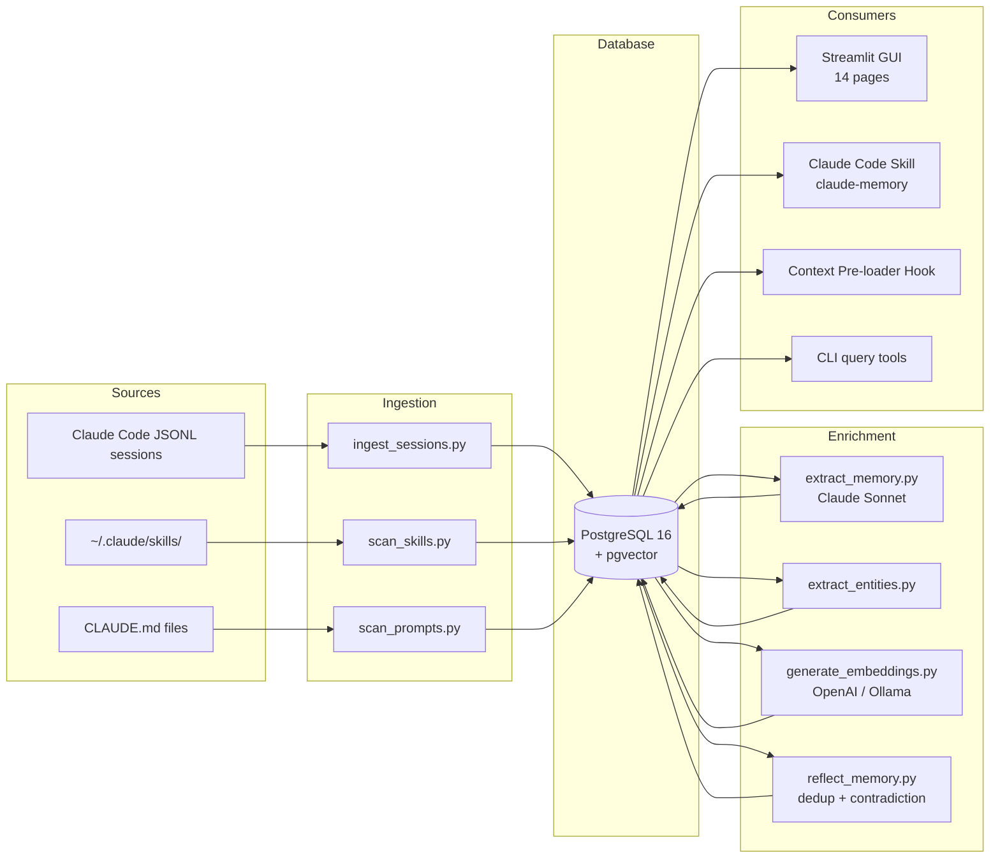

# Throughline — Persistent long-term memory for Claude Code

[](LICENSE)
[](CONTRIBUTING.md)
[](https://www.python.org/downloads/)
[](https://www.postgresql.org/)
[](https://github.com/pgvector/pgvector)
[](#roadmap)

> A local-first, self-reflecting memory database for Claude Code that ingests JSONL sessions, extracts insights, and gives Claude its own memory to query across sessions.

---

```
              ________________
             /                \
            |   CLAUDE CODE    |  ---> JSONL sessions
             \________________/                |
                     ^                         v
                     |                   _____________
        "What do I  |                  |             |
         know about |<---- skill ----->|  Throughline DB  |
         pgvector?" |                  |  Postgres + |
                    |                  |  pgvector   |
                    |                   -------------
                    |                         ^
                    |                         |
                    +----- Streamlit GUI -----+
```

---

## Why this exists

Claude Code has no cross-session memory. Every new session starts from scratch.

The CLI stores each conversation as a JSONL file under `~/.claude/projects/<hash>/*.jsonl`,
but nothing aggregates, searches, or surfaces that knowledge the next time you open a
terminal. Decisions you made last week, the contact you met three projects ago, the
subtle pattern you discovered at 2 a.m. on Tuesday — all of it lives as flat files
that nobody reads.

`Throughline` is the missing piece: a local PostgreSQL database that continuously ingests
your Claude Code sessions, extracts structured memory (decisions, patterns, insights,
contacts, error solutions), and exposes it back to Claude as a queryable skill. The
loop is closed — Claude writes, Claude reads, you stay in flow.

## What it does

- **Ingests Claude Code JSONL sessions** into a relational schema you can actually query.
- **Extracts structured memory chunks** (decisions, patterns, insights, error solutions) via Claude itself — no separate API key required if you have a Max plan.
- **Semantic search** over conversations and memory using pgvector (OpenAI or local Ollama embeddings).
- **Temporal knowledge graph** of entities (people, projects, technologies) and their relationships over time.
- **Streamlit GUI** with 14 pages — dashboard, CRUD, graph visualization, calendar view, SQL console.
- **Context pre-loader hook** that injects relevant memories at the start of each new Claude Code session.
- **Scheduled automation** via launchd (ingest hourly, extract daily, back up daily).
- **Self-reflecting memory** that deduplicates, detects contradictions, and consolidates related chunks over time.

## Demo / Screenshots

> Screenshots will be added to `docs/assets/` before the `v1.0` tag.

- `docs/assets/dashboard.png` — Streamlit dashboard with session counts, token totals, and memory categories
- `docs/assets/graph.png` — Interactive knowledge graph of entities and relationships
- `docs/assets/skill.gif` — Claude Code session using the `Throughline` skill to recall prior context

---

## Features

### Core

- **Session ingestion** — Reads JSONL files from `~/.claude/projects/`, deduplicates by SHA-256 hash, parses messages, tool calls, token counts, and timestamps.
- **Memory extraction** — Sends conversation windows through Claude Sonnet and stores structured chunks (one of eight categories) with confidence scores and tags.
- **Skill scanning** — Walks `~/.claude/skills/` and project-local `.claude/skills/`, records triggers, descriptions, and usage counts.
- **Prompt library** — Catalogs reusable prompts from `CLAUDE.md` files and skill directories.

### Advanced

- **Semantic search** — Cosine similarity over 1536-dim OpenAI or 768-dim Ollama (`nomic-embed-text`) embeddings indexed with HNSW.
- **Temporal knowledge graph** — Entities, relationships, and mentions tracked across sessions with `valid_from` / `valid_until` for time-travel queries.
- **Self-reflecting memory** — Periodic reflection pass merges near-duplicates, flags contradictions, supersedes outdated decisions, and logs every reflection for auditability.
- **Context pre-loader hook** — `SessionStart` hook queries the DB for the current project and injects a short memory summary into the first system message.
- **Scheduled automation** — macOS `launchd` plists for hourly ingest, daily extract, and daily backup. Linux users can wire the same scripts into cron or systemd timers.

### UI

- **14 Streamlit pages** — Dashboard, Conversations, Memory, Skills, Prompts, Projects, Scheduler, Knowledge Graph, Calendar, Semantic Search, Reflections, Ingestion, SQL Console, Settings.
- **Knowledge graph visualization** — Interactive network via `streamlit-agraph`, filterable by entity type and project.
- **Calendar view** — Sessions plotted on a month grid, click a day to drill down.
- **SQL console** — Free-form SQL for power users, with query history and CSV export.

---

## Quick Start

### Option A — Docker (one command, any platform)

```bash
git clone https://github.com/mkupermann/throughline.git
cd throughline
docker compose up -d
# open http://localhost:8501
```

That brings up Postgres 16 + pgvector + the Streamlit GUI. The schema
is auto-deployed on first boot. Your `~/.claude` directory is mounted
read-only into the container so the ingestion scripts can see your
sessions.

Ingest your existing Claude Code sessions:

```bash
docker compose exec gui python3 scripts/ingest_sessions.py
docker compose exec gui python3 scripts/scan_skills.py
```

Optional: enable local embeddings via Ollama (no API key needed):

```bash
docker compose --profile embeddings up -d
docker compose exec ollama ollama pull nomic-embed-text
docker compose exec gui python3 scripts/generate_embeddings.py --backend ollama
```

### Option B — Native macOS (full integration)

Use this path if you want the launchd scheduler, AppleScript hooks for
Mail/Calendar, and the context pre-loader installed in your real
`~/.claude/settings.json`:

```bash
git clone https://github.com/mkupermann/throughline.git
cd throughline

# Installs PostgreSQL 16 + pgvector via Homebrew, creates DB,
# deploys schema, installs launchd jobs
./scripts/install.sh

# Ingest
python3 scripts/ingest_sessions.py
python3 scripts/scan_skills.py

# Optional — extract memory chunks via Claude CLI
python3 scripts/extract_memory.py

# Start the GUI
streamlit run gui/app.py
# open http://localhost:8501
```

The installer is idempotent — running it twice will not break an existing setup.

## Screenshots

> Screenshots live in [`docs/screenshots/`](docs/screenshots/).
> PRs welcome if yours look better on your setup.

| Dashboard | Calendar | Knowledge Graph |
|---|---|---|
|  |  |  |

| Memory | Semantic Search | Conversation Detail |
|---|---|---|
|  |  |  |

---

## Architecture



High-level data flow:

1. **JSONL files** land in `~/.claude/projects/` as you use Claude Code.
2. **Hourly ingest** dedups new files and writes `conversations` + `messages` rows.
3. **Daily extract** sends message windows to Claude Sonnet, parses the response into `memory_chunks`.
4. **Embeddings generator** computes vectors for chunks and messages; HNSW indexes accelerate cosine queries.
5. **Reflection pass** merges duplicates, supersedes outdated decisions, logs every action.
6. **Consumers** (GUI, skill, hooks, CLI) read from the same schema.

A full deep-dive lives in [`docs/ARCHITECTURE.md`](docs/ARCHITECTURE.md).

---

## Database Schema

Eleven tables, three enum types, one view, and HNSW + GIN + trigram indexes.

| Table | Purpose |
|---|---|
| `conversations` | One row per Claude Code session (JSONL file) |
| `messages` | Individual messages with role, content, tool calls, timestamps |
| `memory_chunks` | Extracted insights, categorized, with confidence and tags |
| `skills` | Metadata for every Claude Code skill the scanner found |
| `prompts` | Reusable prompt templates from `CLAUDE.md` and skill dirs |
| `projects` | Project context with contacts and decisions as JSONB |
| `entities` | Named entities (people, projects, technologies) |
| `relationships` | Typed edges between entities with temporal validity |
| `entity_mentions` | Where an entity was mentioned (source + snippet) |
| `embeddings` | 1536-dim or 768-dim vectors indexed with HNSW |
| `memory_reflections` | Audit log of dedup, consolidation, and contradiction events |
| `ingestion_log` | SHA-256 hashes of every ingested file (dedup) |

Full DDL in [`sql/schema.sql`](sql/schema.sql). Conceptual model in [`docs/ARCHITECTURE.md`](docs/ARCHITECTURE.md).

### Memory categories

| Category | Example |
|---|---|
| `decision` | "We picked pgvector over Qdrant because it runs inside the same Postgres instance." |
| `pattern` | "Use HNSW with `m=16, ef_construction=64` for 1536-dim vectors." |
| `insight` | "The `tool_result` role is not a real enum in Anthropic's API — it's our mapping." |
| `preference` | "User wants all bash commands quoted with double quotes when paths contain spaces." |
| `contact` | "Alice Chen — staff engineer, owns the billing service, prefers async review." |
| `error_solution` | "If `pg_isready` hangs on macOS, restart `brew services restart postgresql@16`." |
| `project_context` | "The `acme-dashboard` repo uses Next.js 14 + Drizzle + Neon." |
| `workflow` | "Release checklist: bump version, run `pytest`, tag `vX.Y.Z`, push with tags." |

---

## Usage Examples

### 1. Ask Claude what it already knows

Inside a Claude Code session:

```
> What do I know about HNSW tuning?
```

The `Throughline` skill auto-triggers, runs a semantic + full-text search over
`memory_chunks` and `messages`, and returns ranked results that Claude can use
to answer without starting from zero.

### 2. Search from the command line

```bash
# Full-text + tag search
python3 scripts/search_semantic.py "HNSW tuning"

# Project context
python3 skill/scripts/query.py project "acme-dashboard"

# All decisions across all projects
python3 skill/scripts/query.py decisions

# Statistics
python3 skill/scripts/query.py stats
```

Example output for `stats`:

```
Conversations:      1,284
Messages:         214,507
Memory chunks:      3,129  (decision: 612, pattern: 488, insight: 901, ...)
Skills:                47
Projects:              19
Last ingest:   2 minutes ago
DB size:          482 MB
```

### 3. Add a memory chunk manually

```bash
python3 skill/scripts/add.py \
  --category decision \
  --content "Switched from IVFFlat to HNSW — recall improved from 0.91 to 0.98 on our eval set." \
  --project "Throughline" \
  --tags pgvector,hnsw,indexing \
  --confidence 0.95
```

### 4. Use the Streamlit GUI

```bash
streamlit run gui/app.py
# open http://localhost:8501
```

Click a conversation to see its full transcript plus extracted chunks. Edit
any memory chunk inline. Open the knowledge graph page to see how entities
connect. Drop into the SQL console when you need something custom.

---

## Configuration

Copy the example config and edit as needed:

```bash
cp config.example.yaml config.yaml
```

Key knobs:

- `db.host`, `db.port`, `db.name`, `db.user` — PostgreSQL connection.
- `claude_dir` — location of your `~/.claude/` directory.
- `embeddings.provider` — `openai` (1536d) or `ollama` (768d nomic-embed-text).
- `embeddings.model` — model name per provider.
- `extraction.provider` — `cli` (uses `claude -p` headless) or `api` (direct Anthropic API).
- `schedule.ingest_interval` — defaults to hourly.
- `reflection.enabled` — enable the self-reflection pass.

Secrets (API keys) live in `.env`, never in `config.yaml`. Both are gitignored.

See [`docs/INSTALLATION.md`](docs/INSTALLATION.md) for every option.

---

## Comparison to alternatives

| Tool | Scope | Local-first | Auto-ingests Claude Code | Knowledge graph | Self-reflection | Price |
|---|---|---|---|---|---|---|
| [Mem0](https://github.com/mem0ai/mem0) | General LLM memory | Partial (vector DB local, cloud SaaS option) | No | No | No | Free (OSS) / paid (cloud) |
| [Letta](https://github.com/letta-ai/letta) (MemGPT) | Agent memory framework | Yes | No | No | Limited | Free (OSS) |
| [Zep](https://github.com/getzep/zep) | Chat memory store | Yes (self-host) or cloud | No | Yes | Limited | Free (OSS) / paid (cloud) |
| Anthropic Memory tool | Claude desktop/API | No (Anthropic-hosted) | No (Claude.ai chats only, not Code) | No | No | Included with plan |
| ChatGPT Memory | ChatGPT consumer | No (OpenAI-hosted) | No | No | No | Included with plan |
| **`Throughline`** | **Claude Code sessions** | **Yes (100%)** | **Yes** | **Yes** | **Yes** | **Free** |

The unique slot `Throughline` fills: **the only tool purpose-built for Claude Code
JSONL sessions with a closed loop back into the CLI.** Max plan users pay zero
extra because the extractor calls `claude -p` rather than an API key.

---

## Roadmap

- [ ] MCP (Model Context Protocol) server integration — expose memory over MCP
- [ ] Windows support (replace launchd with Task Scheduler)
- [ ] Multi-user support (per-user schemas and auth)
- [ ] Export to Obsidian, Notion, Logseq
- [ ] Ollama-only setup path (no OpenAI, no Anthropic API)
- [ ] Incremental embeddings (only re-embed changed chunks)
- [ ] First-class support for Cursor, Windsurf, and Cline session formats
- [ ] Web UI packaging as a single binary (Docker image + systemd unit)

Opened issues: <https://github.com/mkupermann/Throughline/issues>

---

## Contributing

PRs and issues are welcome. Start with [`CONTRIBUTING.md`](CONTRIBUTING.md) for
branch naming, commit message format, and the test plan expected for each PR.

The code of conduct is [Contributor Covenant 2.1](CODE_OF_CONDUCT.md). Security
issues go to the address in [`SECURITY.md`](SECURITY.md) — please do not file
them as public issues.

---

## License

MIT — see [`LICENSE`](LICENSE).

## Authors

Released as an open-source personal AI-assistant stack for Claude Code.

## Inspired by

- [Anthropic](https://www.anthropic.com/) for Claude and Claude Code
- [Mem0](https://github.com/mem0ai/mem0) for popularizing LLM memory layers
- [Letta / MemGPT](https://github.com/letta-ai/letta) for the self-editing memory idea
- [pgvector](https://github.com/pgvector/pgvector) for making vector search in Postgres boring
- The Streamlit team for making internal tools pleasant to build
