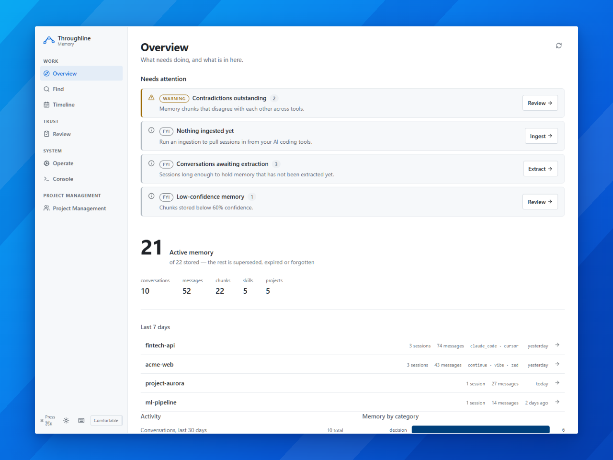
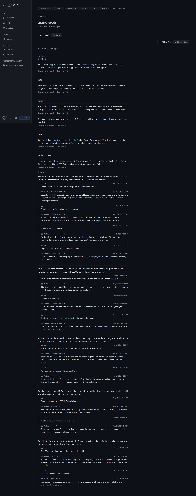
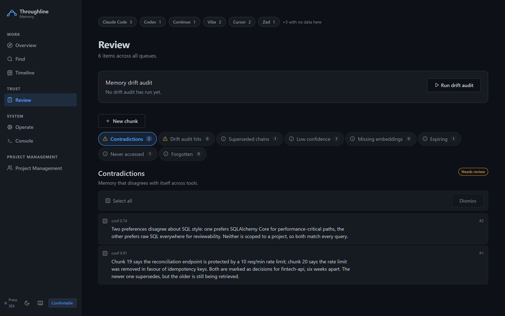
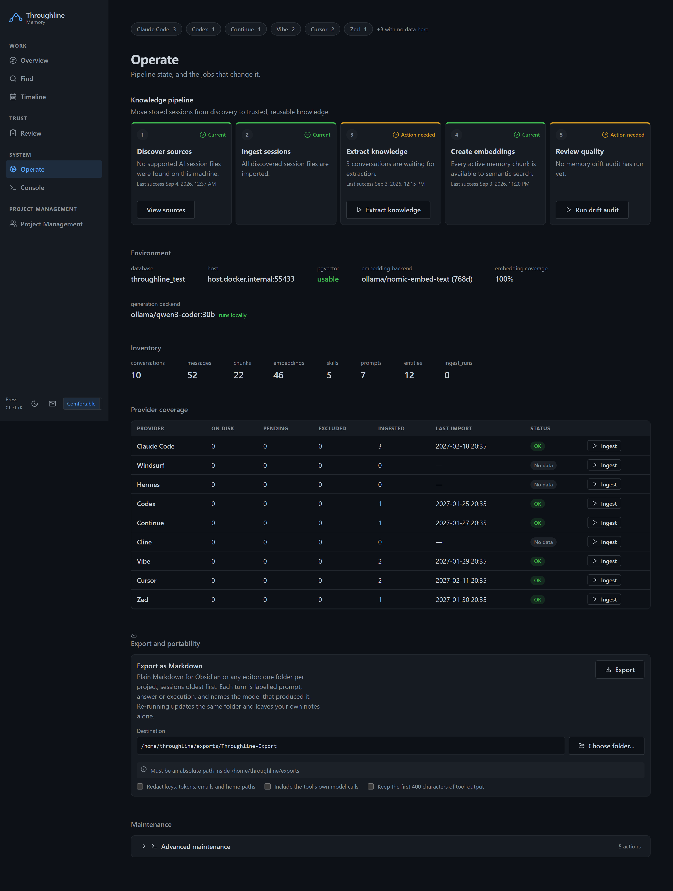
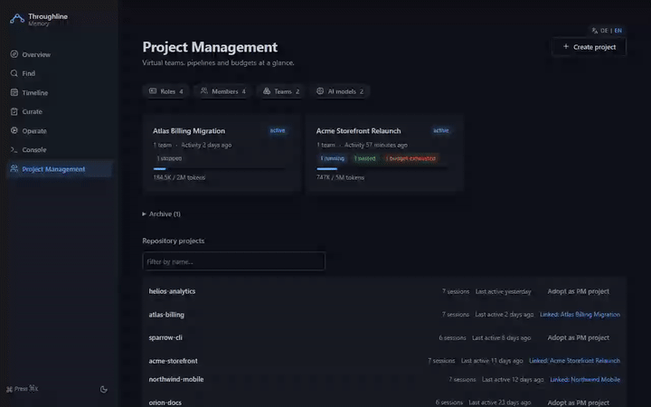

# Throughline

[](LICENSE)
[](pyproject.toml)
[](sql/schema.sql)
[](CHANGELOG.md)

**Your AI work should compound. Throughline makes it searchable, structured, and reusable.**

Throughline imports the sessions that AI coding tools already store on your computer. It brings them into one local PostgreSQL database, organises them by project, extracts durable knowledge, and keeps every result linked to its source.

You can change tools without abandoning what you learned in the last one. Throughline currently reads Claude Code, Cline, Codex CLI, Continue, Cursor, Hermes, Vibe, Windsurf, and Zed.



No account. No telemetry. No proprietary archive.

## The problem it solves

AI tools remember their own sessions, if they remember them at all. They do not know what happened in another tool. Useful decisions disappear into transcripts. Fixes get rediscovered. Context has to be explained again.

Throughline treats those transcripts as one body of work.

- A project becomes a continuous document with its sessions and extracted knowledge.
- Find searches conversations, messages, memory, skills, projects, and prompts together.
- Ask turns retrieved records into a cited answer.
- Timeline shows how work evolved across tools.
- Review exposes contradictions, drift, stale knowledge, and weak evidence.
- Markdown export and MCP put the knowledge back into the tools where you need it.

The result is not another chat history. It is working memory you control.

## What the interface does

The navigation follows the work rather than the storage model.

| Area | Purpose |
|---|---|
| **Overview** | Shows what needs attention, then the projects active in the last seven days. |
| **Projects** | Combines structured knowledge with the complete project transcript. Switch between oldest first and newest first. |
| **Find** | Runs one lexical and semantic query across every stored object. Copy selected context as clean Markdown. |
| **Ask** | Answers from your records and cites the messages or memory chunks it used. Copy the answer with its sources. |
| **Timeline** | Browses the same corpus by date and tool. Open any active day and follow it back to the session. |
| **Review** | Works through contradictions, drift, superseded chains, low confidence, missing embeddings, expiring records, unused records, and forgotten records. |
| **Operate** | Presents discovery, ingestion, extraction, embeddings, and quality review as one recoverable pipeline. |
| **Console** | Runs read-only SQL. PostgreSQL itself rejects writes. |

Project Management remains available as a separate area for local team pipelines. It does not compete with the personal knowledge workflow.

### One project, in full

The Project page opens in Document mode. It groups extracted knowledge by category, keeps provenance visible, and follows it with the complete transcript across every matching session. Content loads incrementally. One explicit action loads the complete project. Switching an incomplete document to newest first loads the remainder before reversing it, so a partial list never pretends to be the latest history.



Sessions mode keeps the compact searchable index for fast navigation.

### Find it, answer it, reuse it

Find and Ask share filters and stable URL state. Recent queries stay in the browser. They are not written to PostgreSQL.

Find is for retrieval. Ask is for synthesis. Both can produce Markdown that carries its source references into another AI tool.


Every answer states which model produced it and whether the request stayed on the machine. An uncited answer is labelled as unverified. When generation is unavailable, Throughline still returns the records it found.

### Trust needs its own workflow

Memory becomes dangerous when old decisions look current. Review makes that failure visible. Its drift audit samples extracted memory against the source conversations and records the result without changing either source conversations or memory chunks.



Destructive actions require confirmation. Forgetting repairs related references and leaves an audit record. The interface offers an undo window for reversible review actions.

### Operate the pipeline, not a wall of jobs

Operate shows five stages in order: discover sources, ingest sessions, extract knowledge, create embeddings, and review quality. Each stage states whether it is current, due, running, blocked, or failed. The next useful action stays beside the stage that needs it.



Markdown export includes an in-app folder browser. Server-side browsing is confined to `THROUGHLINE_EXPORT_ROOT`. A container cannot open the host operating system's native folder dialog, so the browser presents only the directory tree the service is allowed to use.

### Built for daily use

Press `Cmd+K` on macOS or `Ctrl+K` elsewhere for the command palette. It navigates, finds specific records, and runs safe pipeline jobs. Press `/` to focus search. Press `g` and then `o`, `f`, `t`, `c`, `p`, `s`, or `m` to move between areas.

Comfortable and compact density settings persist locally. The interface supports keyboard navigation, visible focus, reduced motion, narrow screens, and light or dark themes.

## Quick start with Docker

Docker Compose is the shortest supported path. It includes PostgreSQL 16 with pgvector and serves the app on loopback.

```bash
git clone https://github.com/mkupermann/throughline.git
cd throughline
python3 scripts/init_compose_env.py
docker compose up -d
docker compose exec web throughline ingest --all
```

On Windows, use `py -3 scripts/init_compose_env.py` if `python3` is not available.

Open [http://127.0.0.1:8788](http://127.0.0.1:8788).

The setup script creates an ignored `.env` with a random database password. Source directories are mounted read-only. The web API binds to loopback because it has no authentication. The first ingestion is explicit.

### Keep the database safe

The PostgreSQL named volume contains the corpus. Rebuilding or replacing the web container does not remove it.

Do not run `docker compose down -v` unless you intend to destroy the database. Use the normal update path instead:

```bash
git pull
docker compose build web migrate
docker compose up -d migrate web
docker compose exec web throughline doctor
```

Create a verified backup before a major update:

```bash
docker compose exec web throughline backup
```

See [Deployment](docs/DEPLOYMENT.md) for upgrades, credential rotation, backups, and recovery.

## Local models

Embeddings enable semantic search. A generation model powers Ask, extraction, titles, and reflection. These are different jobs and need different models.

```bash
docker compose --profile embeddings up -d ollama
docker exec throughline-ollama ollama pull nomic-embed-text
docker exec throughline-ollama ollama pull qwen3.5:9b
docker compose exec web throughline embed --backend ollama
```

Use a smaller or larger generation model to match the machine. Throughline inspects the models Ollama actually has. `throughline doctor` reports what will run.

Model use is an explicit privacy boundary:

| Operation | Local when |
|---|---|
| Embeddings | `--backend ollama` is selected, or `auto` runs without `OPENAI_API_KEY` |
| Ask | the resolved generation backend is local |
| Extraction, titles, and reflection | the resolved generation backend is local |

Embedding `auto` uses hosted OpenAI when `OPENAI_API_KEY` is present. Generation `auto` prefers a reachable local Ollama model, then a configured OpenAI-compatible endpoint, then hosted OpenAI. Set the backend explicitly when content must stay on the machine.

## Supported sources

| Tool | Session location |
|---|---|
| Claude Code | `~/.claude/projects/` |
| Cline | the editor's `globalStorage` task directory |
| Codex CLI | `~/.codex/sessions/` |
| Continue | `~/.continue/sessions/` |
| Cursor | `~/.cursor/sessions/` |
| Hermes | `~/.hermes/sessions/` |
| Vibe | `~/.vibe/logs/session/` |
| Windsurf | `~/.windsurf/plans/` |
| Zed | `~/.zed/data/sessions/` |

Adapters normalise each source into conversations and messages. Re-ingestion is idempotent. Changed source files refresh their stored conversation without creating duplicates. Third-party adapters can register through the `throughline.adapters` entry point. See [Adapter development](docs/ADAPTER_DEVELOPMENT.md).

## The daily loop

Most days Throughline should update itself in the background.

| Platform | Scheduler | Setup |
|---|---|---|
| macOS | per-user launchd agents | [`launchd/`](launchd/) |
| Linux | systemd user timers | [`systemd/`](systemd/) |
| Windows | Task Scheduler | [`windows/`](windows/) |

The scheduled jobs ingest hourly, extract daily, and back up daily. The Windows scripts detect a running Docker setup and use it directly. Native installations use the same commands with a local environment file.

When you need something back:

```bash
throughline ask "why did we change the ingestion queue?"
throughline search "pgvector index"
throughline serve
```

When you need to inspect the system:

```bash
throughline status
throughline doctor
throughline conflicts
throughline migrate --status
```

The complete command guide is in [Usage](docs/USAGE.md).

## Take the knowledge with you

Markdown export writes one folder per project. Sessions remain chronological and large projects split into manageable dated parts. Re-running updates files Throughline owns and leaves your own notes alone.

```bash
throughline export-markdown --out ~/Documents/Throughline
throughline export-markdown --out ~/Documents/Throughline --project throughline
throughline export-markdown --out ~/Documents/Throughline --redact
```

The redaction pass removes common key, token, email, and home-path shapes. It reduces exposure but cannot prove that arbitrary transcript content is safe. Review an export before placing it in a shared or cloud-synced folder.

The MCP server in [`memory_mcp/`](memory_mcp/) lets compatible clients search, recall, write, supersede, and forget shared memory while they work. The optional Claude Code SessionStart hook can preload a short project-scoped context file.

## Architecture

- Python and FastAPI provide the CLI, API, jobs, and server.
- React, TypeScript, Vite, and TanStack Query provide the web interface.
- PostgreSQL 16 and pgvector store the corpus and vector index.
- Ollama or an OpenAI-compatible endpoint can provide local generation.
- The built frontend ships inside the Python package. Installing Throughline does not require Node.

Schema changes use ordered migrations. Compose applies them before the web service starts. `throughline migrate --status` shows what is applied and what remains.

## Native installation

The native route is intended for a machine that already has PostgreSQL 16 and pgvector.

```bash
git clone https://github.com/mkupermann/throughline.git
cd throughline
python3 -m venv .venv
source .venv/bin/activate
pip install -e .
createdb throughline
throughline migrate
throughline ingest --all
throughline serve
```

The application reads standard `PG*` variables and an ignored repository-root `.env`. The native server defaults to [http://127.0.0.1:8790](http://127.0.0.1:8790).

Full setup details are in [Installation](docs/INSTALLATION.md).

## Project Management

The optional Project Management area defines projects, team pipelines, roles, members, model providers, and hard token budgets. It can launch supported local agent workflows or adopt an external run and display its history.



The walkthrough uses fictional data from [`scripts/seed_demo_data.py`](scripts/seed_demo_data.py). An [MP4 version](docs/assets/pm-walkthrough.mp4) and [captions](docs/assets/pm-walkthrough.srt) are also available.

## Development

Install the development dependencies, then run the same checks as CI:

```bash
pip install -r requirements-dev.txt
pytest tests/ -m "not integration" --ignore=tests/integration
ruff check throughline memory_mcp scripts skill/scripts evals tests
black --check throughline memory_mcp scripts skill/scripts evals tests
npm --prefix web ci
npm --prefix web run typecheck
npm --prefix web test
npm --prefix web run build
```

Integration tests require a disposable PostgreSQL 16 instance with pgvector. The frontend suite currently contains 192 tests. Documentation screenshots are generated from [`examples/demo_data.sql`](examples/demo_data.sql), never from a personal database. The capture procedure is in [`docs/screenshots/`](docs/screenshots/).

Contributions are welcome. Read [Contributing](CONTRIBUTING.md) and the [Code of Conduct](CODE_OF_CONDUCT.md). Report bugs in [Issues](https://github.com/mkupermann/throughline/issues). Report security problems through the channel in [Security](SECURITY.md).

## Status

Throughline is beta software. Its schema is migration-tracked and its core paths run in CI against PostgreSQL. Back up a corpus you care about. Treat every model boundary as a data boundary.

## License

Throughline is released under the [MIT License](LICENSE).
