<p align="center">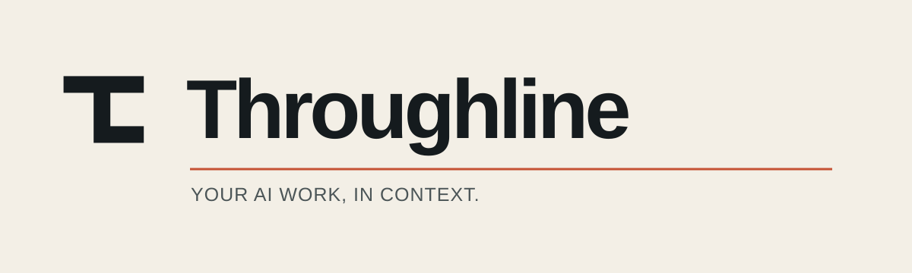</p>

[](LICENSE)
[](pyproject.toml)
[](sql/schema.sql)
[](https://github.com/mkupermann/throughline/actions/workflows/ci.yml)
[](CHANGELOG.md)

**Open a project after four weeks. Understand what you investigated, why the decisions changed, which results still hold, and what comes next.**

Throughline brings locally stored AI conversations into a source-linked project history. It imports sessions from nine supported tools into PostgreSQL, keeps prompts and answers in their conversations, and helps you resume work without assembling the story from separate archives.

The core workflow works without a connected AI model. Optional models add semantic search, extraction and generated answers. Run it locally for one person, or enable authenticated team mode for a controlled internal workspace with one shared corpus. Team mode adds viewer/editor/admin accounts and a change history; it does not isolate confidential projects from other members.

[Start locally](#quick-start-with-docker) · [Deploy a shared workspace](docs/TEAM_DEPLOYMENT.md) · [Upgrade an existing installation](docs/UPGRADING.md) · [Watch the walkthroughs](#see-every-area) · [Try fictional data](docs/DEMO.md) · [Data-model audit](docs/PROJECT_STORY.md) · [What is still missing](docs/ROADMAP.md)

## One complete processing pass

Use **Process everything** in Projects, Timeline or Operate. One click starts a complete pass through configured sources and pending records:

**Import → skills → prompts → project names → conversation titles → knowledge → entities → reflection → embeddings → extraction audit → diagnostics.**

The button shows progress and provides **Stop**. The pass removes the individual buttons' small batch limits, attempts later steps after a failure and reports an incomplete result if anything fails or is blocked. Reflection creates review suggestions; it does not automatically confirm or merge knowledge. Export remains separate because it needs a destination.

Processing requests and completed steps are saved in PostgreSQL. Closing the browser or restarting the web process does not discard them. After a worker or container interruption, processing resumes and skips finished steps; the interrupted step may run again. This is at-least-once processing, so an already submitted remote request may be repeated. Each execution attempt has a 24-hour limit for a full pass, or one hour for an individual job.

Open **AI settings** to choose a provider and model for each purpose. Saved selections never silently switch providers. Source-derived project names are marked as AI suggestions and link to their conversations; user-saved labels take precedence.

[Processing and AI settings guide](docs/AI_PROCESSING.md) · [Processing video](https://raw.githubusercontent.com/mkupermann/throughline/main/docs/videos/processing.mp4) · [AI settings video](https://raw.githubusercontent.com/mkupermann/throughline/main/docs/videos/ai-settings.mp4)

## Follow the work

1. **Choose a project.** See its recorded goal, current position, blocker and next step, with links to the messages supporting them.
2. **Follow its conversations.** Browse across tools and dates. Expand a conversation to read the full messages and their extracted notes.
3. **Inspect the evidence.** Prompt, answer and recorded output have distinct labels. Timestamps include seconds and timezone when available. An absent timestamp or unrecorded file is shown as missing.
4. **See what changed.** Earlier project notes remain available. A superseded memory points to its replacement and source conversation.
5. **Prepare the next session.** Select conversations, inspect a compact Markdown handoff, then download it for another tool.

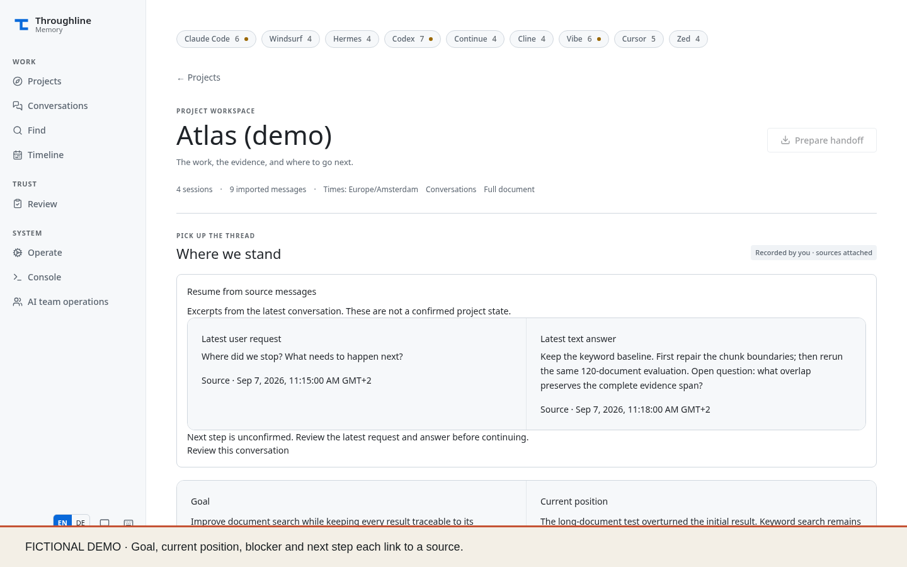

The collapsed conversation card previews the **first prompt**, **last recorded answer**, and **latest recorded tool output or file-reference count**. These are explicitly labelled excerpts, not an inferred prompt/answer pairing. Open the conversation to inspect the sequence. A tool output is not automatically proof that a file was successfully created; explicit file blocks are shown as references, without claiming the file still exists.

## A project is the context

Conversations belong in projects. Messages and extracted memories belong in their conversations. A message may be a search hit or a direct source link, but it is not an independent event on the Timeline.

Imported conversations initially use source working-folder groups. Matching names can include multiple folders; the project view exposes those folders and lets you filter them. Use **Create a project**, then **Project assignment and history** inside a conversation to place it explicitly. Assignments survive re-import and retain the original source folder. Display labels are separate: a user-saved label takes precedence, followed by a generated suggestion, then a source excerpt while naming is pending. Changing a label does not reassign conversations. Assignment history records corrections. Earlier project notes stay where they were recorded and flag a source that has moved.

Time order describes chronology, not causality. Throughline displays supported explicit source relationships where recorded; it does not infer a dependency because two sessions happened close together. See the [relationship and provenance audit](docs/PROJECT_STORY.md).

## See every area

The demo seeder reseeds its target tables; use a separate database ending in `_demo`. Its optional `--reset` flag drops that demo database.

The animated previews below play directly in this README. Click a preview or **Full video** to open its MP4. Every recording uses the actual English interface and the bundled fictional corpus. Videos have burned-in English captions and separate WebVTT tracks. They demonstrate navigation and inspection; no real model call or agent execution is presented as a demo result.

| Area and walkthrough | Animated preview |
|---|---|
| **Projects**<br>Find Atlas and recover its source-linked state.<br>[Full video](https://raw.githubusercontent.com/mkupermann/throughline/main/docs/videos/projects.mp4) · [Captions](docs/videos/projects.vtt) | [](https://raw.githubusercontent.com/mkupermann/throughline/main/docs/videos/projects.mp4) |
| **Workspace access**<br>Sign in and inspect shared-workspace accounts, roles and changes.<br>[Full video](https://raw.githubusercontent.com/mkupermann/throughline/main/docs/videos/workspace-access.mp4) · [Captions](docs/videos/workspace-access.vtt) | [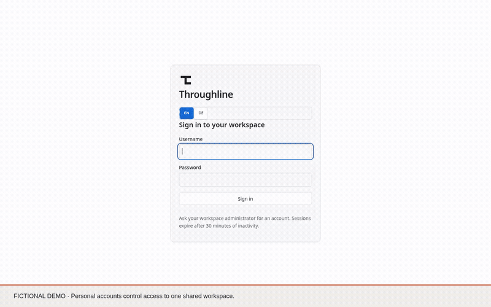](https://raw.githubusercontent.com/mkupermann/throughline/main/docs/videos/workspace-access.mp4) |
| **Project assignment**<br>Create a project and correct a conversation’s membership with its source history intact.<br>[Full video](https://raw.githubusercontent.com/mkupermann/throughline/main/docs/videos/project-assignment.mp4) · [Captions](docs/videos/project-assignment.vtt) | [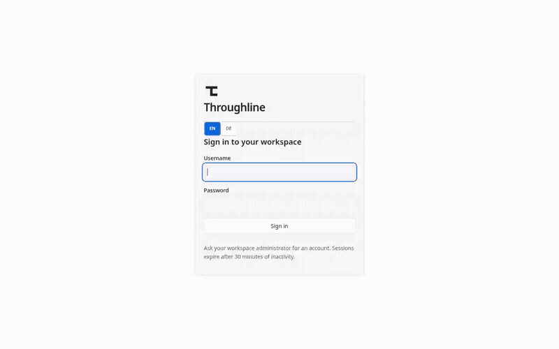](https://raw.githubusercontent.com/mkupermann/throughline/main/docs/videos/project-assignment.mp4) |
| **Conversations**<br>Choose a project, open a conversation and inspect its output reference.<br>[Full video](https://raw.githubusercontent.com/mkupermann/throughline/main/docs/videos/conversations.mp4) · [Captions](docs/videos/conversations.vtt) | [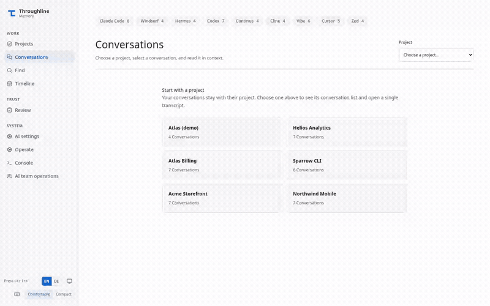](https://raw.githubusercontent.com/mkupermann/throughline/main/docs/videos/conversations.mp4) |
| **Find**<br>Search imported records with their source context.<br>[Full video](https://raw.githubusercontent.com/mkupermann/throughline/main/docs/videos/find.mp4) · [Captions](docs/videos/find.vtt) | [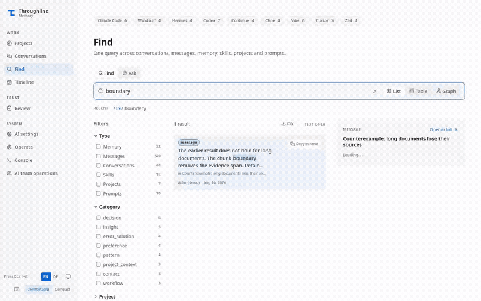](https://raw.githubusercontent.com/mkupermann/throughline/main/docs/videos/find.mp4) |
| **Timeline**<br>Open a dated bucket, then expand conversations within their project context.<br>[Full video](https://raw.githubusercontent.com/mkupermann/throughline/main/docs/videos/timeline.mp4) · [Captions](docs/videos/timeline.vtt) | [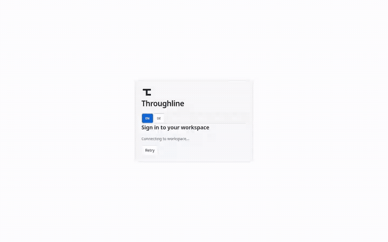](https://raw.githubusercontent.com/mkupermann/throughline/main/docs/videos/timeline.mp4) |
| **Review**<br>Inspect contradictory and superseded knowledge.<br>[Full video](https://raw.githubusercontent.com/mkupermann/throughline/main/docs/videos/review.mp4) · [Captions](docs/videos/review.vtt) | [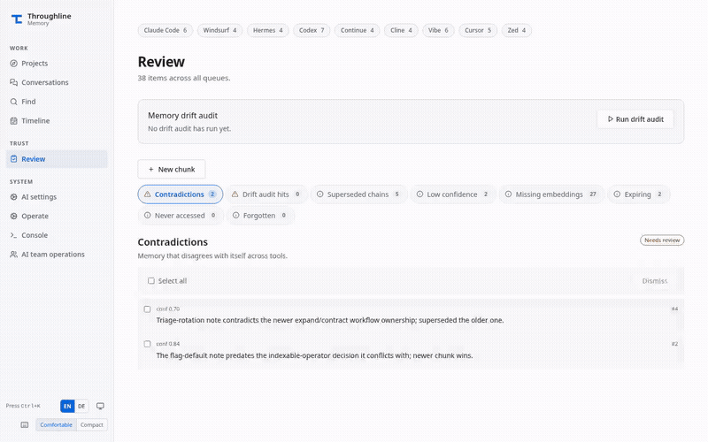](https://raw.githubusercontent.com/mkupermann/throughline/main/docs/videos/review.mp4) |
| **Operate**<br>Understand import, extraction and embedding stages.<br>[Full video](https://raw.githubusercontent.com/mkupermann/throughline/main/docs/videos/operate.mp4) · [Captions](docs/videos/operate.vtt) | [](https://raw.githubusercontent.com/mkupermann/throughline/main/docs/videos/operate.mp4) |
| **Complete processing**<br>Inspect all eleven steps, the start button and recovery behavior.<br>[Full video](https://raw.githubusercontent.com/mkupermann/throughline/main/docs/videos/processing.mp4) · [Captions](docs/videos/processing.vtt) | [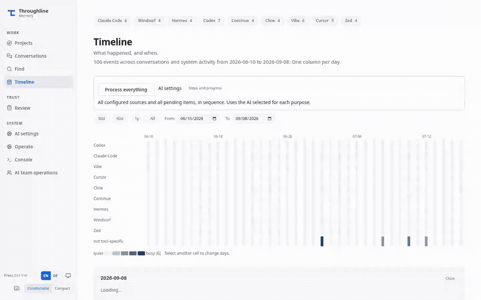](https://raw.githubusercontent.com/mkupermann/throughline/main/docs/videos/processing.mp4) |
| **AI settings**<br>Choose local models, hosted APIs or installed CLIs per purpose.<br>[Full video](https://raw.githubusercontent.com/mkupermann/throughline/main/docs/videos/ai-settings.mp4) · [Captions](docs/videos/ai-settings.vtt) | [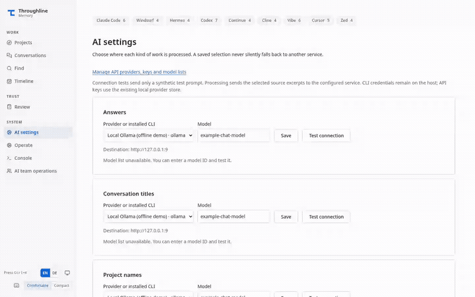](https://raw.githubusercontent.com/mkupermann/throughline/main/docs/videos/ai-settings.mp4) |
| **Console**<br>Count conversations by source with read-only SQL.<br>[Full video](https://raw.githubusercontent.com/mkupermann/throughline/main/docs/videos/console.mp4) · [Captions](docs/videos/console.vtt) | [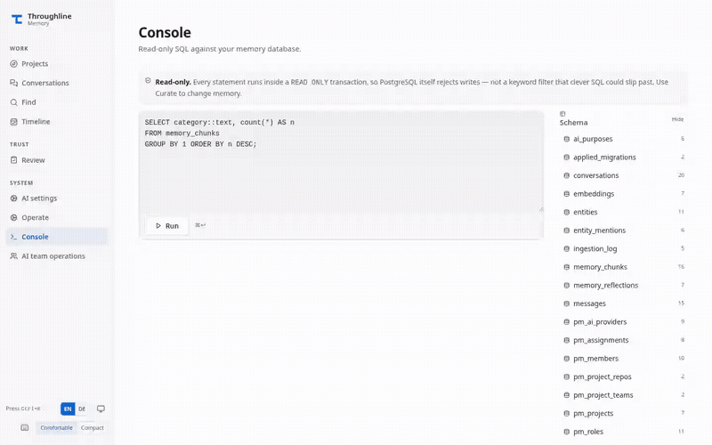](https://raw.githubusercontent.com/mkupermann/throughline/main/docs/videos/console.mp4) |
| **AI team operations**<br>Inspect linked projects, task states and budgets.<br>[Full video](https://raw.githubusercontent.com/mkupermann/throughline/main/docs/videos/teams.mp4) · [Captions](docs/videos/teams.vtt) | [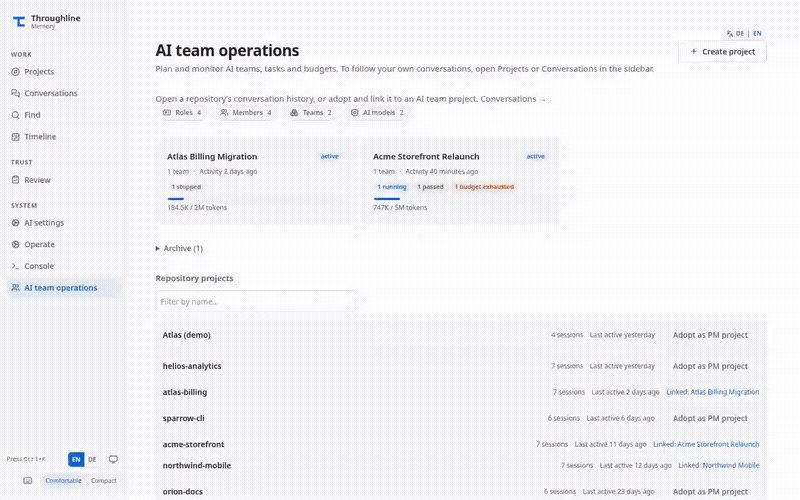](https://raw.githubusercontent.com/mkupermann/throughline/main/docs/videos/teams.mp4) |
| **Roles**<br>Separate analysis, execution, testing and review responsibilities.<br>[Full video](https://raw.githubusercontent.com/mkupermann/throughline/main/docs/videos/roles.mp4) · [Captions](docs/videos/roles.vtt) | [](https://raw.githubusercontent.com/mkupermann/throughline/main/docs/videos/roles.mp4) |
| **Members**<br>Inspect fictional people and agents.<br>[Full video](https://raw.githubusercontent.com/mkupermann/throughline/main/docs/videos/members.mp4) · [Captions](docs/videos/members.vtt) | [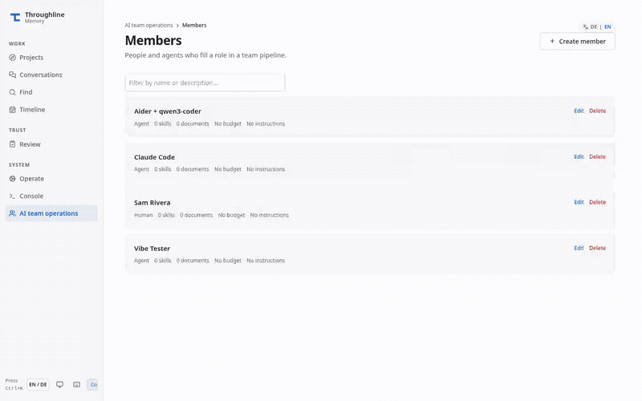](https://raw.githubusercontent.com/mkupermann/throughline/main/docs/videos/members.mp4) |
| **Team pipelines**<br>Inspect reusable team configuration.<br>[Full video](https://raw.githubusercontent.com/mkupermann/throughline/main/docs/videos/pipelines.mp4) · [Captions](docs/videos/pipelines.vtt) | [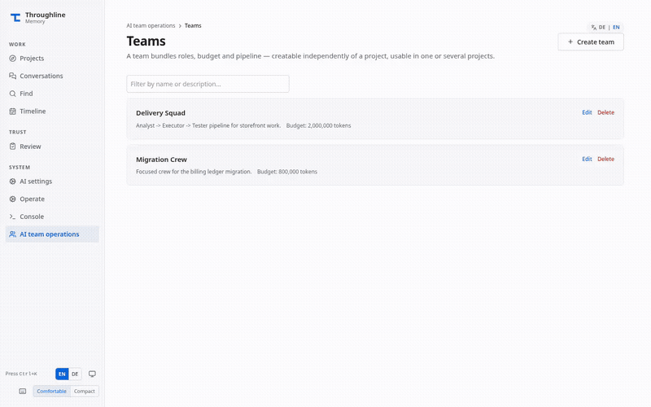](https://raw.githubusercontent.com/mkupermann/throughline/main/docs/videos/pipelines.mp4) |
| **Model providers**<br>Inspect provider configuration independently of project history.<br>[Full video](https://raw.githubusercontent.com/mkupermann/throughline/main/docs/videos/models.mp4) · [Captions](docs/videos/models.vtt) | [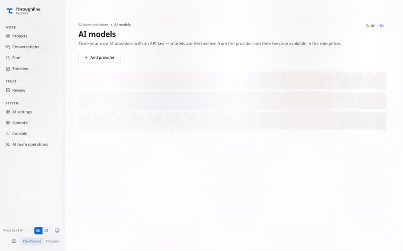](https://raw.githubusercontent.com/mkupermann/throughline/main/docs/videos/models.mp4) |

[Video gallery and captions](docs/videos/README.md) · [Reproduce the recordings](docs/DEMO.md)

Use **EN / DE** in the sidebar to switch interface language; the choice is shared with AI team operations and saved in this browser. English is the default. Imported conversations, project notes, tool output and file names retain their original language. Technical identifiers and diagnostic output can remain English. This README and the walkthroughs are English.

The navigation keeps daily work separate from system operations. Labels remain visible in narrow panels. Use `Ctrl+K` / `Cmd+K` for the command palette; `g` then `v` opens Conversations. Project history is the default project view; **Full document** opens the alternative complete document layout.

## Know what you can trust

| What you see | What it means |
|---|---|
| A project-state note | A user-recorded statement with a source; it is not independent verification |
| Extracted memory | A model-derived note to inspect in its conversation |
| A replacement or supersession | The earlier statement remains traceable; status alone does not establish truth |
| A generated answer | A model response whose citations need checking |
| A file reference | An explicit recorded output block; current file availability is not verified |
| A missing relationship or timestamp | The imported data did not establish it |

Counts describe imported records, not every conversation that ever existed. Unsupported formats, missing files, source timestamps and excluded automation can limit coverage. The project view exposes its source folders, refresh time and automation filter. The latest state fields remain separate from the last 100 historical state notes.

## Quick start with Docker

Docker Compose is the shortest supported path. It includes PostgreSQL 16 with pgvector and serves the app on loopback.

```bash
git clone https://github.com/mkupermann/throughline.git
cd throughline
python3 scripts/init_compose_env.py
docker compose up -d
docker compose exec web throughline ingest --all
```

On Windows, use `py -3 scripts/init_compose_env.py` if `python3` is not available.

Open [http://127.0.0.1:8788](http://127.0.0.1:8788).

The initializer detects Cline’s task directory for macOS, Linux or Windows. For another editor profile, set `THROUGHLINE_CLINE_DIR` in `.env` after initialization to its task directory. Other source mounts are listed in `docker-compose.yml`.

The setup script creates an ignored `.env` with a random database password. Source directories are mounted read-only. The default local mode has no login and binds to loopback. For colleagues, configure [team mode and a TLS proxy](docs/TEAM_DEPLOYMENT.md). The first ingestion is explicit.

### Keep the database safe

The PostgreSQL named volume contains the corpus. Rebuilding or replacing the web container does not remove it.

Do not run `docker compose down -v` unless you intend to destroy the database. Use the normal update path instead:

```bash
git pull
docker compose build web migrate
docker compose up -d migrate web
docker compose exec web throughline doctor
```

Create a verified backup before a major update:

```bash
docker compose exec web throughline backup
```

See [Deployment](docs/DEPLOYMENT.md) for upgrades, credential rotation, backups, and recovery.

## Choose the AI for each purpose

In **AI settings**, choose a provider and model independently for:

| Purpose | What the model receives |
| --- | --- |
| Answers | Retrieved source excerpts and your question |
| Conversation titles | A bounded conversation preview |
| Project names | Openings from up to eight recent conversations in the existing folder group |
| Knowledge and entities | Conversation excerpts |
| Reflection | Candidate knowledge records to compare |
| Search embeddings | Text to convert into vectors |

Generation supports **Ollama, OpenAI, Anthropic, Mistral, Gemini, OpenRouter and OpenAI-compatible APIs**, plus **Codex, Vibe and Claude Code** through the optional authenticated host CLI bridge. Models must support the requested operation and structured response format. The bridge uses the host's existing CLI login; Throughline does not supply subscriptions or model access. See [bridge setup](docs/AI_PROCESSING.md#host-cli-bridge).

Embeddings need an embedding API and a matching **768- or 1536-dimensional** model. Chat CLIs cannot provide them. Supported adapters are Ollama, OpenAI, Mistral, OpenRouter and OpenAI-compatible APIs. Vectors are kept separate by model and endpoint.

For a local setup:

```bash
docker compose --profile embeddings up -d ollama
docker exec throughline-ollama ollama pull nomic-embed-text
```

Also install a generation model that fits your machine. Open **AI settings → Manage API providers**, add the Ollama endpoint reachable from the application (`http://ollama:11434` for the Compose profile), then select your generation model for the five text purposes and `nomic-embed-text` with 768 dimensions for embeddings. Save and use **Test connection** before **Process everything**. Generation tests request structured JSON using synthetic content; embedding tests validate vector dimensions.

A local CLI can still call a hosted service. Check the destination for every purpose before processing private material. Provider API keys are stored as plaintext in the local database and are omitted from provider/settings API responses. Database access, backups and the read-only SQL Console can still expose stored credentials. See [Security](SECURITY.md).

A saved purpose selection takes precedence over legacy environment defaults and the embedding command's `--backend` option. Without a saved selection, the older configuration path remains: embedding `auto` uses OpenAI when `OPENAI_API_KEY` is set, while generation `auto` prefers local Ollama before configured hosted routes. To require local processing, explicitly save local providers for every purpose. Selected-provider failures remain errors; they never trigger a silent fallback.

## Supported sources

| Tool | Session location |
|---|---|
| Claude Code | `~/.claude/projects/` |
| Cline | the editor's `globalStorage` task directory |
| Codex CLI | `~/.codex/sessions/` |
| Continue | `~/.continue/sessions/` |
| Cursor | `~/.cursor/sessions/` |
| Hermes | `~/.hermes/sessions/` |
| Vibe | `~/.vibe/logs/session/` |
| Windsurf | `~/.windsurf/plans/` |
| Zed | `~/.zed/data/sessions/` |

Adapters normalise each source into conversations and messages. Re-ingestion is idempotent. Changed source files refresh their stored conversation without creating duplicates. Third-party adapters can register through the `throughline.adapters` entry point. See [Adapter development](docs/ADAPTER_DEVELOPMENT.md).

Codex rollouts from current app builds and older CLI builds are both supported. Parser upgrades reconsider files that an older parser could not read.

## The daily loop

Most days Throughline should update itself in the background.

| Platform | Scheduler | Setup |
|---|---|---|
| macOS | per-user launchd agents | [`launchd/`](launchd/) |
| Linux | systemd user timers | [`systemd/`](systemd/) |
| Windows | Task Scheduler | [`windows/`](windows/) |

The scheduled jobs ingest hourly, extract daily, and back up daily. The Windows scripts detect a running Docker setup and use it directly. Native installations use the same commands with a local environment file.

When you need something back:

```bash
throughline ask "why did we change the ingestion queue?"
throughline search "pgvector index"
throughline serve
```

When you need to inspect the system:

```bash
throughline status
throughline doctor
throughline conflicts
throughline migrate --status
```

The complete command guide is in [Usage](docs/USAGE.md).

## Take the knowledge with you

Markdown export writes one folder per project. Sessions remain chronological and large projects split into manageable dated parts. Re-running updates files Throughline owns and leaves your own notes alone.

```bash
throughline export-markdown --out ~/Documents/Throughline
throughline export-markdown --out ~/Documents/Throughline --project throughline
throughline export-markdown --out ~/Documents/Throughline --redact
```

The redaction pass removes common key, token, email, and home-path shapes. It reduces exposure but cannot prove that arbitrary transcript content is safe. Review an export before placing it in a shared or cloud-synced folder.

The MCP server in [`memory_mcp/`](memory_mcp/) lets compatible clients search, recall, write, supersede, and forget shared memory while they work. The optional Claude Code SessionStart hook can preload a short project-scoped context file.

## Architecture

- Python and FastAPI provide the CLI, API, jobs, and server.
- React, TypeScript, Vite, and TanStack Query provide the web interface.
- PostgreSQL 16 and pgvector store the corpus and vector index.
- Ollama or an OpenAI-compatible endpoint can provide local generation.
- The built frontend ships inside the Python package. Installing Throughline does not require Node.

Schema changes use ordered migrations. Compose applies them before the web service starts. `throughline migrate --status` shows what is applied and what remains.

## Native installation

The native route is intended for a machine that already has PostgreSQL 16 and pgvector.

```bash
git clone https://github.com/mkupermann/throughline.git
cd throughline
python3 -m venv .venv
source .venv/bin/activate
pip install -e .
createdb throughline
throughline migrate
throughline ingest --all
throughline serve
```

The application reads standard `PG*` variables and an ignored repository-root `.env`. The native server defaults to [http://127.0.0.1:8790](http://127.0.0.1:8790).

Full setup details are in [Installation](docs/INSTALLATION.md).

## Optional AI-team operations

The system area can configure projects, roles, members, pipelines, providers and token budgets, and inspect supported local agent runs. Its project records are separate from imported-history projects and are connected through explicit links. A linked project name opens its conversation history.

This remains an advanced setup workflow. A guided path from project goal to team to first task, project-level confidentiality, SSO/MFA and broader organizational user validation remain open. Conversation assignment and shared-workspace account roles are available now. See [the roadmap](docs/ROADMAP.md).

## Development

Install the development dependencies, then run the same checks as CI:

```bash
pip install -r requirements-dev.txt
pytest tests/ -m "not integration" --ignore=tests/integration
ruff check throughline memory_mcp scripts skill/scripts evals tests
black --check throughline memory_mcp scripts skill/scripts evals tests
npm --prefix web ci
npm --prefix web run typecheck
npm --prefix web test
npm --prefix web run build
```

Integration tests require a disposable PostgreSQL 16 instance with pgvector. Current walkthroughs use [`scripts/seed_demo_data.py`](scripts/seed_demo_data.py). The older screenshot fixture remains in [`examples/demo_data.sql`](examples/demo_data.sql). See [demo reproduction](docs/DEMO.md) for the current media workflow.

Contributions are welcome. Read [Contributing](CONTRIBUTING.md) and the [Code of Conduct](CODE_OF_CONDUCT.md). Report bugs in [Issues](https://github.com/mkupermann/throughline/issues). Report security problems through the channel in [Security](SECURITY.md).

## Status

Throughline is beta software. Its schema is migration-tracked and its core paths run in CI against PostgreSQL. Back up a corpus you care about. Treat every model boundary as a data boundary.

## License

Throughline is released under the [MIT License](LICENSE).
