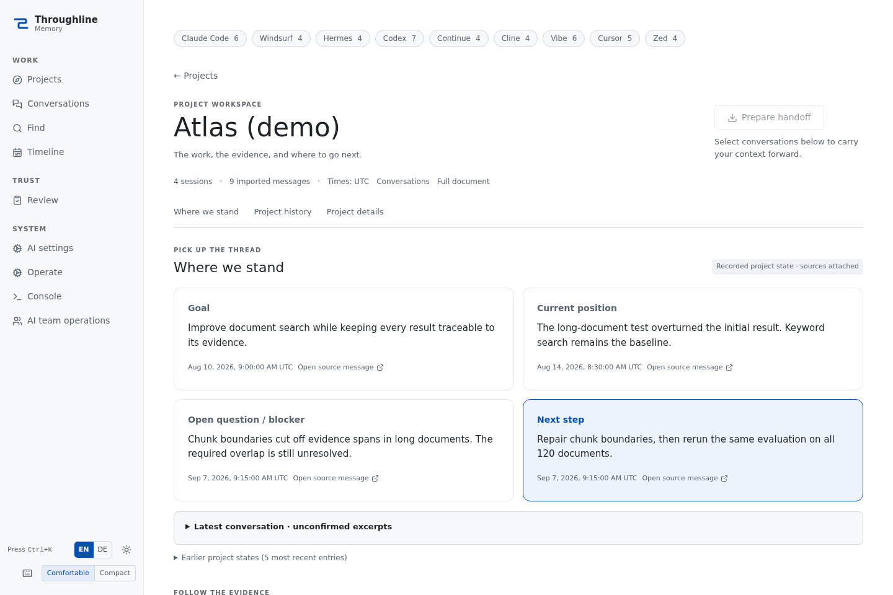
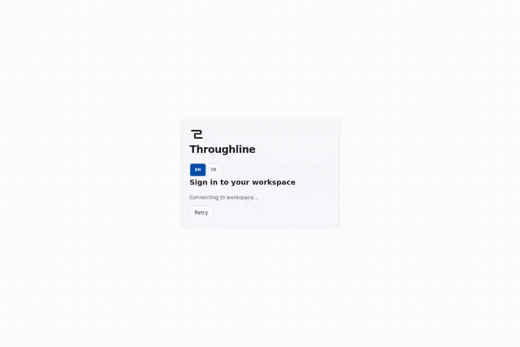
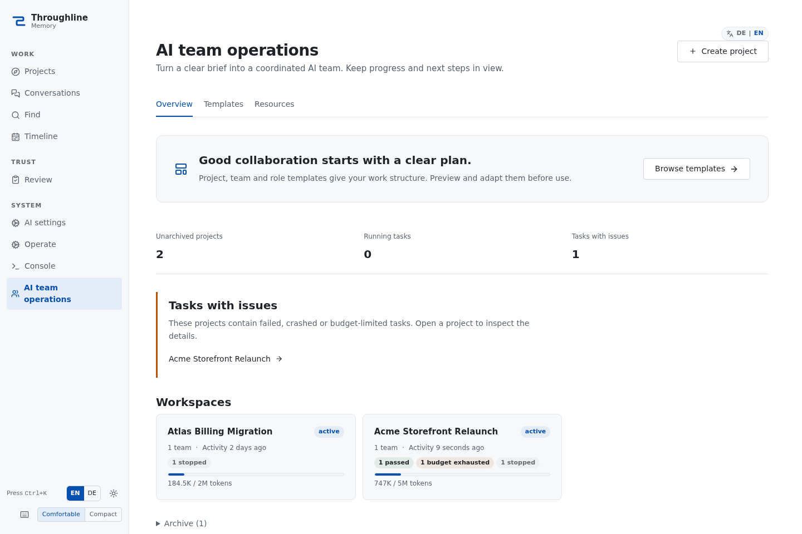
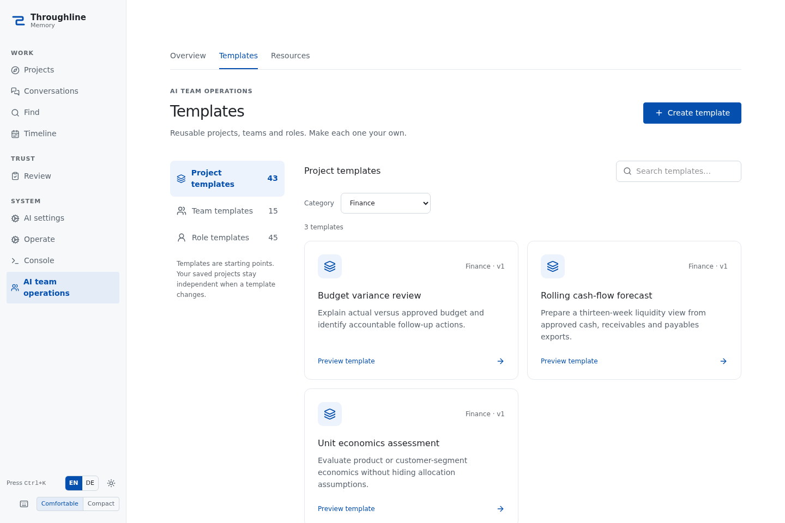
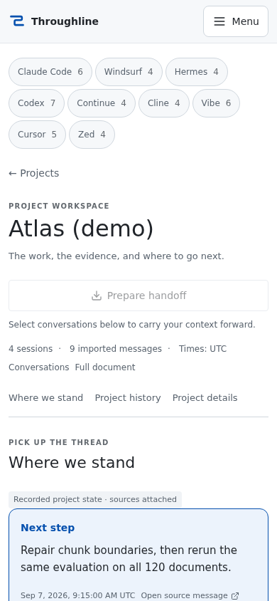
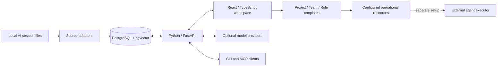

<p align="center">
  <picture>
    <source media="(prefers-color-scheme: dark)" srcset="docs/brand/throughline-wordmark-dark.svg">
    
  </picture>
</p>

<p align="center"><strong>Recover the context. Organize the team. Continue the work.</strong></p>

<p align="center">
  <a href="LICENSE"></a>
  <a href="pyproject.toml"></a>
  <a href="sql/schema.sql"></a>
  <a href="https://github.com/mkupermann/throughline/actions/workflows/ci.yml"></a>
  <a href="CHANGELOG.md"></a>
</p>

Throughline is a self-hosted workspace for AI-assisted projects. Bring conversations from nine tools into one source-linked history, recover the decisions behind your work, and configure AI teams with reusable project, team and role templates.

**Return after a month and know what happened, what supports it, and what to do next.** Your conversations stay connected to their projects. Your teams start with a brief, defined responsibilities and review criteria.

[Quick start](#quick-start) · [Product tour](#see-throughline) · [Template library](#a-template-library-for-real-work) · [Documentation](#documentation) · [Contributing](CONTRIBUTING.md)



## From scattered sessions to continued work

| Recover project context | Prepare AI team operations |
|---|---|
| Import local sessions from Claude Code, Codex, Vibe and six other tools. | Start with a project template and its linked team and roles. |
| Inspect recorded goals, blockers, next steps and supporting messages. | Customize objectives, deliverables and acceptance criteria. |
| Search across tools without losing the original conversation. | Keep role responsibilities separate from model assignments. |
| Select sessions and download a Markdown handoff for your next tool. | Save editable resources with their original template versions. |

The core import, browsing and handoff workflow works without a connected model. Optional AI adds extraction, semantic search and generated answers. Light and dark themes, English and German navigation, and a mobile drawer keep the same workspace usable across devices.

**Team templates configure work; they do not execute it by themselves.** Launching agent runs requires a separately installed compatible executor. Workflow instructions and review policies are guidance, not automatically enforced approval gates.

## Continue work without rebuilding context

Open a project and choose **Continue this project** for a bounded Markdown brief of recorded knowledge and recent conversation excerpts, with links back to the evidence.
It runs locally without an AI call and is also available as the MCP tool `continue_project(project, max_chars=12000)`.
Excerpts are historical evidence, not verified instructions: the brief does not inspect current code, infer task completion, or invent missing decisions.

In **Operate**, use **Process recent conversations** to select one project or the newest conversations across projects, with a per-stage limit.
Successful source versions—including valid empty results—are checkpointed atomically with their derived records.
Unchanged versions are skipped on later runs; edited versions become eligible again.
Existing history without checkpoints needs one initial pass.
API processing supports one to four workers; CLI processing stays serial to avoid contention on the host bridge.
Timings and approximate remaining time are measured during processing; no fixed speedup or automatic model switch is promised.
Use **Embeddings first** to make existing knowledge searchable without waiting for the full enrichment pass.

Expand **Where is my data?** to compare stored, visible, and generated conversations, historical project records and separate Operations projects.
The same panel shows the connected database, pending extraction versions and actual model selections.
Database health does not certify backups; restore verification remains an external deployment responsibility.
See [processing and recovery](docs/AI_PROCESSING.md) for checkpoint, retry and concurrency details.

## See Throughline

[](docs/media/throughline-tour.mp4)

[Watch the full video](docs/media/throughline-tour.mp4) · [English captions](docs/media/throughline-tour.vtt) · [Template walkthrough](docs/media/templates-tour.mp4) · [Template captions](docs/media/templates-tour.vtt) · [Earlier feature walkthroughs](docs/videos/README.md)

The tour and screenshots show the actual application with fictional demonstration data. The full tour has burned-in English captions and a separate caption track; the GIF is a short preview. They demonstrate navigation and template inspection, not completed model calls or autonomous agent execution. To run your own demonstration, follow the [demo guide](docs/DEMO.md) using a separate database ending in `_demo`.

| AI Team Operations | Template library |
|---|---|
|  |  |

<details>
<summary>See the mobile workspace</summary>

<p align="center"></p>

</details>

## A template library for real work

Open **AI Team Operations → Templates** to search the library, filter by category, preview a template and create an editable resource.

| Template type | What it provides |
|---|---|
| **Project** | Objective, required inputs, planned stages, deliverables, acceptance criteria and a linked team. |
| **Team** | Role composition, collaboration order, handoff expectations and review policy. |
| **Role** | Responsibilities, instructions, requested tools and expected output. |

Projects create their linked teams and roles together. Instances retain a template snapshot; editing the library does not silently rewrite existing work. Assign models, providers and members through the resource editors after creation.

**103 starter templates: 43 projects, 15 teams and 45 roles.** Fourteen professional categories each provide three project blueprints, one team and three specialist roles, alongside five general product-improvement starters: one project, one team and three roles. [Browse the complete catalog, deliverables and usage guide](docs/TEMPLATES.md).

| Category | Example project templates |
|---|---|
| **Finance** | Rolling cash-flow forecast · Budget variance review · Unit economics assessment |
| **Science** | Reproducible experiment · Structured literature review · Dataset quality assessment |
| **Education** | Course module design · Assessment and feedback pack · Learning support intervention |
| **Enterprise** | Application portfolio review · Enterprise AI pilot · Change readiness assessment |
| **Mid-size business** | Sales-to-delivery handoff · ERP selection brief · Capacity and hiring plan |
| **Startups** | Problem validation sprint · MVP scope and launch plan · Pricing experiment design |
| **Engineering** | API integration delivery · Legacy refactoring plan · Incident analysis and prevention |
| **Product and design** | Usability improvement sprint · Design system consolidation · Onboarding activation review |
| **Marketing** | Campaign planning kit · Content refresh audit · Customer case study draft |
| **Operations** | Standard operating procedure · Supplier performance review · Service capacity improvement |
| **Security** | Threat modelling workshop · Access review preparation · Security incident tabletop |
| **Legal and compliance** | Policy gap assessment · Contract review preparation · Audit evidence readiness |
| **Healthcare** | Clinic administration workflow · Patient information readability · Healthcare service quality review |
| **Nonprofit and public good** | Grant proposal preparation · Programme impact framework · Volunteer onboarding programme |

Templates are starting points for a human-reviewed brief, not claims of professional accreditation or regulatory compliance.

## Quick start

Docker Compose includes PostgreSQL 16 with pgvector and serves the application on loopback. You need Git, Python 3 and Docker with Compose.

The workspace, template library and incremental processing controls are included on `main`. Use a separate demo database to evaluate them before processing a private corpus.

```bash
git clone --branch main https://github.com/mkupermann/throughline.git
cd throughline
python3 scripts/init_compose_env.py --check-docker
docker compose up -d
docker compose exec web throughline ingest --all
```

Open **[http://127.0.0.1:8788](http://127.0.0.1:8788)**.

On Windows, use `py -3` if `python3` is unavailable. The initializer creates an ignored `.env` with a random database password and detects Cline's task directory. Source folders are mounted read-only; inspect [docker-compose.yml](docker-compose.yml) to adjust the imports. Ingestion is explicit.

1. Open **Projects** and choose an imported project.
2. Follow a recorded note to its source, then select conversations for a handoff.
3. Open **AI Team Operations → Templates** to create a configured project.
4. Add model connections in **AI settings** when you want optional AI processing.

For a native installation with an existing PostgreSQL instance, see [Installation](docs/INSTALLATION.md). For a shared workspace, follow [Team deployment](docs/TEAM_DEPLOYMENT.md).

### Update without losing your corpus

```bash
docker compose exec web throughline backup
git pull
docker compose build web migrate
docker compose up -d migrate web
docker compose exec web throughline doctor
```

The database lives in a persistent named volume. **`docker compose down -v` deletes it.** Keep verified backups and follow [Upgrading](docs/UPGRADING.md) and [Deployment](docs/DEPLOYMENT.md) for migration and recovery details.

## Connect your tools and models

**Supported conversation sources:** Claude Code, Cline, Codex CLI, Continue, Cursor, Hermes, Vibe, Windsurf and Zed. Adapters normalize supported local formats into conversations and messages. Re-ingestion updates changed source files without duplicating conversations. See [Adapter development](docs/ADAPTER_DEVELOPMENT.md).

Choose a provider independently for answers, conversation titles, project names, knowledge extraction, reflection and search embeddings. Generation supports Ollama, OpenAI, Anthropic, Mistral, Gemini, OpenRouter and OpenAI-compatible APIs. An optional authenticated host bridge connects Codex, Vibe and Claude Code using your existing CLI access.

Embeddings require a compatible embedding API and a 768- or 1536-dimensional model; chat CLIs cannot supply them. Explicit saved selections never silently fall back to another provider. A local CLI may still contact a hosted service.

**Process everything** runs ingestion and pending enrichment stages with progress and a Stop action. Requests and completed steps are persisted; interrupted steps may repeat after recovery. See [AI processing and provider setup](docs/AI_PROCESSING.md) for model requirements, data destinations and the host CLI bridge.

## Evidence you can inspect

Throughline preserves distinctions that matter when resuming work:

- **Recorded project state** is a sourced statement, not independent verification.
- **Extracted memories and generated answers** remain model output that needs review.
- **Prompt and answer excerpts** are labelled separately; open the conversation for their sequence.
- **File references** show what was recorded, without claiming that the file still exists.
- **Missing timestamps and relationships** stay missing. Chronology does not establish causality.

Projects expose source folders and assignment history. Renaming a display label does not move conversations. Explicit assignments survive re-import, while earlier notes retain their original context. See the [project history and provenance guide](docs/PROJECT_STORY.md).

Markdown export carries your project history into other tools. The optional [MCP server](memory_mcp/) lets compatible clients search and maintain shared memory. See [Usage](docs/USAGE.md) for export, search, scheduling and CLI commands.

## Architecture and deployment boundaries


```mermaid
flowchart LR
    Sources[Local AI session files] --> Adapters[Source adapters]
    Adapters --> DB[(PostgreSQL + pgvector)]
    DB <--> API[Python / FastAPI]
    API <--> UI[React / TypeScript workspace]
    API <--> Models[Optional model providers]
    API <--> CLI[CLI and MCP clients]
    UI --> Templates[Project / Team / Role templates]
    Templates --> Resources[Configured operational resources]
    Resources -. separate setup .-> Executor[External agent executor]
```

The built frontend ships inside the Python package; using Throughline does not require Node. Compose applies ordered database migrations before starting the web service.

| Boundary | Current behavior |
|---|---|
| **Local mode** | No login; loopback binding is the default. |
| **Shared workspace** | Viewer, editor and administrator accounts with change history; one shared corpus. |
| **Project confidentiality** | No project-level isolation between workspace members. SSO/MFA are not provided. |
| **Model data** | Selected providers receive the content needed for their purpose; check each destination before processing private data. |
| **Credentials** | Provider keys are stored as plaintext in the local database and omitted from normal provider/settings responses. Database access, backups and SQL Console access can expose them. |
| **Agent execution** | Requires a separately configured external pipeline; template policies do not create enforced runtime permissions. |

Throughline is **beta software**. Read [Security](SECURITY.md) before a shared deployment and [Roadmap](docs/ROADMAP.md) for remaining work. A template in a regulated category does not make the application a certified system for that industry.

## Documentation

| Start and operate | Understand and extend |
|---|---|
| [Installation](docs/INSTALLATION.md) | [Project history and provenance](docs/PROJECT_STORY.md) |
| [Team deployment](docs/TEAM_DEPLOYMENT.md) | [Design blueprint](DESIGN.md) |
| [Upgrading](docs/UPGRADING.md) | [Architecture](docs/architecture.md) |
| [Template catalog and usage](docs/TEMPLATES.md) | [Adapter development](docs/ADAPTER_DEVELOPMENT.md) |
| [AI processing](docs/AI_PROCESSING.md) | [Current tour media](docs/media/README.md) |
| [CLI usage](docs/USAGE.md) | [FAQ](docs/FAQ.md) |
| [Fictional demo and recordings](docs/DEMO.md) | [Changelog](CHANGELOG.md) |

## Development and contributing

Read [Contributing](CONTRIBUTING.md) for development setup, branch conventions and commit requirements. Maintainers use the [release validation checklist](docs/RELEASE_CHECKLIST.md) before publishing; the release workflow publishes container images, not GitHub Releases or PyPI packages. Run the checks used by CI:

```bash
pip install -r requirements-dev.txt
pytest tests/ -m "not integration" --ignore=tests/integration
ruff check throughline memory_mcp scripts skill/scripts evals tests
black --check throughline memory_mcp scripts skill/scripts evals tests
npm --prefix web ci
npm --prefix web run typecheck
npm --prefix web test
npm --prefix web run build
```

Integration tests require a disposable PostgreSQL 16 database with pgvector. Contributions follow the [Code of Conduct](CODE_OF_CONDUCT.md). Report reproducible bugs through [GitHub Issues](https://github.com/mkupermann/throughline/issues), and security issues through [Security](SECURITY.md).

## License

[MIT](LICENSE). Self-host it, inspect it and adapt it to your workflow.
