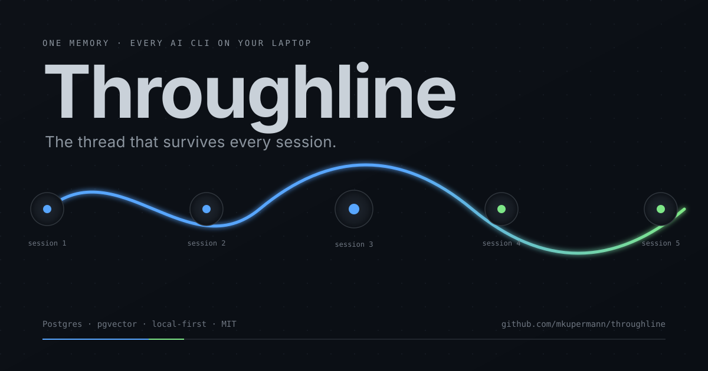
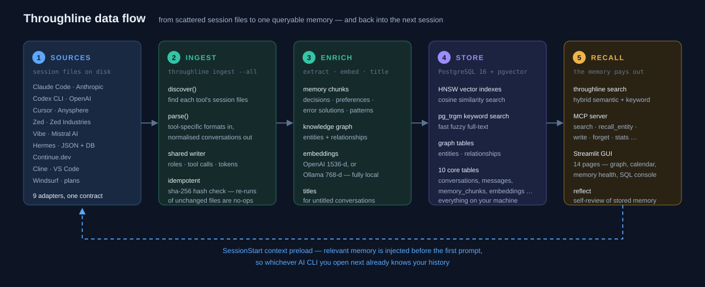
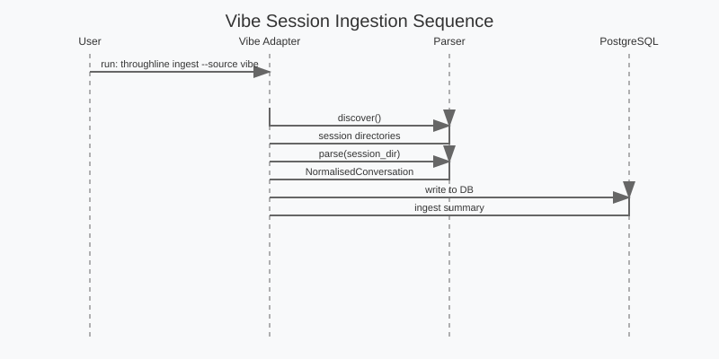
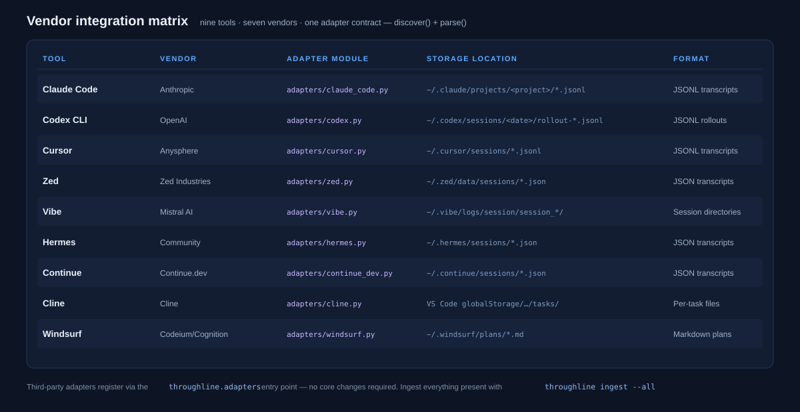
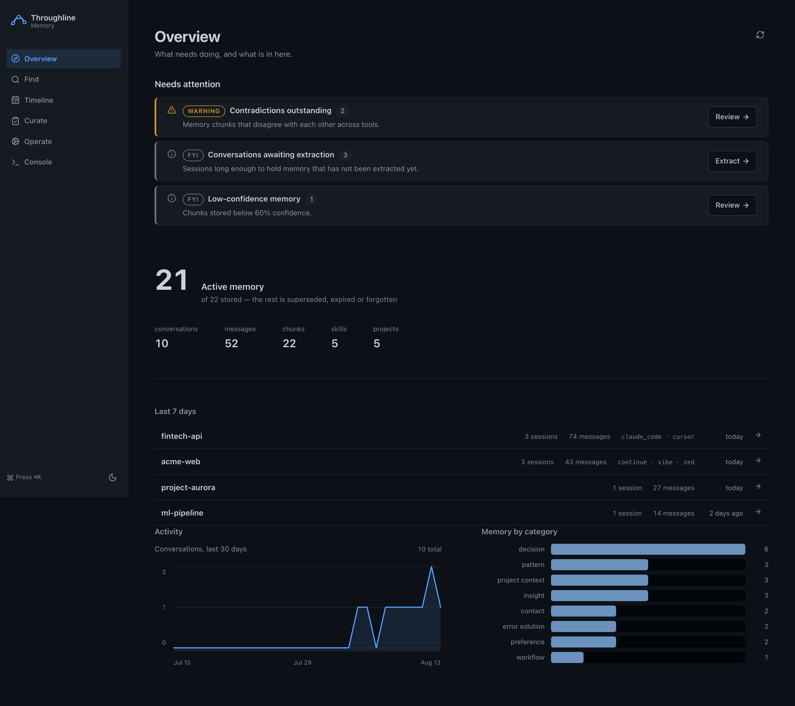
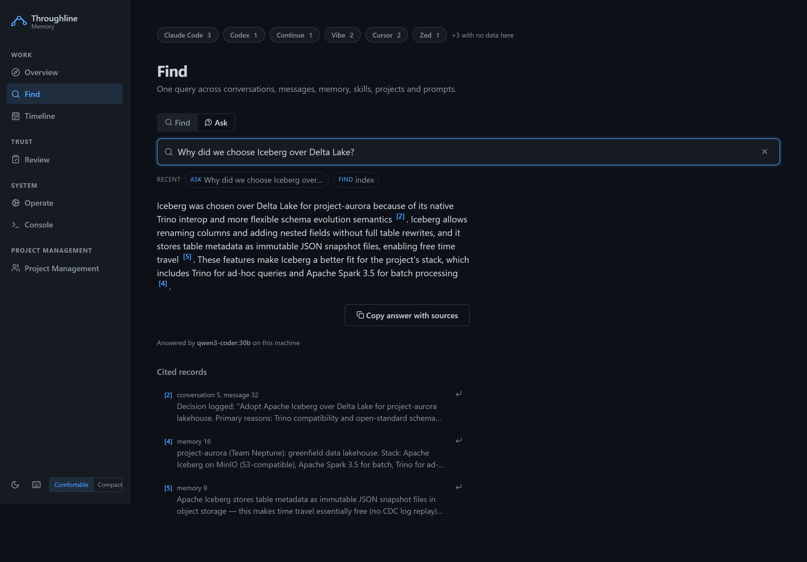

# Throughline



[](LICENSE)
[](pyproject.toml)
[](sql/schema.sql)
[](CHANGELOG.md)

**Your AI assistant forgets you every time you close it. Throughline does not.**

It is a universal, vendor-agnostic memory layer for AI coding assistants — no account, no telemetry, no cloud. Each of them remembers, at best, its own sessions, and none of them can see what you did in the others. Throughline ingests the session history of all major AI CLIs — Claude Code, Cursor, Zed, Codex, Hermes, Continue, Cline, Windsurf, and Vibe — into one local PostgreSQL database and feeds that unified memory back to whichever tool you use next.

Storage, indexing, search, and every listing happen on your machine. Three operations may call a model, and each is therefore a point where content could leave. They are named here rather than in a footnote:

| Operation | Stays local when | Required? |
|---|---|---|
| **Embedding** (`throughline embed`) | the backend is Ollama — the default | needed for semantic search |
| **Answering** (`throughline ask`) | the backend is local | optional |
| **Extraction, titles, reflection** | the backend is local | optional |

Each one defaults to a local backend, so on a machine running Ollama nothing you have stored leaves it and no setting had to be found first. That is a default, not an enforcement: `THROUGHLINE_ANSWER_BACKEND`, `THROUGHLINE_ANSWER_BASE_URL` and `OPENAI_API_KEY` deliberately let you route any of these to a hosted endpoint. Setting one changes that operation, and only that one — `throughline doctor` prints where each currently goes.

Switch providers freely — Anthropic today, Mistral or OpenAI tomorrow — and your accumulated context, decisions, and preferences move with you. The memory belongs to you, not to a vendor.

---

## Why Throughline

| Problem | Throughline's answer |
|---|---|
| Each AI CLI keeps its own siloed, ephemeral history | One normalised store across all nine supported tools |
| Vendor lock-in through accumulated context | Vendor-neutral schema; switch assistants without losing memory |
| Cloud memory features raise data-governance questions | PostgreSQL on your machine, read-only source mounts, no account; every operation that can reach a network is named above, and each has a local option |
| Raw transcripts are unsearchable | Structured memory chunks, semantic search (pgvector), knowledge graph |

A longer discussion of the cross-tool memory problem is in [docs/why-cross-tool.md](docs/why-cross-tool.md).

---

## Architecture


Four layers: nine source adapters (one per AI CLI), a shared ingestion pipeline that normalises conversations, PostgreSQL 16 with pgvector for storage and semantic search, and the consumers that read memory back — the web UI, MCP server, CLI, and automation jobs.

### Data flow



### Ingestion sequence



Design details: [docs/architecture.md](docs/architecture.md) · measured performance: [docs/BENCHMARKS.md](docs/BENCHMARKS.md)

---

## Supported tools



| Tool | Vendor | Storage location | Format |
|------|--------|------------------|--------|
| Claude Code | Anthropic | `~/.claude/projects/<project>/*.jsonl` | JSONL transcripts |
| Cline | Cline | VS Code `globalStorage/.../tasks/` | Per-task files |
| Codex CLI | OpenAI | `~/.codex/sessions/<date>/rollout-*.jsonl` | JSONL rollouts |
| Continue | Continue.dev | `~/.continue/sessions/*.json` | JSON transcripts |
| Cursor | Anysphere | `~/.cursor/sessions/*.jsonl` | JSONL transcripts |
| Hermes | Community | `~/.hermes/sessions/*.json` | JSON transcripts |
| Vibe | Mistral AI | `~/.vibe/logs/session/session_*/` | Session directories |
| Windsurf | Codeium/Cognition | `~/.windsurf/plans/*.md` | Markdown plans |
| Zed | Zed Industries | `~/.zed/data/sessions/*.json` | JSON transcripts |

Listed alphabetically. No adapter is privileged in the schema, the pipeline or the UI: a conversation carries a `source_tool` and nothing else distinguishes where it came from.

Adapters degrade gracefully: a tool that is not installed is simply reported as "not present". Third-party adapters plug in through the `throughline.adapters` entry point without any changes to Throughline itself — see [docs/ADAPTER_DEVELOPMENT.md](docs/ADAPTER_DEVELOPMENT.md).

---

## Quick start

**Requirements.** Docker route: Docker with Compose v2, and 2 GB of free disk
for the image and database. Native route: Python 3.11+, PostgreSQL 16 with the
pgvector extension, and the `psql`/`createdb` client tools. macOS and Linux are
supported and both are tested; Windows works under WSL2 and is not tested.

### Docker (recommended)

```bash
git clone https://github.com/mkupermann/throughline.git
cd throughline
docker compose up -d
docker compose exec gui throughline ingest --all   # first run only
# Web UI: http://127.0.0.1:8788
```

The compose stack starts PostgreSQL 16 with pgvector (schema applied automatically) and the web UI. Ingestion is not automatic on first boot — run it once, then schedule it. The port is published on loopback only — the API has no authentication, by design for a single-user local tool. Host tool directories are mounted read-only into the container, so ingestion works out of the box. Optional profiles: `--profile mcp` (adds the MCP server so assistants can query memory mid-session) and `--profile embeddings` (adds a local Ollama container, so embeddings never need an API key).

The container publishes **8788**; a native `throughline serve` listens on **8790**. Different ports on purpose, so both can run at once.

### Native installation

```bash
git clone https://github.com/mkupermann/throughline.git
cd throughline
pip install -r requirements.txt
pip install -e .

createdb throughline
psql throughline < sql/schema.sql

throughline ingest --all
throughline serve
```

The connection comes from the standard `PG*` variables, and a `.env` in the
repository root is read automatically. Upgrading an existing install:
[CHANGELOG.md](CHANGELOG.md) has the one-line step.

Full instructions, including scheduled ingestion via launchd/systemd: [docs/INSTALLATION.md](docs/INSTALLATION.md) and [docs/DEPLOYMENT.md](docs/DEPLOYMENT.md).

---

## Command line interface

```bash
throughline ingest --list-sources   # show all adapters and whether they are present
throughline ingest --all            # ingest from every present adapter
throughline ingest --source vibe    # ingest from one tool
throughline extract-memory          # distill structured memory chunks from conversations
throughline generate-titles         # title untitled conversations
throughline search "authentication" # semantic search across all tools' history
throughline ask "why did we drop X?"  # a cited answer assembled from your own history
throughline reflect                 # self-reflecting memory maintenance (dedup, decay)
throughline status                  # database and ingestion status
throughline doctor                  # diagnose environment, schema, and archive integrity
throughline serve                   # web UI + API on http://127.0.0.1:8790
```

Usage guide with examples: [docs/USAGE.md](docs/USAGE.md).

### The web UI

`throughline serve` runs the UI and its JSON API from one process on one port
(default `http://127.0.0.1:8790`). Six surfaces in the navigation — Overview,
Find, Timeline, Curate, Operate, Console — and two more you reach by following
something rather than by navigating to it: a project's own page, and Ask, which
sits beside the search box on Find. Most carry a provider bar showing each tool
that has material here, its conversation count, and whether anything is waiting
to be ingested — clicking a tool scopes the page to it. Overview and Console do
without: one is a worklist about every tool at once, the other answers to SQL
rather than to a filter.

| Surface | What it is for |
|---|---|
| **Overview** | A worklist, not a dashboard: what needs doing first, then what you worked on in the last seven days, by project. |
| **Projects** | One project's whole history — every session in it, newest or oldest first, with a search that covers session titles and every message inside them. A project is the working directory a session ran in, so nothing has to be maintained for this to work. |
| **Find** | One query across conversations, messages, memory, skills, projects and prompts — lexical and semantic retrieval fused, with facets and three views (list, table, graph), plus a reading pane: `↓` from the search box, then `j`/`k` walks results without leaving the page. |
| **Ask** | A question in plain language, answered from your own records. Every claim carries a citation you can click through to the message or memory chunk it came from; an answer that cites nothing is labelled unverified, and a question the records cannot answer is told so rather than guessed at. |
| **Timeline** | The same corpus browsed by time rather than by query: one column per day across every tool, opening the most recent active day on arrival, drilling from a day into a session and its full transcript — prose, the commands that ran, and what they returned. |
| **Curate** | Eight queues that keep memory trustworthy — contradictions, drift, superseded chains, low confidence, missing embeddings, expiring, never accessed, forgotten. Bulk actions, with a confirmation before anything is forgotten and an undo after. |
| **Operate** | Pipeline state and the jobs that change it, with live streamed output. |
| **Console** | Read-only SQL. Every statement runs in a `READ ONLY` transaction, so PostgreSQL rejects writes — not a keyword filter. |

### What it looks like



Overview answers "what should I deal with?" before it shows a single statistic:
what needs doing, then the projects you actually worked in this week — with the
tools each one spanned, which is the thing no per-tool interface can show you.



Ask answers in prose and cites the records it used, and says which model
answered and whether it ran on your machine. Every screenshot here is generated
from the bundled demo fixture by `npm run screenshots`; the rest are in
[docs/screenshots/](docs/screenshots/).

Press `⌘K` for the command palette, `/` to search, `g` then `o f t c p s` to jump
between surfaces. Light and dark both supported; the theme follows your system
by default.

---

## Technical deep-dive

### Adapter contract

Each adapter implements a deliberately small interface:

- `discover()` — yield the files ingestion will process
- `parse(path)` — convert one file into a `NormalisedConversation`

Two optional hooks separate what *exists* from what is *safe to ingest*, which is
what lets the provider bar report honest coverage:

- `discover_all()` — every candidate on disk, including ones ingestion skips; defaults to `discover()`, so an adapter with no exclusions writes no extra code
- `excluded_reason(path)` — why a discovered file must not be ingested, or `None`

The Claude Code adapter uses both, because it has the most awkward layout to
work with: it searches `~/.claude/projects` recursively (older transcripts sit
one level deeper than the flat layout assumed), then excludes subagent
transcripts, which are machine-generated and would drown the corpus. Vibe needs
neither hook and implements neither — the base class covers it in four lines.
`is_present` is derived — a tool counts as present when `discover_all()` yields at
least one file, so a tool whose directory exists but is empty is reported as
absent rather than as silently contributing nothing.

Everything else — database connections, idempotency via the ingestion log, project bucketing, error handling — lives in the shared writer, so adapters stay small and individually testable. Re-ingestion is idempotent: unchanged files are skipped, changed files are refreshed without duplicates.

Every adapter has its own test module built on a sample of that tool's real on-disk format, and shared suites assert what must hold for all of them: each writes its own `source_tool`, and each is a registered provider. A separate end-to-end test drives ingestion into a live PostgreSQL and checks that re-running changes nothing while an edited file refreshes rather than duplicates — that one currently covers four of the nine sources, not all of them. `tests/test_adapter_*.py` and `tests/integration/test_adapter_e2e.py` are the files to read first if you doubt the nine-tool claim.

### Storage and retrieval

- **PostgreSQL 16 + pgvector**: conversations, messages, and extracted memory chunks in a normalised schema (`sql/schema.sql`), with vector similarity search over embeddings and trigram search over content.
- **Memory extraction**: an LLM pass distills durable facts (preferences, decisions, error solutions, project context) from raw transcripts into typed, tagged memory chunks. It goes through the same swappable backend as everything else — as do title generation and the reflection engine, so a machine running Ollama fills its memory without a network call and without an API key. Memory comes back in the language the session was held in, so a bilingual corpus stays bilingual instead of being translated one conversation at a time; `THROUGHLINE_MEMORY_LANG` forces a single language when that is what you want.
- **MCP server**: `memory_mcp` exposes the memory database to any MCP-capable client over stdio, so every supported CLI can query the shared memory at runtime.
- **Bring your own model.** Embeddings and answers both run through whatever backend you point them at, chosen by probe with local first — a machine running Ollama never reaches the network and never had to be configured not to. Nothing here is tied to one vendor:

  | Variable | Purpose |
  |---|---|
  | `THROUGHLINE_ANSWER_BACKEND` | `auto` (default), `ollama`, `openai`, `claude` |
  | `THROUGHLINE_ANSWER_MODEL` | model name for that backend |
  | `THROUGHLINE_ANSWER_BASE_URL` | any OpenAI-compatible server — LM Studio, llama.cpp, vLLM, LiteLLM |
  | `OPENAI_API_KEY` | only read by the `openai` backend |
  | `THROUGHLINE_EXTRACT_MODEL` · `THROUGHLINE_TITLE_MODEL` · `THROUGHLINE_REFLECT_MODEL` | per-job model override, when one job wants a bigger model than the rest |
  | `THROUGHLINE_MEMORY_LANG` | force the language memory is written in; by default it follows the session |

  `throughline doctor` reports which model will answer and whether it runs locally, and every answer in the UI says so on screen.

- **A tool that reads its own output must not count it.** Throughline calls a
  model to title conversations, extract memory, and answer questions. Those
  calls are themselves sessions on disk, so ingestion picks them up: on the
  corpus this was written against, 3,017 of 3,606 stored conversations were the
  tool talking to itself, which is why every listing read as noise. They are
  labelled at ingest (`conversations.generated_by`) rather than dropped —
  nothing is deleted and the count stays available — and every listing, chart,
  search and answer excludes them by default. A project page reports how many it
  is withholding and shows them on request.
- **Privacy**: sources are mounted read-only. The one point at which stored content leaves the machine is a question sent to a *remote* answering model — pick a local one and it never does. `THROUGHLINE_REDACT_PROMPTS=1` strips secrets from those excerpts, off by default because a memory tool that hides your own credentials from you is failing at its job. PII scanning utilities are included (`throughline/pii.py`).
- **The database outlives its sources.** Assistant CLIs rotate their transcripts away: on a corpus measured while writing this, 91% of the Claude Code sessions Throughline had ingested no longer existed on disk. For those the database is not an index over files you still have — it is the only copy. Two consequences worth knowing before you rely on it: schema changes are tracked in `sql/migrations/` and applied with `python3 scripts/migrate.py` (`--status` lists what is pending), and `throughline doctor --category archive` reports the store's own consistency and whether a recent backup exists. `scripts/install_backup_agent.sh` schedules a verified nightly dump.

> **About the numbers in this section.** Every measurement quoted here — the
> 3,017, the 91%, the recall figures — comes from one real corpus: the author's
> own, roughly 3,600 sessions across nine tools. They are reported because a
> design decision explained by the observation that forced it is easier to argue
> with than one asserted as a principle. They are not benchmarks, and your corpus
> will differ. `throughline status` and `throughline doctor` print the equivalent
> numbers for yours.

Performance characteristics and tuning: [docs/PERFORMANCE.md](docs/PERFORMANCE.md) · security model: [SECURITY.md](SECURITY.md).

---

## Extending Throughline

To support a new AI CLI, implement the adapter contract and register it:

```python
from pathlib import Path
from typing import Iterable
from throughline.adapters.base import Adapter, NormalisedConversation

class MyToolAdapter(Adapter):
    name = "my_tool"
    label = "My Tool"
    home = Path("~/.my_tool/sessions").expanduser()

    def discover(self) -> Iterable[Path]:
        yield from sorted(self.home.glob("*.json"))

    def parse(self, path: Path) -> NormalisedConversation | None:
        ...
```

Register it either in `throughline/adapters/registry.py` (built-in) or via the `throughline.adapters` entry point in your own package (no core changes). The complete guide, including normalisation rules and test patterns, is in [docs/ADAPTER_DEVELOPMENT.md](docs/ADAPTER_DEVELOPMENT.md).

---

## Contributing and support

Contributions are welcome — new adapters especially. Read [CONTRIBUTING.md](CONTRIBUTING.md) for setup, style, and PR conventions, and [CODE_OF_CONDUCT.md](CODE_OF_CONDUCT.md) for community standards. Run the test suite with `pytest`; integration tests expect a reachable PostgreSQL (e.g. `docker compose up -d postgres`).

Bugs and feature requests go to [GitHub Issues](https://github.com/mkupermann/throughline/issues); questions and ideas to [Discussions](https://github.com/mkupermann/throughline/discussions). Security reports have their own channel — see [SECURITY.md](SECURITY.md). Current version and what changed: [CHANGELOG.md](CHANGELOG.md).

**Status: beta.** The schema is migration-tracked and `pytest` runs 746 tests, with a dedicated module for each of the nine adapters — but this has been run in earnest on one person's machine. Expect rough edges on setups unlike that one, and say so in an issue when you find them. The claims on this page are checked before publishing by an adversarial review run through a second vendor's model — the procedure, and what it has caught, are in [CONTRIBUTING.md](CONTRIBUTING.md#reviewing-user-facing-claims).

## License

Throughline is released under the [MIT License](LICENSE).

## Acknowledgments

- [pgvector](https://github.com/ankane/pgvector) — vector similarity search in PostgreSQL
- [FastAPI](https://github.com/fastapi/fastapi) and [React](https://react.dev) — web UI and API
- [Model Context Protocol](https://modelcontextprotocol.io) — runtime memory access for AI clients
