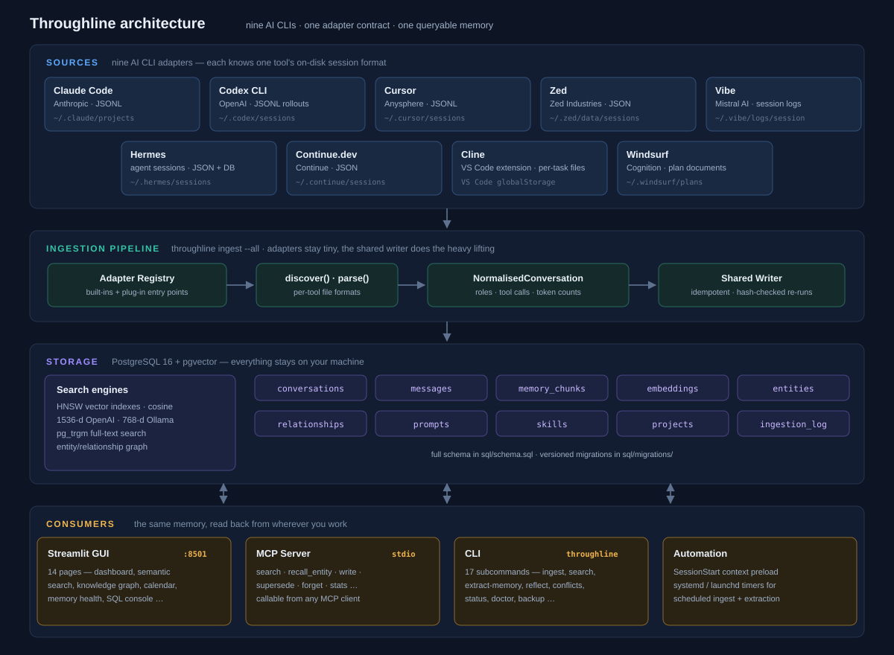

# Throughline Architektur

**Status:** aktuelle Referenz, Stand 0.3.0
**Stack:** PostgreSQL 16 mit pgvector und pg_trgm, Python 3.10+, FastAPI, React, MCP

## Überblick

Throughline sammelt die lokalen Sitzungsverläufe mehrerer AI Coding Tools in
einer PostgreSQL-Datenbank. Die Daten bleiben auf dem Rechner. CLI, MCP Server,
Web UI und Scheduler arbeiten auf derselben Datenbasis.

Unterstützte Quellen sind Claude Code, Codex, Cursor, Zed, Hermes, Continue,
Cline, Windsurf und Vibe. Kein Tool hat ein eigenes Schema. Jede Conversation
trägt `source_tool`, sonst durchläuft sie dieselbe Ingestion und dieselben
Abfragen.



## Komponenten

| Komponente | Aufgabe |
| --- | --- |
| Adapter | Finden und parsen die lokale Ablage eines Tools. Sie lesen nur Dateien, sie schreiben nicht in die Datenbank. |
| Writer | Prüft Hashes, öffnet Transaktionen, schreibt Conversations und Messages und führt den Ingestion Log. |
| PostgreSQL | Speichert Rohverläufe, Memory Chunks, Embeddings, Knowledge Graph und den Ingestion Log. |
| CLI | Stellt die installierten Befehle für Ingestion, Pflege, Suche, Diagnose, Backup und Migration bereit. |
| MCP Server | Stellt projektbezogene Memory Tools über stdio bereit. |
| Web UI | FastAPI liefert API und React SPA aus einem Prozess. |
| Scheduler | launchd auf macOS und systemd User Timer auf Linux führen Ingestion, Extraktion und Backup aus. |

Die ausführbaren Python Jobs liegen unter `throughline.jobs` und sind Teil des
Wheels. `scripts/*.py` bleiben direkte Kompatibilitätswrapper für Source
Checkouts. Installierte Umgebungen verwenden `throughline <befehl>`.

## Datenfluss

`throughline ingest --all` arbeitet pro Adapter und Quelldatei in fünf Schritten:

1. Der Adapter findet Kandidaten und meldet auch bewusst ausgeschlossene Dateien.
2. Der Writer vergleicht den SHA-256 Hash mit `ingestion_log`.
3. Der Adapter erzeugt `NormalisedConversation` und `NormalisedMessage`.
4. Der Writer aktualisiert die Conversation über `session_id` und ersetzt alle
   normalisierten Felder und Messages in einer Transaktion.
5. Der Writer protokolliert Hash und Ergebnis.

Eine unveränderte Quelle ist ein No-op. Bei einer geänderten Quelle löscht der
Writer vorher abgeleitete Message-Daten, also Embeddings und Entity Mentions,
und schreibt den aktuellen Stand. Transaktionsgebundene Advisory Locks verhindern,
dass ein paralleler Producer noch Daten für gerade ersetzte Messages schreibt.
Fehler in einer Datei rollen nur diese Datei zurück.

Die meisten Quelldateien haben keine UUID. Adapter leiten daher stabile UUID5
Werte aus Tool und Quellenkennung ab. So bleibt eine Session über erneute Läufe
und Aktualisierungen dieselbe Conversation.

## Datenmodell

| Tabelle | Zweck |
| --- | --- |
| `conversations` | Eine Session pro Tool mit Projekt, Zeitstempeln, Modell, Tokenzahlen und Metadaten. |
| `messages` | Einzelne Turns mit Text, Content Blocks, Tool Calls und Ergebnissen. |
| `memory_chunks` | Extrahierte, kategorisierte und projektbezogene Erkenntnisse. |
| `embeddings` | Vektoren für Messages und Memory Chunks. |
| `entities`, `entity_mentions`, `relationships` | Knowledge Graph mit Herkunft und zeitlicher Gültigkeit. |
| `ingestion_log` | Hash-basierte Idempotenz der Quellen. |
| `projects`, `skills`, `prompts` | Projekt- und Indexdaten. |
| `memory_reflections` | Audit Trail für Konsolidierung, Widersprüche und Veraltung. |

`project_name` wird aus `project_path` abgeleitet. Nach einer Ingestion ergänzt
der Writer fehlende Projekte, ohne manuell gepflegte Daten zu überschreiben.

## Generierte Sitzungen

Titelgenerierung, Memory Extraction und Antworten können selbst wieder lokale
Sitzungen erzeugen. Der Writer löscht diese Sessions nicht. Er markiert sie mit
`conversations.generated_by`. Listings, Suche, Charts und Antworten schließen
sie standardmäßig aus. Eine Projektansicht kann den zurückgehaltenen Bestand
anzeigen und ihn auf Wunsch einbeziehen. Damit bleibt der Audit Trail erhalten,
ohne dass das System seine eigenen Inhalte bevorzugt.

## Migrationen

Das Versionsschema liegt in `throughline/migrations/NNN_*.sql` und wird mit dem
Paket ausgeliefert. `throughline migrate` legt `public.applied_migrations` an,
prüft Namen und Reihenfolge und führt jede noch fehlende Migration in einer
eigenen Transaktion aus. Der Tracking Eintrag wird nur mit dem erfolgreichen
SQL commitet.

Für eine native Installation gilt:

```bash
createdb throughline
throughline migrate
```

Nach jedem Upgrade zeigen `throughline migrate --status` und bei Bedarf
`throughline migrate --dry-run` den Stand. `sql/schema.sql` dient der Prüfung
und dem CI, nicht der Initialisierung einer neuen Installation. Eine ältere
Datenbank, die einmal aus diesem Snapshot angelegt wurde, erkennt der Runner,
zeichnet ihre Baseline auf und führt danach spätere Migrationen aus. Die
Migration History wird nicht umgeschrieben oder gelöscht.

Docker Compose wartet erst auf die PostgreSQL Readiness, startet dann den
Service `migrate` und startet Web UI oder MCP erst nach erfolgreicher Migration.

## Web UI

Die React SPA hat acht Route Komponenten:

| Route | Zweck |
| --- | --- |
| Overview | Arbeitsliste und aktuelle Projektaktivität. |
| Find | Gemeinsame lexikalische und semantische Suche. |
| Timeline | Sessions und Ereignisse nach Zeit. |
| Curate | Queues für Qualität und Pflege des Memory Stores. |
| Project | Verlauf eines Projekts. |
| Detail | Detailseite für Conversation, Memory, Entity, Skill oder Prompt. |
| Operate | Pipeline Status und Jobs. |
| Console | Read-only SQL in einer `READ ONLY` Transaktion. |

Overview, Find, Timeline, Curate, Operate und Console stehen in der Navigation.
Project und Detail werden aus Datensätzen geöffnet. Die UI verarbeitet Lade,
Leer, Fehler und Retry Zustände auf allen acht Route Komponenten.

## Sicherheit und Betrieb

Die Anwendung ist lokal und für einen Benutzer ausgelegt. Der native Server
bindet nur an Loopback. Compose veröffentlicht PostgreSQL, Web UI und optional
Ollama ebenfalls nur auf Loopback. Die API hat keine Anmeldung. Ein Remote Bind
erfordert deshalb eigene Authentifizierung und TLS und wird nativ ohne
`THROUGHLINE_ALLOW_REMOTE=1` abgewiesen.

`scripts/init_compose_env.py` erstellt oder aktualisiert die ignorierte `.env`.
Sie enthält ein zufälliges Datenbankpasswort und die numerische UID/GID des
Hosts. Die Container laufen als unprivilegierter Benutzer `throughline`. Die
Adapter Quellverzeichnisse werden read-only unter dessen Home gemountet. So
können 0600 Quelldateien auf Linux und Docker Desktop für macOS gelesen werden,
ohne die Container als root auszuführen.

Bei einem bestehenden Compose Volume sind `POSTGRES_USER` und `POSTGRES_DB`
unveränderliche Identitäten. Eine Passwortänderung läuft über das explizite
Profil `credential-rotate`. Es prüft die alte Identität und benennt weder Rolle
noch Datenbank um. Der Health Endpoint `/api/health` meldet nur dann Erfolg,
wenn die Anwendung `SELECT 1` gegen PostgreSQL ausführen kann.

Alle modelbasierten Operationen können Inhalte an den gewählten Model Provider
senden. Lokale Backends halten sie auf dem Rechner. Für Remote Antworten kann
`THROUGHLINE_REDACT_PROMPTS=1` die Exzerpte redigieren. Die Extraction verwendet
standardmäßig die Heuristik in `throughline/pii.py`.

## Qualitätssicherung

Die CI prüft das Wheel außerhalb des Checkouts, Ruff, Black, Syntax, die
aktuelle Frontend Build Ausgabe und Markdown. Sie führt Migrationen auf einer
frischen PostgreSQL Datenbank aus und prüft einen zweiten Lauf auf Idempotenz.
Zum aktuellen Stand laufen 111 Frontend Tests und 229 PostgreSQL basierte
Integrationstests ohne Skip.

## Weiterführende Dokumente

- [INSTALLATION.md](INSTALLATION.md)
- [DEPLOYMENT.md](DEPLOYMENT.md)
- [USAGE.md](USAGE.md)
- [SECURITY.md](../SECURITY.md)
- [architecture.md](architecture.md), englische Referenz
