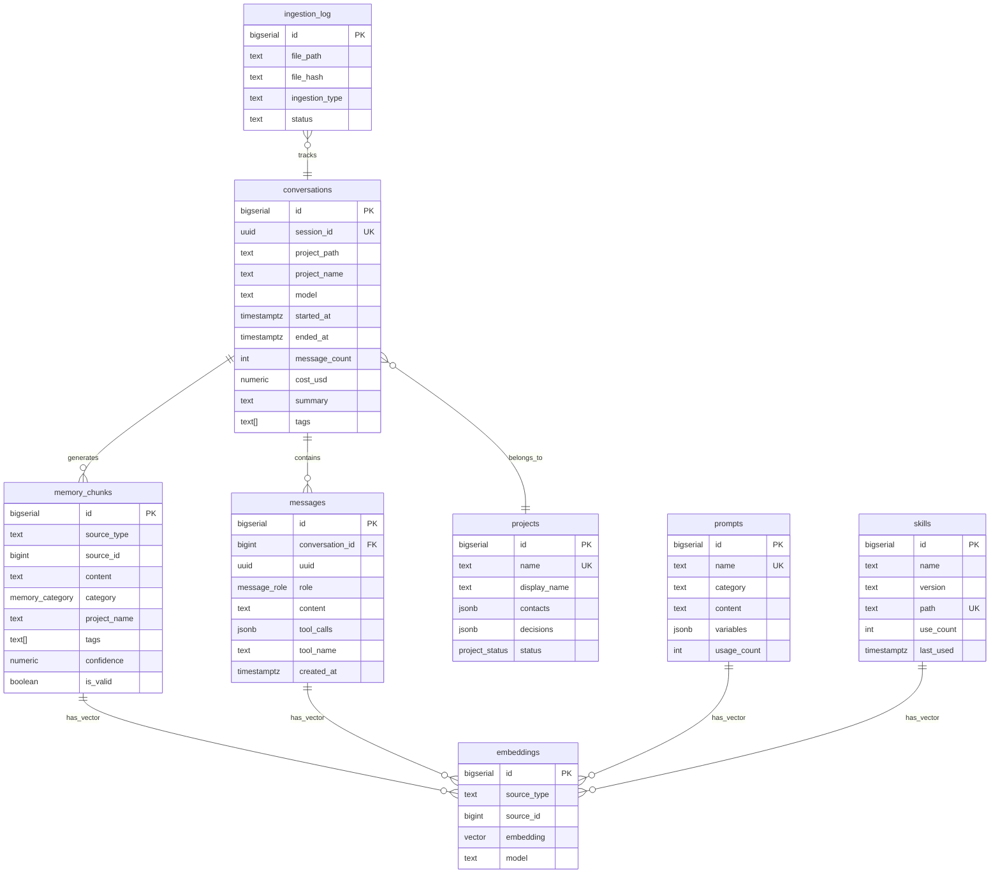

# Claude Memory DB -- Persistentes Langzeitgedaechtnis fuer Claude Code

**Datum:** 2026-04-17  
**Status:** Entwurf  
**Stack:** PostgreSQL 16 + pgvector | Python 3.12 | Claude Code Skill | launchd

---

## 1. Uebersicht und Zielbild

### Problem

Claude Code speichert Kontext aktuell als flache Dateien:
- Session-JSONL unter `~/.claude/projects/<project-hash>/<session-id>.jsonl`
- Session-Metadaten unter `~/.claude/sessions/<pid>.json`
- Prompt-History als `~/.claude/history.jsonl`
- Skill-Definitionen unter `~/.claude/skills/` und projektspezifisch unter `.claude/skills/`

Diese Struktur ist nicht durchsuchbar, nicht korrelierbar und skaliert nicht. Bei ~50 Skills, dutzenden aktiven Projekten und taeglichen Sessions gehen Erkenntnisse, Entscheidungen und Patterns verloren.

### Loesung

Eine lokale PostgreSQL-Datenbank (`claude_memory`) mit pgvector-Extension, die als persistentes, durchsuchbares Langzeitgedaechtnis dient. Claude Code greift ueber einen dedizierten Skill (`memory-db`) per `psql` oder Python auf die DB zu. Scheduler fuellen die DB kontinuierlich mit neuen Sessions und extrahierten Erkenntnissen.

### Zielbild

```
┌──────────────────────────────────────────────────────────┐
│                   Claude Code Session                     │
│                                                           │
│  "Was weiss ich ueber das SAP-Import-Problem?"           │
│         │                                                 │
│         ▼                                                 │
│  ┌─────────────┐    SQL/Python    ┌──────────────────┐   │
│  │ memory-db   │ ───────────────► │  PostgreSQL 16   │   │
│  │   Skill     │ ◄─────────────── │  + pgvector      │   │
│  └─────────────┘                  │                  │   │
│                                   │  claude_memory   │   │
│                                   └──────────────────┘   │
└──────────────────────────────────────────────────────────┘
                                           ▲
                    ┌──────────────────────┤
                    │                      │
            ┌───────────────┐    ┌─────────────────┐
            │  launchd       │    │  Metabase/GUI   │
            │  Scheduler     │    │  (Phase E)      │
            │  (Ingestion)   │    │                 │
            └───────────────┘    └─────────────────┘
```

---

## 2. Datenschema

### 2.1 Erweiterungen und Grundkonfiguration

```sql
-- Datenbank erstellen
CREATE DATABASE claude_memory
    ENCODING 'UTF8'
    LC_COLLATE 'de_DE.UTF-8'
    LC_CTYPE 'de_DE.UTF-8';

\c claude_memory

-- Extensions
CREATE EXTENSION IF NOT EXISTS pgvector;
CREATE EXTENSION IF NOT EXISTS pg_trgm;  -- Trigram-Index fuer Volltextsuche

-- Enum-Typen
CREATE TYPE message_role AS ENUM ('user', 'assistant', 'system', 'tool_result');
CREATE TYPE session_kind AS ENUM ('interactive', 'headless', 'sdk-cli');
CREATE TYPE memory_category AS ENUM (
    'decision',        -- Architekturentscheidung, Designwahl
    'pattern',         -- Wiederverwendbares Muster
    'insight',         -- Erkenntnis, Gelerntes
    'preference',      -- User-Praeferenz
    'contact',         -- Person, Rolle, Kontext
    'error_solution',  -- Problem + Loesung
    'project_context', -- Projektwissen
    'workflow'         -- Ablauf, Prozess
);
CREATE TYPE project_status AS ENUM ('active', 'paused', 'completed', 'archived');
```

### 2.2 Tabelle: conversations

Jede Claude Code Session wird als eine Conversation gespeichert.

```sql
CREATE TABLE conversations (
    id              BIGSERIAL PRIMARY KEY,
    session_id      UUID NOT NULL UNIQUE,
    project_path    TEXT,                          -- e.g. /Users/<user>/Documents/GitHub/wiki
    project_name    TEXT GENERATED ALWAYS AS (
                        CASE
                            WHEN project_path IS NULL THEN 'unknown'
                            ELSE split_part(project_path, '/', -1)
                        END
                    ) STORED,
    model           TEXT,                          -- z.B. claude-opus-4-6
    kind            session_kind DEFAULT 'interactive',
    entrypoint      TEXT,                          -- cli, sdk-cli, etc.
    git_branch      TEXT,
    started_at      TIMESTAMPTZ NOT NULL,
    ended_at        TIMESTAMPTZ,
    message_count   INT DEFAULT 0,
    token_count_in  INT,                           -- Prompt-Tokens gesamt
    token_count_out INT,                           -- Completion-Tokens gesamt
    cost_usd        NUMERIC(10, 4),
    summary         TEXT,                          -- Automatisch generierte Zusammenfassung
    tags            TEXT[] DEFAULT '{}',
    metadata        JSONB DEFAULT '{}',            -- Flexibles Feld fuer Zusaetzliches
    created_at      TIMESTAMPTZ DEFAULT now(),
    updated_at      TIMESTAMPTZ DEFAULT now()
);

CREATE INDEX idx_conversations_session_id ON conversations (session_id);
CREATE INDEX idx_conversations_project_name ON conversations (project_name);
CREATE INDEX idx_conversations_started_at ON conversations (started_at DESC);
CREATE INDEX idx_conversations_tags ON conversations USING GIN (tags);
CREATE INDEX idx_conversations_metadata ON conversations USING GIN (metadata);
```

### 2.3 Tabelle: messages

Einzelne Nachrichten innerhalb einer Conversation.

```sql
CREATE TABLE messages (
    id              BIGSERIAL PRIMARY KEY,
    conversation_id BIGINT NOT NULL REFERENCES conversations(id) ON DELETE CASCADE,
    uuid            UUID,                          -- Aus der JSONL-Datei
    parent_uuid     UUID,                          -- Fuer Baumstruktur (Sidechains)
    role            message_role NOT NULL,
    content         TEXT,                           -- Hauptinhalt
    content_blocks  JSONB,                         -- Strukturierte Content-Blocks (Text + Tool Use)
    tool_calls      JSONB,                         -- Array von {tool_name, input, result}
    tool_name       TEXT,                           -- Falls role=tool_result
    token_count     INT,
    is_sidechain    BOOLEAN DEFAULT FALSE,
    model           TEXT,                           -- Modell das diese Antwort generiert hat
    duration_ms     INT,                           -- Antwortzeit
    created_at      TIMESTAMPTZ NOT NULL,
    metadata        JSONB DEFAULT '{}'
);

CREATE INDEX idx_messages_conversation_id ON messages (conversation_id);
CREATE INDEX idx_messages_role ON messages (role);
CREATE INDEX idx_messages_created_at ON messages (created_at DESC);
CREATE INDEX idx_messages_tool_name ON messages (tool_name) WHERE tool_name IS NOT NULL;
CREATE INDEX idx_messages_content_trgm ON messages USING GIN (content gin_trgm_ops);
```

### 2.4 Tabelle: skills

Metadaten und Nutzungsstatistiken aller Skills.

```sql
CREATE TABLE skills (
    id              BIGSERIAL PRIMARY KEY,
    name            TEXT NOT NULL,
    version         TEXT DEFAULT '1.0.0',
    description     TEXT,
    path            TEXT NOT NULL,                 -- Absoluter Pfad zum Skill-Verzeichnis
    skill_type      TEXT DEFAULT 'project',        -- project, global, shared
    triggers        TEXT[],                         -- Trigger-Woerter
    dependencies    TEXT[],                         -- Andere Skills/Tools die genutzt werden
    last_used       TIMESTAMPTZ,
    use_count       INT DEFAULT 0,
    avg_duration_ms INT,
    success_rate    NUMERIC(5, 2),                 -- Prozent erfolgreicher Ausfuehrungen
    config          JSONB DEFAULT '{}',            -- Skill-spezifische Konfiguration
    created_at      TIMESTAMPTZ DEFAULT now(),
    updated_at      TIMESTAMPTZ DEFAULT now(),
    UNIQUE(name, path)
);

CREATE INDEX idx_skills_name ON skills (name);
CREATE INDEX idx_skills_use_count ON skills (use_count DESC);
CREATE INDEX idx_skills_last_used ON skills (last_used DESC);
```

### 2.5 Tabelle: prompts

Wiederverwendbare Prompt-Templates, CLAUDE.md-Inhalte und Instruktionen.

```sql
CREATE TABLE prompts (
    id              BIGSERIAL PRIMARY KEY,
    name            TEXT NOT NULL UNIQUE,
    category        TEXT NOT NULL,                 -- system, skill, template, claude_md, snippet
    content         TEXT NOT NULL,
    variables       JSONB DEFAULT '[]',            -- [{name: "project", type: "string", default: ""}]
    source_path     TEXT,                          -- Herkunftsdatei
    usage_count     INT DEFAULT 0,
    last_used       TIMESTAMPTZ,
    tags            TEXT[] DEFAULT '{}',
    is_active       BOOLEAN DEFAULT TRUE,
    created_at      TIMESTAMPTZ DEFAULT now(),
    updated_at      TIMESTAMPTZ DEFAULT now()
);

CREATE INDEX idx_prompts_category ON prompts (category);
CREATE INDEX idx_prompts_tags ON prompts USING GIN (tags);
CREATE INDEX idx_prompts_content_trgm ON prompts USING GIN (content gin_trgm_ops);
```

### 2.6 Tabelle: memory_chunks

Extrahierte Erkenntnisse, Entscheidungen und Patterns aus Conversations.

```sql
CREATE TABLE memory_chunks (
    id              BIGSERIAL PRIMARY KEY,
    source_type     TEXT NOT NULL,                 -- conversation, manual, skill, document
    source_id       BIGINT,                        -- FK zur Quelle (z.B. conversations.id)
    source_session  UUID,                          -- Optionale Session-Referenz
    content         TEXT NOT NULL,                  -- Die eigentliche Erkenntnis
    category        memory_category NOT NULL,
    subcategory     TEXT,                           -- Freies Feld fuer Feinklassifikation
    project_name    TEXT,                           -- Zuordnung zu Projekt
    tags            TEXT[] DEFAULT '{}',
    confidence      NUMERIC(3, 2) DEFAULT 0.80,    -- 0.00 bis 1.00
    relevance_score NUMERIC(3, 2) DEFAULT 1.00,    -- Nimmt ueber Zeit ab
    related_chunks  BIGINT[] DEFAULT '{}',         -- Verknuepfung zu anderen Chunks
    created_at      TIMESTAMPTZ DEFAULT now(),
    expires_at      TIMESTAMPTZ,                   -- Optionales Ablaufdatum
    accessed_at     TIMESTAMPTZ DEFAULT now(),     -- Letzter Zugriff
    access_count    INT DEFAULT 0,
    is_valid        BOOLEAN DEFAULT TRUE,          -- Kann invalidiert werden
    metadata        JSONB DEFAULT '{}'
);

CREATE INDEX idx_memory_category ON memory_chunks (category);
CREATE INDEX idx_memory_project ON memory_chunks (project_name);
CREATE INDEX idx_memory_tags ON memory_chunks USING GIN (tags);
CREATE INDEX idx_memory_content_trgm ON memory_chunks USING GIN (content gin_trgm_ops);
CREATE INDEX idx_memory_confidence ON memory_chunks (confidence DESC) WHERE is_valid = TRUE;
CREATE INDEX idx_memory_expires ON memory_chunks (expires_at) WHERE expires_at IS NOT NULL;
CREATE INDEX idx_memory_source ON memory_chunks (source_type, source_id);
```

### 2.7 Tabelle: projects

Projektkontext mit Kontakten, Entscheidungen und Status.

```sql
CREATE TABLE projects (
    id              BIGSERIAL PRIMARY KEY,
    name            TEXT NOT NULL UNIQUE,           -- z.B. "project-alpha"
    display_name    TEXT,                           -- z.B. "Project Alpha"
    description     TEXT,
    repo_path       TEXT,                           -- Lokaler Pfad zum Repository
    repo_url        TEXT,                           -- GitHub URL
    contacts        JSONB DEFAULT '[]',            -- [{name, role, email, notes}]
    decisions       JSONB DEFAULT '[]',            -- [{date, topic, decision, rationale, participants}]
    tech_stack      TEXT[] DEFAULT '{}',            -- ["python", "azure-functions", "postgresql"]
    status          project_status DEFAULT 'active',
    started_at      DATE,
    ended_at        DATE,
    metadata        JSONB DEFAULT '{}',
    created_at      TIMESTAMPTZ DEFAULT now(),
    updated_at      TIMESTAMPTZ DEFAULT now()
);

CREATE INDEX idx_projects_name ON projects (name);
CREATE INDEX idx_projects_status ON projects (status);
CREATE INDEX idx_projects_contacts ON projects USING GIN (contacts);
CREATE INDEX idx_projects_decisions ON projects USING GIN (decisions);
```

### 2.8 Tabelle: embeddings

Vektoren fuer semantische Suche ueber pgvector.

```sql
CREATE TABLE embeddings (
    id              BIGSERIAL PRIMARY KEY,
    source_type     TEXT NOT NULL,                 -- conversation, message, memory_chunk, prompt, skill
    source_id       BIGINT NOT NULL,               -- FK zur Quelltabelle
    chunk_text      TEXT,                           -- Der eingebettete Text (fuer Debugging)
    embedding       vector(1536) NOT NULL,         -- OpenAI text-embedding-3-small oder vergleichbar
    model           TEXT NOT NULL DEFAULT 'text-embedding-3-small',
    created_at      TIMESTAMPTZ DEFAULT now()
);

-- HNSW-Index fuer schnelle Approximate Nearest Neighbor Suche
CREATE INDEX idx_embeddings_vector ON embeddings
    USING hnsw (embedding vector_cosine_ops)
    WITH (m = 16, ef_construction = 64);

CREATE INDEX idx_embeddings_source ON embeddings (source_type, source_id);
CREATE UNIQUE INDEX idx_embeddings_unique_source ON embeddings (source_type, source_id, model);
```

### 2.9 Tabelle: ingestion_log

Tracking welche Dateien bereits verarbeitet wurden.

```sql
CREATE TABLE ingestion_log (
    id              BIGSERIAL PRIMARY KEY,
    file_path       TEXT NOT NULL,
    file_hash       TEXT NOT NULL,                 -- SHA256 des Dateiinhalts
    file_size       BIGINT,
    ingestion_type  TEXT NOT NULL,                 -- session, skill_scan, memory_extract, prompt_scan
    status          TEXT DEFAULT 'completed',      -- completed, failed, partial
    records_created INT DEFAULT 0,
    error_message   TEXT,
    duration_ms     INT,
    ingested_at     TIMESTAMPTZ DEFAULT now(),
    UNIQUE(file_path, file_hash)
);

CREATE INDEX idx_ingestion_file ON ingestion_log (file_path);
CREATE INDEX idx_ingestion_type ON ingestion_log (ingestion_type);
```

### 2.10 Views fuer haeufige Abfragen

```sql
-- Aktive Memory-Chunks mit Relevanz-Ranking
CREATE VIEW v_active_memory AS
SELECT
    mc.*,
    p.display_name AS project_display_name,
    CASE
        WHEN mc.accessed_at > now() - INTERVAL '7 days' THEN mc.relevance_score
        WHEN mc.accessed_at > now() - INTERVAL '30 days' THEN mc.relevance_score * 0.8
        WHEN mc.accessed_at > now() - INTERVAL '90 days' THEN mc.relevance_score * 0.5
        ELSE mc.relevance_score * 0.2
    END AS effective_relevance
FROM memory_chunks mc
LEFT JOIN projects p ON mc.project_name = p.name
WHERE mc.is_valid = TRUE
  AND (mc.expires_at IS NULL OR mc.expires_at > now());

-- Conversations mit Statistiken
CREATE VIEW v_conversation_stats AS
SELECT
    c.*,
    COUNT(m.id) AS actual_message_count,
    COUNT(m.id) FILTER (WHERE m.role = 'user') AS user_messages,
    COUNT(m.id) FILTER (WHERE m.role = 'assistant') AS assistant_messages,
    COUNT(m.id) FILTER (WHERE m.tool_name IS NOT NULL) AS tool_calls,
    MAX(m.created_at) - MIN(m.created_at) AS duration
FROM conversations c
LEFT JOIN messages m ON c.id = m.conversation_id
GROUP BY c.id;

-- Skill-Nutzung pro Woche
CREATE VIEW v_skill_usage_weekly AS
SELECT
    s.name,
    date_trunc('week', m.created_at) AS week,
    COUNT(*) AS invocations
FROM skills s
JOIN messages m ON m.tool_name = 'Skill' AND m.content_blocks @> ('[{"skill": "' || s.name || '"}]')::jsonb
GROUP BY s.name, date_trunc('week', m.created_at)
ORDER BY week DESC, invocations DESC;
```

### 2.11 ER-Diagramm (Mermaid)



---

## 3. Ingestion-Strategie

### 3.1 Session-Ingestion: JSONL zu conversations + messages

Claude Code speichert Sessions als JSONL-Dateien. Jede Zeile ist ein JSON-Objekt mit einem `type`-Feld.

**Quelle:** `~/.claude/projects/<project-hash>/<session-id>.jsonl`  
**Meta:** `~/.claude/sessions/<pid>.json` (enthaelt `sessionId`, `cwd`, `startedAt`, `kind`, `entrypoint`)

**Ablauf:**

```python
#!/usr/bin/env python3
"""
claude_memory/ingest_sessions.py
Ingestiert Claude Code Sessions in die PostgreSQL-Datenbank.
"""

import json
import hashlib
import os
import glob
import time
from pathlib import Path
from datetime import datetime, timezone
import psycopg2
from psycopg2.extras import execute_values, Json

DB_CONFIG = {
    "dbname": "claude_memory",
    "user": os.environ.get("PGUSER", os.environ.get("USER", "postgres")),
    "host": "localhost",
    "port": 5432,
}

CLAUDE_DIR = Path.home() / ".claude"
PROJECTS_DIR = CLAUDE_DIR / "projects"
SESSIONS_DIR = CLAUDE_DIR / "sessions"


def compute_file_hash(filepath: str) -> str:
    sha256 = hashlib.sha256()
    with open(filepath, "rb") as f:
        for chunk in iter(lambda: f.read(8192), b""):
            sha256.update(chunk)
    return sha256.hexdigest()


def is_already_ingested(cursor, filepath: str, file_hash: str) -> bool:
    cursor.execute(
        "SELECT 1 FROM ingestion_log WHERE file_path = %s AND file_hash = %s",
        (filepath, file_hash),
    )
    return cursor.fetchone() is not None


def parse_session_meta(pid_file: Path) -> dict:
    """Liest die Metadaten aus ~/.claude/sessions/<pid>.json."""
    with open(pid_file) as f:
        return json.load(f)


def parse_session_jsonl(filepath: Path) -> tuple[dict, list[dict]]:
    """
    Parst eine Session-JSONL-Datei.
    Gibt (conversation_meta, messages) zurueck.
    """
    messages = []
    session_id = filepath.stem  # Dateiname ohne .jsonl = Session-UUID
    project_path = None
    model = None
    kind = "interactive"
    entrypoint = "cli"
    git_branch = None
    started_at = None
    ended_at = None

    with open(filepath) as f:
        for line in f:
            line = line.strip()
            if not line:
                continue
            try:
                entry = json.loads(line)
            except json.JSONDecodeError:
                continue

            entry_type = entry.get("type")
            timestamp_raw = entry.get("timestamp")

            # Timestamp parsen
            ts = None
            if isinstance(timestamp_raw, str):
                try:
                    ts = datetime.fromisoformat(timestamp_raw.replace("Z", "+00:00"))
                except ValueError:
                    pass
            elif isinstance(timestamp_raw, (int, float)):
                ts = datetime.fromtimestamp(timestamp_raw / 1000, tz=timezone.utc)

            # Metadaten extrahieren
            if entry_type in ("user", "assistant", "system"):
                msg = entry.get("message", {})
                role = msg.get("role", entry_type)
                content = msg.get("content", "")

                # Content kann ein String oder eine Liste von Blocks sein
                content_text = ""
                content_blocks = None
                if isinstance(content, str):
                    content_text = content
                elif isinstance(content, list):
                    content_blocks = content
                    content_text = " ".join(
                        block.get("text", "")
                        for block in content
                        if isinstance(block, dict) and block.get("type") == "text"
                    )

                tool_calls = None
                tool_name = None
                if isinstance(content, list):
                    tools = [
                        block for block in content
                        if isinstance(block, dict) and block.get("type") == "tool_use"
                    ]
                    if tools:
                        tool_calls = tools
                        tool_name = tools[0].get("name")

                messages.append({
                    "uuid": entry.get("uuid"),
                    "parent_uuid": entry.get("parentUuid"),
                    "role": role,
                    "content": content_text[:50000] if content_text else None,
                    "content_blocks": content_blocks,
                    "tool_calls": tool_calls,
                    "tool_name": tool_name,
                    "is_sidechain": entry.get("isSidechain", False),
                    "model": entry.get("model"),
                    "created_at": ts,
                    "metadata": {
                        k: v for k, v in entry.items()
                        if k not in ("message", "type", "timestamp", "uuid",
                                     "parentUuid", "isSidechain")
                    },
                })

                # Metadaten aus erstem User-Message
                if not project_path and entry.get("cwd"):
                    project_path = entry.get("cwd")
                if not model and entry.get("model"):
                    model = entry.get("model")
                if entry.get("entrypoint"):
                    entrypoint = entry.get("entrypoint")
                if entry.get("gitBranch"):
                    git_branch = entry.get("gitBranch")

                if ts:
                    if not started_at or ts < started_at:
                        started_at = ts
                    if not ended_at or ts > ended_at:
                        ended_at = ts

    conversation = {
        "session_id": session_id,
        "project_path": project_path,
        "model": model,
        "kind": kind,
        "entrypoint": entrypoint,
        "git_branch": git_branch,
        "started_at": started_at or datetime.now(timezone.utc),
        "ended_at": ended_at,
        "message_count": len(messages),
    }

    return conversation, messages


def ingest_session(cursor, filepath: Path):
    """Ingestiert eine einzelne Session-Datei."""
    start_time = time.time()
    str_path = str(filepath)
    file_hash = compute_file_hash(str_path)

    if is_already_ingested(cursor, str_path, file_hash):
        return 0

    conversation, messages = parse_session_jsonl(filepath)

    # Conversation einfuegen
    cursor.execute("""
        INSERT INTO conversations
            (session_id, project_path, model, kind, entrypoint, git_branch,
             started_at, ended_at, message_count)
        VALUES (%(session_id)s, %(project_path)s, %(model)s,
                %(kind)s::session_kind, %(entrypoint)s, %(git_branch)s,
                %(started_at)s, %(ended_at)s, %(message_count)s)
        ON CONFLICT (session_id) DO UPDATE SET
            ended_at = EXCLUDED.ended_at,
            message_count = EXCLUDED.message_count,
            updated_at = now()
        RETURNING id
    """, conversation)

    conv_id = cursor.fetchone()[0]

    # Messages einfuegen
    if messages:
        for msg in messages:
            cursor.execute("""
                INSERT INTO messages
                    (conversation_id, uuid, parent_uuid, role, content,
                     content_blocks, tool_calls, tool_name, is_sidechain,
                     model, created_at, metadata)
                VALUES (
                    %(conv_id)s, %(uuid)s, %(parent_uuid)s,
                    %(role)s::message_role, %(content)s,
                    %(content_blocks)s, %(tool_calls)s, %(tool_name)s,
                    %(is_sidechain)s, %(model)s, %(created_at)s, %(metadata)s
                )
            """, {
                "conv_id": conv_id,
                **msg,
                "content_blocks": Json(msg["content_blocks"]) if msg["content_blocks"] else None,
                "tool_calls": Json(msg["tool_calls"]) if msg["tool_calls"] else None,
                "metadata": Json(msg["metadata"]),
            })

    duration_ms = int((time.time() - start_time) * 1000)

    # Ingestion-Log
    cursor.execute("""
        INSERT INTO ingestion_log
            (file_path, file_hash, file_size, ingestion_type,
             records_created, duration_ms)
        VALUES (%s, %s, %s, 'session', %s, %s)
    """, (str_path, file_hash, os.path.getsize(str_path),
          len(messages) + 1, duration_ms))

    return len(messages) + 1


def run_ingestion():
    """Hauptfunktion: Alle nicht-ingestierten Sessions verarbeiten."""
    conn = psycopg2.connect(**DB_CONFIG)
    conn.autocommit = False
    cursor = conn.cursor()

    total_records = 0
    total_files = 0

    # Alle Session-JSONL-Dateien finden
    for project_dir in PROJECTS_DIR.iterdir():
        if not project_dir.is_dir():
            continue
        for jsonl_file in project_dir.glob("*.jsonl"):
            try:
                records = ingest_session(cursor, jsonl_file)
                if records > 0:
                    total_records += records
                    total_files += 1
                    conn.commit()
            except Exception as e:
                conn.rollback()
                cursor.execute("""
                    INSERT INTO ingestion_log (file_path, file_hash, ingestion_type, status, error_message)
                    VALUES (%s, %s, 'session', 'failed', %s)
                    ON CONFLICT DO NOTHING
                """, (str(jsonl_file), "", str(e)))
                conn.commit()
                print(f"FEHLER bei {jsonl_file}: {e}")

    cursor.close()
    conn.close()
    print(f"Ingestion abgeschlossen: {total_files} Dateien, {total_records} Records")


if __name__ == "__main__":
    run_ingestion()
```

### 3.2 Skill-Scan: Filesystem zu skills-Tabelle

```python
#!/usr/bin/env python3
"""
claude_memory/scan_skills.py
Scannt Skill-Verzeichnisse und aktualisiert die skills-Tabelle.
"""

import json
import os
import re
from pathlib import Path
from datetime import datetime, timezone
import psycopg2

DB_CONFIG = {
    "dbname": "claude_memory",
    "user": os.environ.get("PGUSER", os.environ.get("USER", "postgres")),
    "host": "localhost",
    "port": 5432,
}

SKILL_DIRS = [
    Path.home() / ".claude" / "skills",
    Path.home() / "Documents" / "GitHub" / "<your-workspace>" / ".claude" / "skills",
]


def extract_skill_metadata(skill_dir: Path) -> dict:
    """Extrahiert Metadaten aus einem Skill-Verzeichnis."""
    readme = skill_dir / "README.md"
    instructions = skill_dir / "instructions.md"

    name = skill_dir.name
    description = ""
    triggers = []
    version = "1.0.0"

    # README oder instructions.md parsen
    for doc_file in [instructions, readme]:
        if doc_file.exists():
            content = doc_file.read_text(errors="ignore")
            # Erste Zeile als Beschreibung
            lines = content.strip().split("\n")
            for line in lines:
                line = line.strip().lstrip("#").strip()
                if line and not line.startswith("---"):
                    description = line[:500]
                    break
            # Triggers aus Markdown extrahieren
            trigger_match = re.findall(
                r'[Tt]rigger[s]?.*?[:\-]\s*["\']([^"\']+)["\']',
                content
            )
            if trigger_match:
                triggers = trigger_match[:20]
            break

    # Version aus package.json oder pyproject.toml
    pkg = skill_dir / "package.json"
    if pkg.exists():
        try:
            data = json.loads(pkg.read_text())
            version = data.get("version", version)
        except json.JSONDecodeError:
            pass

    return {
        "name": name,
        "version": version,
        "description": description,
        "path": str(skill_dir),
        "triggers": triggers,
    }


def scan_skills():
    conn = psycopg2.connect(**DB_CONFIG)
    cursor = conn.cursor()

    count = 0
    for base_dir in SKILL_DIRS:
        if not base_dir.exists():
            continue
        for skill_dir in sorted(base_dir.iterdir()):
            if not skill_dir.is_dir() or skill_dir.name.startswith("_"):
                continue

            meta = extract_skill_metadata(skill_dir)
            cursor.execute("""
                INSERT INTO skills (name, version, description, path, triggers)
                VALUES (%(name)s, %(version)s, %(description)s, %(path)s, %(triggers)s)
                ON CONFLICT (name, path) DO UPDATE SET
                    version = EXCLUDED.version,
                    description = EXCLUDED.description,
                    triggers = EXCLUDED.triggers,
                    updated_at = now()
            """, meta)
            count += 1

    conn.commit()
    cursor.close()
    conn.close()
    print(f"Skill-Scan abgeschlossen: {count} Skills aktualisiert")


if __name__ == "__main__":
    scan_skills()
```

### 3.3 Memory-Extraktion: Conversations zu memory_chunks

Die Memory-Extraktion nutzt Claude selbst, um aus Conversations strukturierte Erkenntnisse zu extrahieren.

```python
#!/usr/bin/env python3
"""
claude_memory/extract_memory.py
Extrahiert Memory-Chunks aus Conversations via Claude API.
"""

import json
import os
from datetime import datetime, timezone
import psycopg2
from psycopg2.extras import Json
import anthropic

DB_CONFIG = {
    "dbname": "claude_memory",
    "user": os.environ.get("PGUSER", os.environ.get("USER", "postgres")),
    "host": "localhost",
    "port": 5432,
}

EXTRACTION_PROMPT = """Analysiere die folgende Claude Code Conversation und extrahiere strukturierte Erkenntnisse.

Fuer jede Erkenntnis gib zurueck:
- category: Eine von [decision, pattern, insight, preference, contact, error_solution, project_context, workflow]
- content: Die Erkenntnis in 1-3 Saetzen, praezise und eigenstaendig verstaendlich
- tags: 2-5 relevante Tags als Array
- confidence: 0.0 bis 1.0 wie sicher diese Erkenntnis korrekt ist
- project_name: Falls einem Projekt zuordenbar

Ignoriere:
- Triviale Interaktionen (Begruessung, einfache Dateianzeigen)
- Rein mechanische Tool-Aufrufe ohne inhaltlichen Erkenntnisgewinn
- Duplikate von offensichtlichem Allgemeinwissen

Gib die Ergebnisse als JSON-Array zurueck. Nur valides JSON, keine Erklaerung drumherum.

CONVERSATION:
{conversation_text}
"""


def get_unprocessed_conversations(cursor, limit: int = 10) -> list:
    """Findet Conversations, fuer die noch keine Memory-Chunks extrahiert wurden."""
    cursor.execute("""
        SELECT c.id, c.session_id, c.project_name, c.project_path
        FROM conversations c
        WHERE c.message_count > 3
          AND NOT EXISTS (
              SELECT 1 FROM memory_chunks mc
              WHERE mc.source_type = 'conversation' AND mc.source_id = c.id
          )
          AND NOT EXISTS (
              SELECT 1 FROM ingestion_log il
              WHERE il.ingestion_type = 'memory_extract'
                AND il.file_path = 'conversation:' || c.id::text
                AND il.status = 'completed'
          )
        ORDER BY c.started_at DESC
        LIMIT %s
    """, (limit,))
    return cursor.fetchall()


def get_conversation_text(cursor, conv_id: int, max_chars: int = 30000) -> str:
    """Holt den Text einer Conversation, gekuerzt auf max_chars."""
    cursor.execute("""
        SELECT role, content
        FROM messages
        WHERE conversation_id = %s AND content IS NOT NULL
        ORDER BY created_at
    """, (conv_id,))

    text_parts = []
    total_len = 0
    for role, content in cursor.fetchall():
        entry = f"[{role}]: {content[:2000]}"
        if total_len + len(entry) > max_chars:
            break
        text_parts.append(entry)
        total_len += len(entry)

    return "\n\n".join(text_parts)


def extract_chunks_via_claude(conversation_text: str) -> list[dict]:
    """Ruft Claude API auf, um Memory-Chunks zu extrahieren."""
    client = anthropic.Anthropic()

    response = client.messages.create(
        model="claude-sonnet-4-20250514",
        max_tokens=4096,
        messages=[{
            "role": "user",
            "content": EXTRACTION_PROMPT.format(conversation_text=conversation_text),
        }],
    )

    result_text = response.content[0].text.strip()
    # JSON extrahieren (falls in Markdown-Codeblock)
    if result_text.startswith("```"):
        result_text = result_text.split("\n", 1)[1].rsplit("```", 1)[0]

    return json.loads(result_text)


def extract_memory():
    conn = psycopg2.connect(**DB_CONFIG)
    cursor = conn.cursor()

    conversations = get_unprocessed_conversations(cursor, limit=10)
    total_chunks = 0

    for conv_id, session_id, project_name, project_path in conversations:
        try:
            text = get_conversation_text(cursor, conv_id)
            if len(text) < 200:
                continue

            chunks = extract_chunks_via_claude(text)

            for chunk in chunks:
                cursor.execute("""
                    INSERT INTO memory_chunks
                        (source_type, source_id, source_session, content,
                         category, project_name, tags, confidence)
                    VALUES ('conversation', %s, %s, %s,
                            %s::memory_category, %s, %s, %s)
                """, (
                    conv_id, session_id, chunk["content"],
                    chunk["category"], chunk.get("project_name", project_name),
                    chunk.get("tags", []), chunk.get("confidence", 0.8),
                ))

            total_chunks += len(chunks)

            # Ingestion-Log
            cursor.execute("""
                INSERT INTO ingestion_log
                    (file_path, file_hash, ingestion_type, records_created)
                VALUES (%s, %s, 'memory_extract', %s)
            """, (f"conversation:{conv_id}", str(session_id), len(chunks)))

            conn.commit()
            print(f"Conversation {session_id}: {len(chunks)} Chunks extrahiert")

        except Exception as e:
            conn.rollback()
            print(f"FEHLER bei Conversation {conv_id}: {e}")

    cursor.close()
    conn.close()
    print(f"Memory-Extraktion abgeschlossen: {total_chunks} Chunks")


if __name__ == "__main__":
    extract_memory()
```

### 3.4 Prompt-Sammlung: CLAUDE.md und Skill-Prompts

```python
#!/usr/bin/env python3
"""
claude_memory/scan_prompts.py
Sammelt Prompt-Templates aus CLAUDE.md-Dateien und Skill-Instruktionen.
"""

import os
import hashlib
from pathlib import Path
import psycopg2

DB_CONFIG = {
    "dbname": "claude_memory",
    "user": os.environ.get("PGUSER", os.environ.get("USER", "postgres")),
    "host": "localhost",
    "port": 5432,
}

SCAN_PATHS = [
    # CLAUDE.md Dateien in Projekten
    (Path.home() / "Documents" / "GitHub", "claude_md"),
    # Skill-Instruktionen
    (Path.home() / "Documents" / "GitHub" / "<your-workspace>" / ".claude" / "skills", "skill"),
]


def scan_claude_md_files(base_path: Path) -> list[dict]:
    """Findet und parst alle CLAUDE.md Dateien."""
    results = []
    for claude_md in base_path.rglob("CLAUDE.md"):
        content = claude_md.read_text(errors="ignore")
        if len(content) < 50:
            continue
        project_name = claude_md.parent.name
        results.append({
            "name": f"claude_md:{project_name}",
            "category": "claude_md",
            "content": content,
            "source_path": str(claude_md),
            "tags": [project_name, "claude_md", "instructions"],
        })
    return results


def scan_skill_instructions(skills_dir: Path) -> list[dict]:
    """Sammelt instructions.md aus allen Skills."""
    results = []
    if not skills_dir.exists():
        return results
    for skill_dir in skills_dir.iterdir():
        if not skill_dir.is_dir():
            continue
        instructions = skill_dir / "instructions.md"
        if instructions.exists():
            content = instructions.read_text(errors="ignore")
            results.append({
                "name": f"skill:{skill_dir.name}",
                "category": "skill",
                "content": content,
                "source_path": str(instructions),
                "tags": [skill_dir.name, "skill", "instructions"],
            })
    return results


def scan_prompts():
    conn = psycopg2.connect(**DB_CONFIG)
    cursor = conn.cursor()

    all_prompts = []
    github_dir, _ = SCAN_PATHS[0]
    skills_dir, _ = SCAN_PATHS[1]

    all_prompts.extend(scan_claude_md_files(github_dir))
    all_prompts.extend(scan_skill_instructions(skills_dir))

    count = 0
    for prompt in all_prompts:
        cursor.execute("""
            INSERT INTO prompts (name, category, content, source_path, tags)
            VALUES (%(name)s, %(category)s, %(content)s, %(source_path)s, %(tags)s)
            ON CONFLICT (name) DO UPDATE SET
                content = EXCLUDED.content,
                source_path = EXCLUDED.source_path,
                tags = EXCLUDED.tags,
                updated_at = now()
        """, prompt)
        count += 1

    conn.commit()
    cursor.close()
    conn.close()
    print(f"Prompt-Scan abgeschlossen: {count} Prompts aktualisiert")


if __name__ == "__main__":
    scan_prompts()
```

---

## 4. Abfrage-Patterns

### 4.1 "Was weiss ich ueber Projekt X?"

```sql
-- Alle Memory-Chunks fuer ein bestimmtes Projekt, nach Relevanz sortiert
SELECT
    mc.category,
    mc.content,
    mc.tags,
    mc.confidence,
    mc.created_at,
    c.session_id,
    c.started_at AS conversation_date
FROM memory_chunks mc
LEFT JOIN conversations c ON mc.source_type = 'conversation' AND mc.source_id = c.id
WHERE mc.project_name = 'project-alpha'
  AND mc.is_valid = TRUE
ORDER BY mc.confidence DESC, mc.created_at DESC
LIMIT 20;
```

### 4.2 "Welche Entscheidungen wurden zu Thema Y getroffen?"

```sql
-- Entscheidungen aus Memory-Chunks
SELECT
    mc.content,
    mc.project_name,
    mc.tags,
    mc.confidence,
    mc.created_at
FROM memory_chunks mc
WHERE mc.category = 'decision'
  AND mc.is_valid = TRUE
  AND (
      mc.content ILIKE '%pgvector%'
      OR mc.tags @> ARRAY['pgvector']
  )
ORDER BY mc.created_at DESC;

-- Entscheidungen aus Projekt-JSONB
SELECT
    p.name,
    d->>'date' AS decision_date,
    d->>'topic' AS topic,
    d->>'decision' AS decision,
    d->>'rationale' AS rationale
FROM projects p,
     jsonb_array_elements(p.decisions) AS d
WHERE d->>'topic' ILIKE '%datenbank%'
   OR d->>'decision' ILIKE '%datenbank%'
ORDER BY d->>'date' DESC;
```

### 4.3 "Zeige mir aehnliche Conversations zu diesem Problem"

```sql
-- Semantische Suche via pgvector (setzt Embedding des Suchbegriffs voraus)
-- $1 = Embedding-Vektor des Suchbegriffs (z.B. via API generiert)

SELECT
    c.session_id,
    c.project_name,
    c.summary,
    c.started_at,
    c.message_count,
    e.chunk_text,
    1 - (e.embedding <=> $1::vector) AS similarity
FROM embeddings e
JOIN conversations c ON e.source_type = 'conversation' AND e.source_id = c.id
WHERE 1 - (e.embedding <=> $1::vector) > 0.75
ORDER BY e.embedding <=> $1::vector
LIMIT 10;

-- Fallback ohne Embeddings: Trigram-basierte Volltextsuche
SELECT
    c.session_id,
    c.project_name,
    c.started_at,
    m.content,
    similarity(m.content, 'SAP 500 Internal Server Error') AS sim
FROM messages m
JOIN conversations c ON m.conversation_id = c.id
WHERE m.content % 'SAP 500 Internal Server Error'
ORDER BY sim DESC
LIMIT 10;
```

### 4.4 "Welche Skills nutze ich am haeufigsten?"

```sql
-- Top Skills nach Nutzungshaeufigkeit
SELECT
    name,
    use_count,
    last_used,
    success_rate,
    avg_duration_ms
FROM skills
WHERE use_count > 0
ORDER BY use_count DESC
LIMIT 20;

-- Skill-Nutzung pro Woche (letzte 8 Wochen)
SELECT
    s.name,
    date_trunc('week', m.created_at)::date AS woche,
    COUNT(*) AS aufrufe
FROM messages m
JOIN skills s ON m.tool_name = s.name
WHERE m.created_at > now() - INTERVAL '8 weeks'
  AND m.role = 'assistant'
GROUP BY s.name, date_trunc('week', m.created_at)
ORDER BY woche DESC, aufrufe DESC;
```

### 4.5 "Welche Fehler hatte ich letzte Woche und wie wurden sie geloest?"

```sql
SELECT
    mc.content,
    mc.project_name,
    mc.tags,
    mc.created_at,
    c.summary AS conversation_summary
FROM memory_chunks mc
LEFT JOIN conversations c ON mc.source_type = 'conversation' AND mc.source_id = c.id
WHERE mc.category = 'error_solution'
  AND mc.created_at > now() - INTERVAL '7 days'
  AND mc.is_valid = TRUE
ORDER BY mc.created_at DESC;
```

### 4.6 Abfrage-Wrapper fuer Claude Code

Der `memory-db` Skill stellt diese Abfragen als einfache Befehle bereit:

```bash
# Beispiel-Aufruf aus einer Claude Code Session
psql -d claude_memory -c "
    SELECT category, content, tags, confidence
    FROM v_active_memory
    WHERE project_name = 'project-alpha'
    ORDER BY effective_relevance DESC
    LIMIT 10;
" --csv
```

---

## 5. Embeddings und Vektorsuche

### 5.1 pgvector Setup

```bash
# Installation via Homebrew (falls PostgreSQL via Homebrew installiert)
brew install pgvector

# Alternativ: Aus Source kompilieren
cd /tmp
git clone --branch v0.8.0 https://github.com/pgvector/pgvector.git
cd pgvector
make
make install  # Benoetigt pg_config im PATH
```

```sql
-- In der Datenbank aktivieren
\c claude_memory
CREATE EXTENSION IF NOT EXISTS vector;

-- Verifizieren
SELECT * FROM pg_extension WHERE extname = 'vector';
```

### 5.2 Embedding-Generierung

```python
#!/usr/bin/env python3
"""
claude_memory/generate_embeddings.py
Generiert Embeddings fuer Memory-Chunks und Conversations via OpenAI-kompatible API.

Optionen:
  - OpenAI text-embedding-3-small (1536 Dimensionen, guenstig)
  - Lokales Modell via Ollama (z.B. nomic-embed-text, 768 Dimensionen)
"""

import os
import time
import psycopg2
import openai

DB_CONFIG = {
    "dbname": "claude_memory",
    "user": os.environ.get("PGUSER", os.environ.get("USER", "postgres")),
    "host": "localhost",
    "port": 5432,
}

# OpenAI API fuer Embeddings (oder lokaler Ollama-Endpunkt)
EMBEDDING_MODEL = "text-embedding-3-small"
EMBEDDING_DIM = 1536
BATCH_SIZE = 50  # OpenAI erlaubt bis zu 2048 Inputs pro Request


def get_embedding(texts: list[str]) -> list[list[float]]:
    """Generiert Embeddings fuer eine Liste von Texten."""
    client = openai.OpenAI()  # Nutzt OPENAI_API_KEY aus Umgebung

    response = client.embeddings.create(
        model=EMBEDDING_MODEL,
        input=texts,
    )

    return [item.embedding for item in response.data]


def get_embedding_ollama(texts: list[str]) -> list[list[float]]:
    """Alternative: Lokale Embeddings via Ollama."""
    import requests

    embeddings = []
    for text in texts:
        resp = requests.post("http://localhost:11434/api/embeddings", json={
            "model": "nomic-embed-text",
            "prompt": text,
        })
        embeddings.append(resp.json()["embedding"])
    return embeddings


def embed_memory_chunks():
    """Generiert Embeddings fuer alle Memory-Chunks ohne Embedding."""
    conn = psycopg2.connect(**DB_CONFIG)
    cursor = conn.cursor()

    cursor.execute("""
        SELECT mc.id, mc.content
        FROM memory_chunks mc
        WHERE mc.is_valid = TRUE
          AND NOT EXISTS (
              SELECT 1 FROM embeddings e
              WHERE e.source_type = 'memory_chunk' AND e.source_id = mc.id
          )
        ORDER BY mc.created_at DESC
        LIMIT 500
    """)

    rows = cursor.fetchall()
    if not rows:
        print("Keine neuen Memory-Chunks zum Einbetten.")
        return

    # In Batches verarbeiten
    for i in range(0, len(rows), BATCH_SIZE):
        batch = rows[i:i + BATCH_SIZE]
        ids = [r[0] for r in batch]
        texts = [r[1][:8000] for r in batch]  # Max 8k Zeichen pro Text

        embeddings = get_embedding(texts)

        for chunk_id, text, emb in zip(ids, texts, embeddings):
            vector_str = "[" + ",".join(str(v) for v in emb) + "]"
            cursor.execute("""
                INSERT INTO embeddings (source_type, source_id, chunk_text, embedding, model)
                VALUES ('memory_chunk', %s, %s, %s::vector, %s)
                ON CONFLICT (source_type, source_id, model) DO UPDATE SET
                    embedding = EXCLUDED.embedding,
                    chunk_text = EXCLUDED.chunk_text,
                    created_at = now()
            """, (chunk_id, text[:500], vector_str, EMBEDDING_MODEL))

        conn.commit()
        print(f"Batch {i // BATCH_SIZE + 1}: {len(batch)} Embeddings generiert")
        time.sleep(0.5)  # Rate-Limiting

    cursor.close()
    conn.close()


def embed_conversation_summaries():
    """Generiert Embeddings fuer Conversation-Summaries."""
    conn = psycopg2.connect(**DB_CONFIG)
    cursor = conn.cursor()

    cursor.execute("""
        SELECT c.id, c.summary
        FROM conversations c
        WHERE c.summary IS NOT NULL
          AND NOT EXISTS (
              SELECT 1 FROM embeddings e
              WHERE e.source_type = 'conversation' AND e.source_id = c.id
          )
        ORDER BY c.started_at DESC
        LIMIT 200
    """)

    rows = cursor.fetchall()
    if not rows:
        print("Keine neuen Conversation-Summaries zum Einbetten.")
        return

    for i in range(0, len(rows), BATCH_SIZE):
        batch = rows[i:i + BATCH_SIZE]
        ids = [r[0] for r in batch]
        texts = [r[1][:8000] for r in batch]

        embeddings = get_embedding(texts)

        for conv_id, text, emb in zip(ids, texts, embeddings):
            vector_str = "[" + ",".join(str(v) for v in emb) + "]"
            cursor.execute("""
                INSERT INTO embeddings (source_type, source_id, chunk_text, embedding, model)
                VALUES ('conversation', %s, %s, %s::vector, %s)
                ON CONFLICT (source_type, source_id, model) DO UPDATE SET
                    embedding = EXCLUDED.embedding,
                    chunk_text = EXCLUDED.chunk_text,
                    created_at = now()
            """, (conv_id, text[:500], vector_str, EMBEDDING_MODEL))

        conn.commit()
        print(f"Batch {i // BATCH_SIZE + 1}: {len(batch)} Conv-Embeddings generiert")

    cursor.close()
    conn.close()


def semantic_search(query: str, source_type: str = None, limit: int = 10) -> list:
    """Fuehrt eine semantische Suche durch."""
    query_embedding = get_embedding([query])[0]
    vector_str = "[" + ",".join(str(v) for v in query_embedding) + "]"

    conn = psycopg2.connect(**DB_CONFIG)
    cursor = conn.cursor()

    type_filter = ""
    params = [vector_str, vector_str, limit]
    if source_type:
        type_filter = "AND e.source_type = %s"
        params = [vector_str, vector_str, source_type, limit]

    cursor.execute(f"""
        SELECT
            e.source_type,
            e.source_id,
            e.chunk_text,
            1 - (e.embedding <=> %s::vector) AS similarity
        FROM embeddings e
        WHERE 1 - (e.embedding <=> %s::vector) > 0.70
        {type_filter}
        ORDER BY similarity DESC
        LIMIT %s
    """, params)

    results = cursor.fetchall()
    cursor.close()
    conn.close()
    return results


if __name__ == "__main__":
    embed_memory_chunks()
    embed_conversation_summaries()
```

### 5.3 Similarity-Search-Funktion in der DB

```sql
-- Stored Function fuer einfache semantische Suche aus Claude Code heraus
CREATE OR REPLACE FUNCTION search_memory(
    query_embedding vector(1536),
    min_similarity float DEFAULT 0.70,
    result_limit int DEFAULT 10,
    filter_source_type text DEFAULT NULL,
    filter_project text DEFAULT NULL
)
RETURNS TABLE (
    source_type text,
    source_id bigint,
    chunk_text text,
    similarity float,
    project_name text,
    category memory_category,
    created_at timestamptz
) AS $$
BEGIN
    RETURN QUERY
    SELECT
        e.source_type,
        e.source_id,
        e.chunk_text,
        (1 - (e.embedding <=> query_embedding))::float AS similarity,
        mc.project_name,
        mc.category,
        mc.created_at
    FROM embeddings e
    LEFT JOIN memory_chunks mc
        ON e.source_type = 'memory_chunk' AND e.source_id = mc.id
    WHERE (1 - (e.embedding <=> query_embedding)) > min_similarity
      AND (filter_source_type IS NULL OR e.source_type = filter_source_type)
      AND (filter_project IS NULL OR mc.project_name = filter_project)
    ORDER BY e.embedding <=> query_embedding
    LIMIT result_limit;
END;
$$ LANGUAGE plpgsql;
```

---

## 6. Implementierungsplan

### Phase A: PostgreSQL + pgvector installieren, Schema deployen

**Dauer:** 1 Stunde  
**Voraussetzung:** Homebrew installiert

```bash
# 1. PostgreSQL 16 installieren
brew install postgresql@16
brew services start postgresql@16

# 2. pgvector installieren
brew install pgvector

# 3. pg_trgm ist standardmaessig in contrib enthalten

# 4. Datenbank erstellen
createdb claude_memory

# 5. Extensions aktivieren
psql -d claude_memory -c "CREATE EXTENSION IF NOT EXISTS vector;"
psql -d claude_memory -c "CREATE EXTENSION IF NOT EXISTS pg_trgm;"

# 6. Schema deployen (alle CREATE-Statements aus Abschnitt 2)
psql -d claude_memory -f /path/to/claude-memory/sql/schema.sql

# 7. Verifizieren
psql -d claude_memory -c "\dt"
psql -d claude_memory -c "\dx"
```

**Dateistruktur:**

```
claude-memory/
├── schema.sql                    # Alle CREATE-Statements
├── seed_projects.sql             # Initiale Projektdaten
├── claude_memory/
│   ├── __init__.py
│   ├── config.py                 # DB-Konfiguration
│   ├── ingest_sessions.py        # Phase B
│   ├── scan_skills.py            # Phase B
│   ├── scan_prompts.py           # Phase B
│   ├── extract_memory.py         # Phase C
│   ├── generate_embeddings.py    # Phase C
│   └── query.py                  # Phase D: Abfrage-Interface
├── requirements.txt
├── pyproject.toml
└── launchd/
    ├── com.claude-memory-ingest.plist
    └── com.claude-memory-extract.plist
```

**Initiale Projektdaten:**

```sql
-- seed_projects.sql (example — replace with your own projects)
INSERT INTO projects (name, display_name, description, repo_url, tech_stack, status, started_at) VALUES
('project-alpha', 'Project Alpha', 'Example project description',
 'https://github.com/<org>/<repo>',
 ARRAY['python', 'postgres'], 'active', '2025-01-01'),
('project-beta', 'Project Beta', 'Another example project', NULL,
 ARRAY['typescript', 'azure'], 'active', '2024-06-01')
ON CONFLICT (name) DO NOTHING;
```

### Phase B: Session-Ingestion bauen

**Dauer:** 2-3 Stunden

1. Python-Umgebung einrichten:
```bash
cd /path/to/claude-memory
python3 -m venv .venv
source .venv/bin/activate
pip install psycopg2-binary anthropic openai
```

2. `ingest_sessions.py` ausfuehren (Abschnitt 3.1)
3. `scan_skills.py` ausfuehren (Abschnitt 3.2)
4. `scan_prompts.py` ausfuehren (Abschnitt 3.4)
5. Ergebnisse verifizieren:
```bash
psql -d claude_memory -c "SELECT COUNT(*) AS conversations FROM conversations;"
psql -d claude_memory -c "SELECT COUNT(*) AS messages FROM messages;"
psql -d claude_memory -c "SELECT COUNT(*) AS skills FROM skills;"
psql -d claude_memory -c "SELECT COUNT(*) AS prompts FROM prompts;"
```

### Phase C: Memory-Extraktion Pipeline

**Dauer:** 2-3 Stunden

1. `extract_memory.py` ausfuehren (Abschnitt 3.3) -- nutzt Claude Sonnet fuer Kosteneffizienz
2. `generate_embeddings.py` ausfuehren (Abschnitt 5.2)
3. Verifizieren:
```bash
psql -d claude_memory -c "
    SELECT category, COUNT(*), AVG(confidence)::numeric(3,2)
    FROM memory_chunks
    GROUP BY category
    ORDER BY count DESC;
"
psql -d claude_memory -c "SELECT COUNT(*) AS embeddings FROM embeddings;"
```

### Phase D: Abfrage-Interface fuer Claude Code (als Skill)

**Dauer:** 2-3 Stunden

Neuer Skill `memory-db` unter `.claude/skills/memory-db/`:

```
.claude/skills/memory-db/
├── instructions.md
└── scripts/
    ├── query.py          # Hauptabfrage-Script
    ├── remember.py       # Manuell Memory-Chunk anlegen
    └── search.py         # Semantische Suche
```

**instructions.md:**

```markdown
# Memory DB Skill

Zugriff auf das persistente Langzeitgedaechtnis (PostgreSQL claude_memory).

## Befehle

### Abfrage nach Projekt
\`\`\`bash
python3 ~/.claude/skills/memory-db/scripts/query.py --project project-alpha
\`\`\`

### Entscheidungen suchen
\`\`\`bash
python3 ~/.claude/skills/memory-db/scripts/query.py --category decision --search "datenbank"
\`\`\`

### Semantische Suche
\`\`\`bash
python3 ~/.claude/skills/memory-db/scripts/search.py "SAP 500 Fehler bei Rechnungsverarbeitung"
\`\`\`

### Erkenntnis speichern
\`\`\`bash
python3 ~/.claude/skills/memory-db/scripts/remember.py \
    --category decision \
    --project project-alpha \
    --tags "sap,retry,error-handling" \
    --content "SAP 500-Fehler werden mit exponential backoff (3 Versuche, 30s/60s/120s) behandelt."
\`\`\`

### Direkte SQL-Abfrage
\`\`\`bash
psql -d claude_memory -c "SELECT content, tags FROM memory_chunks WHERE project_name = 'project-alpha' ORDER BY created_at DESC LIMIT 5;"
\`\`\`

## Automatisches Verhalten

Wenn du eine wichtige Erkenntnis, Entscheidung oder ein Pattern identifizierst,
speichere es proaktiv mit remember.py. Nutze query.py zu Beginn einer Session,
um relevanten Kontext fuer das aktuelle Projekt zu laden.
```

**scripts/query.py:**

```python
#!/usr/bin/env python3
"""Abfrage-Interface fuer claude_memory."""

import argparse
import json
import os
import psycopg2
import psycopg2.extras

DB_CONFIG = {
    "dbname": "claude_memory",
    "user": os.environ.get("PGUSER", os.environ.get("USER", "postgres")),
    "host": "localhost",
    "port": 5432,
}


def query_memory(project=None, category=None, search=None, limit=15):
    conn = psycopg2.connect(**DB_CONFIG)
    cursor = conn.cursor(cursor_factory=psycopg2.extras.RealDictCursor)

    conditions = ["mc.is_valid = TRUE"]
    params = []

    if project:
        conditions.append("mc.project_name = %s")
        params.append(project)
    if category:
        conditions.append("mc.category = %s::memory_category")
        params.append(category)
    if search:
        conditions.append("mc.content ILIKE %s")
        params.append(f"%{search}%")

    params.append(limit)

    sql = f"""
        SELECT mc.id, mc.category, mc.content, mc.project_name,
               mc.tags, mc.confidence, mc.created_at::text
        FROM memory_chunks mc
        WHERE {' AND '.join(conditions)}
        ORDER BY mc.confidence DESC, mc.created_at DESC
        LIMIT %s
    """

    cursor.execute(sql, params)
    results = cursor.fetchall()

    cursor.close()
    conn.close()

    for r in results:
        print(f"\n--- [{r['category']}] ({r['project_name']}) conf={r['confidence']} ---")
        print(f"  {r['content']}")
        print(f"  Tags: {r['tags']}  |  {r['created_at']}")


if __name__ == "__main__":
    parser = argparse.ArgumentParser(description="Claude Memory DB Abfrage")
    parser.add_argument("--project", "-p", help="Projektname filtern")
    parser.add_argument("--category", "-c", help="Kategorie filtern")
    parser.add_argument("--search", "-s", help="Volltextsuche im Content")
    parser.add_argument("--limit", "-l", type=int, default=15, help="Max Ergebnisse")
    args = parser.parse_args()

    query_memory(
        project=args.project,
        category=args.category,
        search=args.search,
        limit=args.limit,
    )
```

### Phase E: GUI (Metabase oder Custom)

**Dauer:** 2-4 Stunden

**Option 1: Metabase (empfohlen fuer schnellen Start)**

```bash
# Metabase via Docker
docker run -d -p 3000:3000 \
    -e MB_DB_TYPE=postgres \
    -e MB_DB_DBNAME=metabase \
    -e MB_DB_PORT=5432 \
    -e MB_DB_USER="$USER" \
    -e MB_DB_HOST=host.docker.internal \
    --name metabase metabase/metabase

# Dann in Metabase: claude_memory als Datenquelle hinzufuegen
# URL: http://localhost:3000
```

Vordefinierte Dashboards:
- **Memory Overview:** Chunks nach Kategorie, Projekt, Zeitverlauf
- **Conversation Analytics:** Sessions pro Tag/Woche, Token-Verbrauch, Kosten
- **Skill Usage:** Meistgenutzte Skills, Trends, Erfolgsrate
- **Project Intelligence:** Projektbezogene Erkenntnisse, Entscheidungshistorie

**Option 2: Custom Streamlit-App (mehr Kontrolle)**

```bash
pip install streamlit plotly
streamlit run claude_memory/dashboard.py --server.port 8501
```

### Phase F: Scheduler fuer kontinuierliche Ingestion

**Dauer:** 1-2 Stunden

**launchd-Plist fuer Session-Ingestion (alle 30 Minuten):**

```xml
<?xml version="1.0" encoding="UTF-8"?>
<!DOCTYPE plist PUBLIC "-//Apple//DTD PLIST 1.0//EN" "http://www.apple.com/DTDs/PropertyList-1.0.dtd">
<plist version="1.0">
<dict>
    <key>Label</key>
    <string>com.claude-memory-ingest</string>
    <key>ProgramArguments</key>
    <array>
        <string>/path/to/claude-memory/.venv/bin/python3</string>
        <string>/path/to/claude-memory/scripts/ingest_sessions.py</string>
    </array>
    <key>StartInterval</key>
    <integer>1800</integer>
    <key>StandardOutPath</key>
    <string>/tmp/claude-memory-ingest.log</string>
    <key>StandardErrorPath</key>
    <string>/tmp/claude-memory-ingest.err</string>
    <key>EnvironmentVariables</key>
    <dict>
        <key>PATH</key>
        <string>/opt/homebrew/bin:/usr/local/bin:/usr/bin:/bin</string>
        <key>PGUSER</key>
        <string>REPLACE_WITH_YOUR_USER</string>
    </dict>
    <key>RunAtLoad</key>
    <true/>
</dict>
</plist>
```

**launchd-Plist fuer Memory-Extraktion (taeglich um 02:00):**

```xml
<?xml version="1.0" encoding="UTF-8"?>
<!DOCTYPE plist PUBLIC "-//Apple//DTD PLIST 1.0//EN" "http://www.apple.com/DTDs/PropertyList-1.0.dtd">
<plist version="1.0">
<dict>
    <key>Label</key>
    <string>com.claude-memory-extract</string>
    <key>ProgramArguments</key>
    <array>
        <string>/path/to/claude-memory/.venv/bin/python3</string>
        <string>/path/to/claude-memory/scripts/extract_memory.py</string>
    </array>
    <key>StartCalendarInterval</key>
    <dict>
        <key>Hour</key>
        <integer>2</integer>
        <key>Minute</key>
        <integer>0</integer>
    </dict>
    <key>StandardOutPath</key>
    <string>/tmp/claude-memory-extract.log</string>
    <key>StandardErrorPath</key>
    <string>/tmp/claude-memory-extract.err</string>
    <key>EnvironmentVariables</key>
    <dict>
        <key>PATH</key>
        <string>/opt/homebrew/bin:/usr/local/bin:/usr/bin:/bin</string>
        <key>PGUSER</key>
        <string>REPLACE_WITH_YOUR_USER</string>
        <key>ANTHROPIC_API_KEY</key>
        <string>PLACEHOLDER_SETZE_ECHTEN_KEY</string>
    </dict>
</dict>
</plist>
```

**Installation der Scheduler:**

```bash
# Plists kopieren
cp /path/to/claude-memory/launchd/*.plist \
   ~/Library/LaunchAgents/

# Laden
launchctl load ~/Library/LaunchAgents/com.claude-memory-ingest.plist
launchctl load ~/Library/LaunchAgents/com.claude-memory-extract.plist

# Status pruefen
launchctl list | grep claude-memory
```

---

## 7. Technologie-Stack

| Komponente | Technologie | Version | Zweck |
|---|---|---|---|
| Datenbank | PostgreSQL | 16+ | Relationale Datenhaltung, JSONB |
| Vektorsuche | pgvector | 0.8+ | Embedding-Speicherung, Similarity Search |
| Volltextsuche | pg_trgm | (built-in) | Trigram-basierte unscharfe Suche |
| Ingestion | Python | 3.12 | Session-Parsing, Skill-Scan, Prompt-Scan |
| Memory-Extraktion | Claude Sonnet API | claude-sonnet-4 | Automatische Erkenntnis-Extraktion |
| Embeddings | OpenAI API | text-embedding-3-small | 1536-dim Vektoren fuer semantische Suche |
| Embeddings (lokal) | Ollama + nomic-embed-text | (optional) | Offline-Alternative, 768-dim |
| Scheduler | launchd | macOS native | Automatische Ingestion und Extraktion |
| Abfrage-Interface | Claude Code Skill | memory-db | Natuerlichsprachlicher DB-Zugriff |
| GUI | Metabase | 0.50+ | Dashboards und Visualisierung |
| Python-DB-Driver | psycopg2 | 2.9+ | PostgreSQL-Verbindung |

### Kostenabschaetzung (monatlich)

| Posten | Annahme | Kosten |
|---|---|---|
| Claude Sonnet (Memory-Extraktion) | ~300 Conversations/Monat, je ~30k Tokens | ~5-10 USD |
| OpenAI Embeddings | ~3000 Chunks/Monat, je ~500 Tokens | ~0.50 USD |
| PostgreSQL Speicher | ~500 MB nach 6 Monaten | 0 USD (lokal) |
| Metabase | Docker lokal | 0 USD |
| **Gesamt** | | **~6-11 USD/Monat** |

### Sicherheitshinweise

- Die Datenbank laeuft ausschliesslich lokal (`localhost`), kein Netzwerkzugriff
- PostgreSQL-User ist der macOS-User (`$USER`), Authentifizierung via `trust` oder `peer`
- Conversations koennen sensible Daten enthalten (API-Keys, Passwoerter) -- der Ingestion-Prozess sollte keine Secrets in `messages.content` speichern, die in Tool-Calls als Klartext stehen
- ANTHROPIC_API_KEY und OPENAI_API_KEY nicht in Dateien speichern, sondern via macOS Keychain oder `.env`-Datei mit restriktiven Berechtigungen (`chmod 600`)
- Regelmaessige `pg_dump`-Backups in das bestehende Backup-System integrieren:
```bash
pg_dump claude_memory | gzip > ~/Documents/GitHub/claude-memory/backups/claude_memory_$(date +%Y%m%d).sql.gz
```
