# Throughline video walkthroughs

Real interface recordings with fictional conversations, people, outcomes and agent runs. No audio narration; captions are burned into every clip and supplied separately. [Reproduce the corpus and recording](../DEMO.md).

## Projects

[Play MP4](projects.mp4) · [WebVTT captions](projects.vtt)

## Conversations

[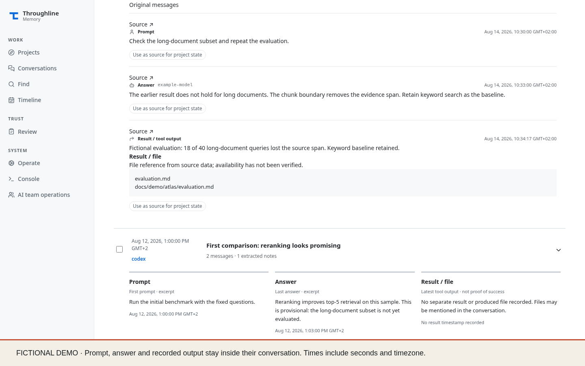](conversations.mp4)

[Play MP4](conversations.mp4) · [WebVTT captions](conversations.vtt)

## Find

[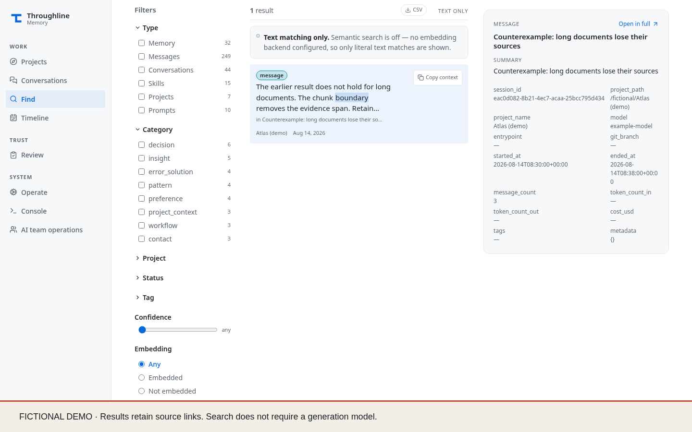](find.mp4)

[Play MP4](find.mp4) · [WebVTT captions](find.vtt)

## Timeline

[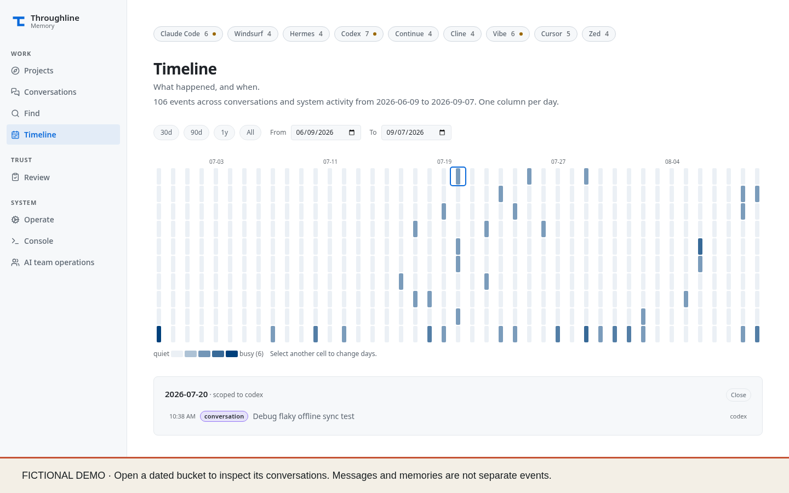](timeline.mp4)

[Play MP4](timeline.mp4) · [WebVTT captions](timeline.vtt)

## Review

[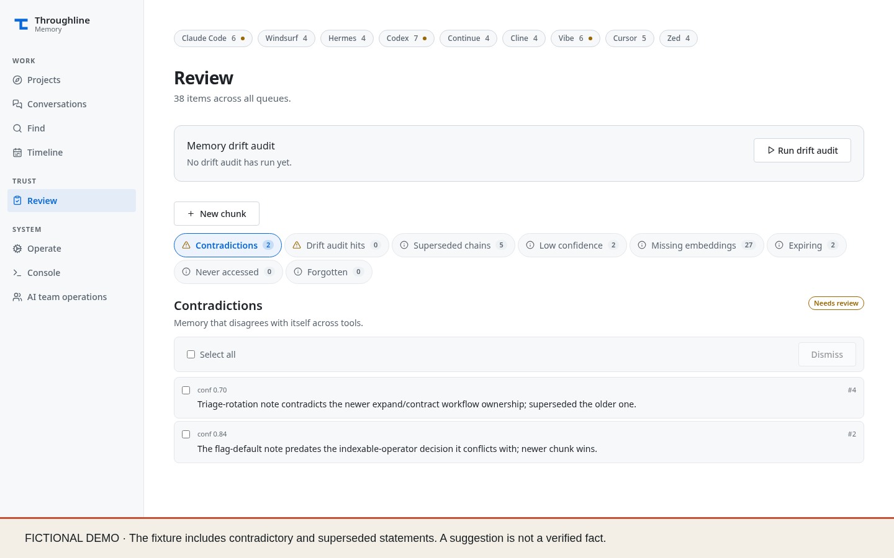](review.mp4)

[Play MP4](review.mp4) · [WebVTT captions](review.vtt)

## Operate

[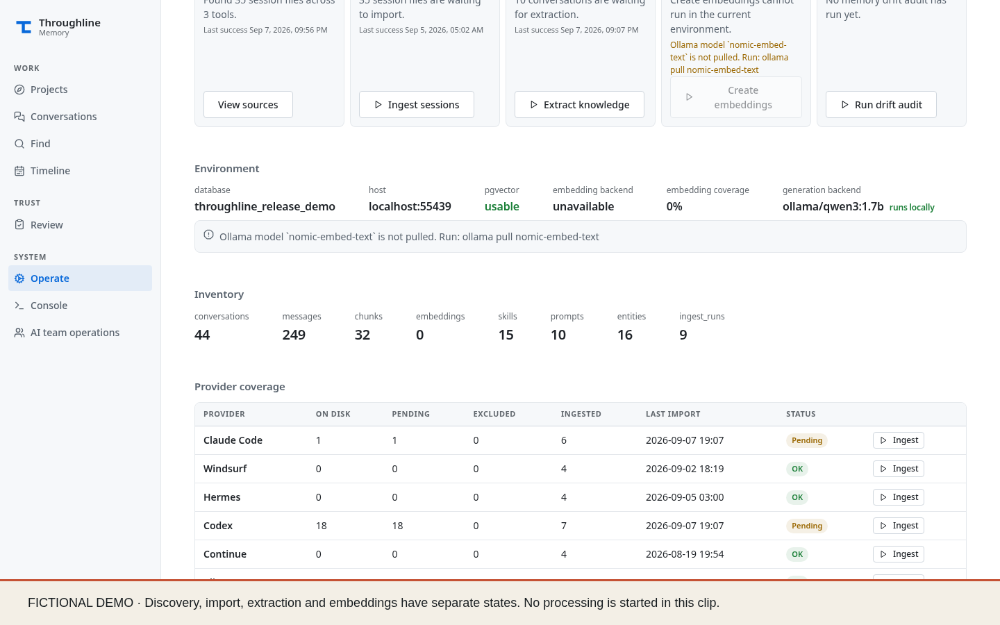](operate.mp4)

[Play MP4](operate.mp4) · [WebVTT captions](operate.vtt)

## Console

[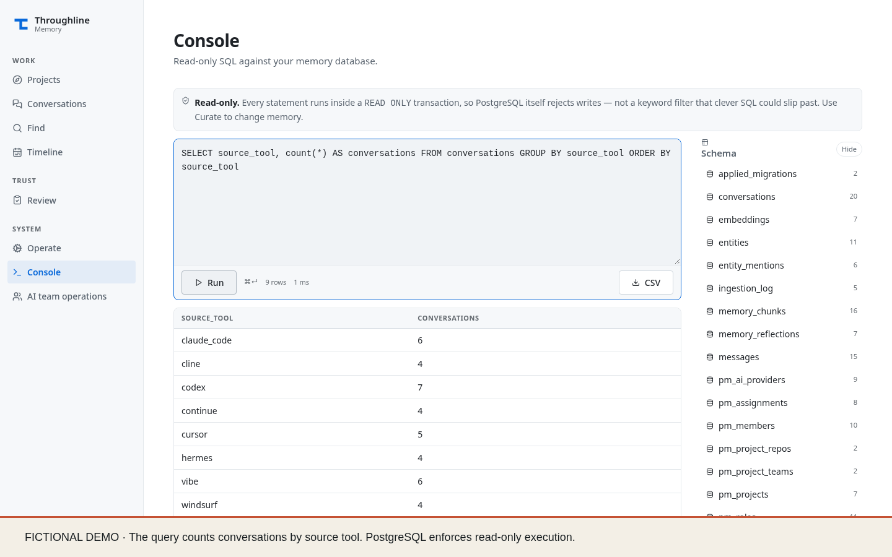](console.mp4)

[Play MP4](console.mp4) · [WebVTT captions](console.vtt)

## Teams

[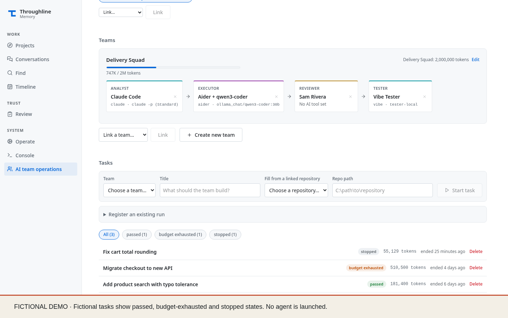](teams.mp4)

[Play MP4](teams.mp4) · [WebVTT captions](teams.vtt)

## Roles

[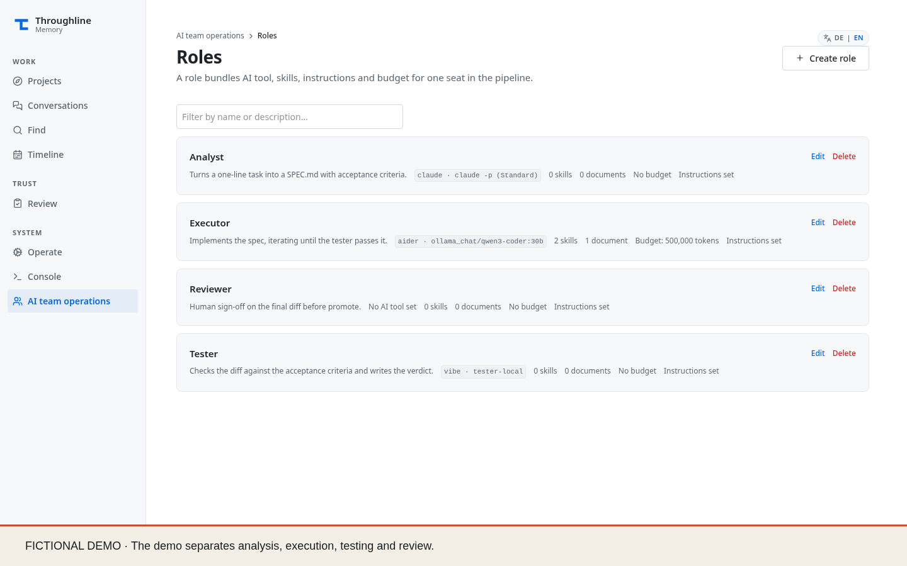](roles.mp4)

[Play MP4](roles.mp4) · [WebVTT captions](roles.vtt)

## Members

[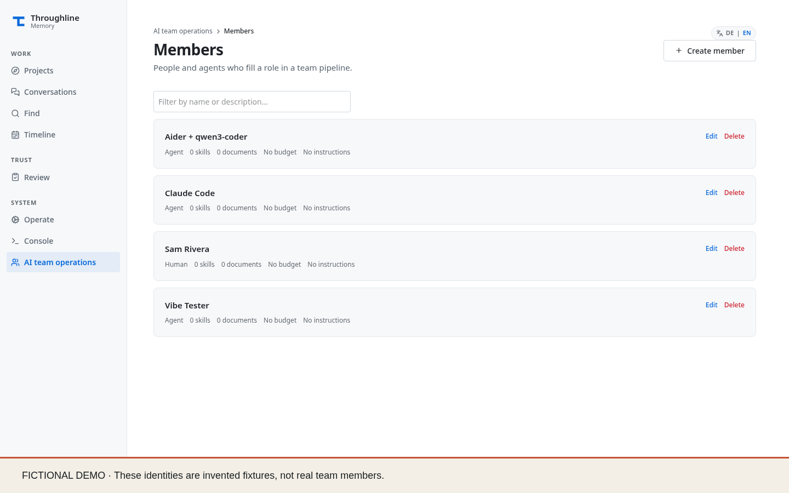](members.mp4)

[Play MP4](members.mp4) · [WebVTT captions](members.vtt)

## Pipelines

[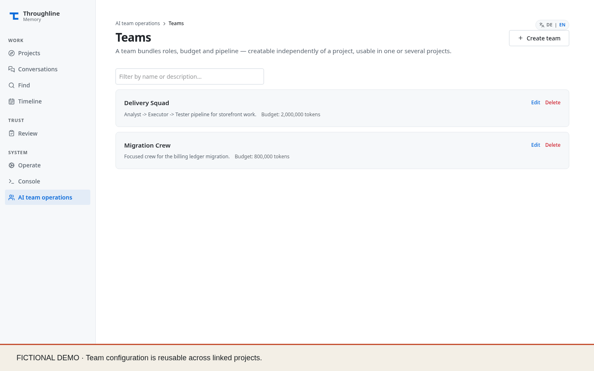](pipelines.mp4)

[Play MP4](pipelines.mp4) · [WebVTT captions](pipelines.vtt)

## Models

[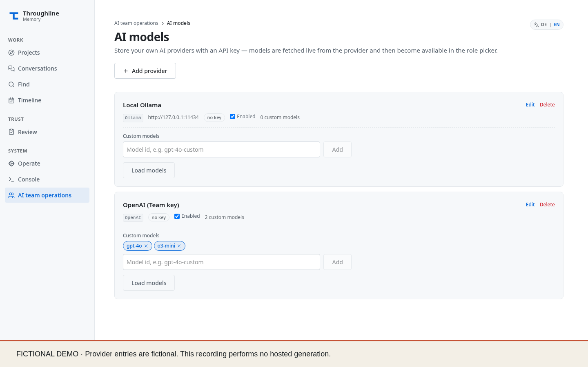](models.mp4)

[Play MP4](models.mp4) · [WebVTT captions](models.vtt)

## Inline previews

The GIFs play in GitHub Markdown. Open the MP4 for the full-size recording. All recordings use the English interface and English captions.

### Projects

### Conversations

### Find

### Timeline

### Review

### Operate

### Console

### AI team operations

### Roles

### Members

### Team pipelines

### Model providers

